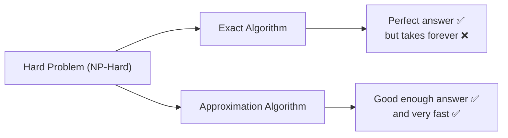
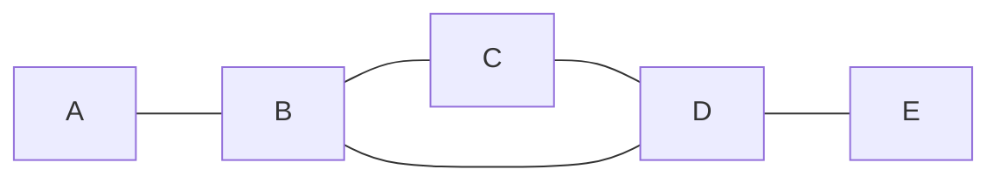
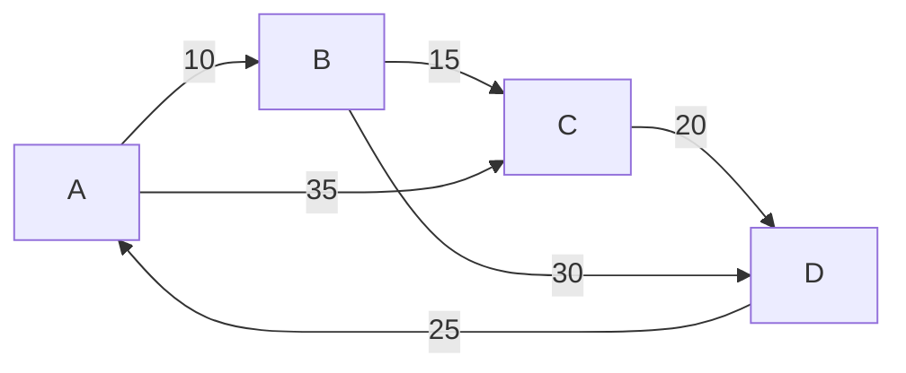

# Approximation Algorithms

Some problems are so hard that no one has found a fast way to solve them perfectly. These are called **NP-Hard** problems. For these problems, finding the *exact* best answer could take longer than the age of the universe — even on the fastest computer.

An **Approximation Algorithm** says: *"I can't promise you the perfect answer, but I can give you a pretty good answer — really fast — and I can prove how close it is to perfect."*

> [!NOTE]
> Approximation algorithms are **not** about being lazy. They are a mathematically rigorous approach to solving problems that are **impossible** to solve optimally in a reasonable time. They come with **guarantees** about how close the result will be to the best possible answer.

## Why Do We Need Them?

Some problems seem simple on the surface but are incredibly hard to solve optimally:

-   **Traveling Salesman:** Visit every city exactly once and return home — what's the shortest route? With 20 cities, there are over **60 quadrillion** possible routes.
-   **Set Cover:** You have a bunch of sets that overlap. What's the fewest sets you need to cover everything?
-   **Vertex Cover:** What's the smallest group of nodes that "touches" every edge in a graph?

For these problems, the exact solution requires trying every possible combination (exponential time). Approximation algorithms give us a **practical alternative**.



## The Approximation Ratio

How do we measure "good enough"? We use the **Approximation Ratio**.

For a **minimization** problem (where less is better, like shortest distance):

$$\text{Approximation Ratio} = \frac{\text{Algorithm's Answer}}{\text{Optimal Answer}}$$

For a **maximization** problem (where more is better, like maximum coverage):

$$\text{Approximation Ratio} = \frac{\text{Optimal Answer}}{\text{Algorithm's Answer}}$$

The ratio is always ≥ 1. **The closer to 1, the better.**

| Ratio | What It Means                                            |
| ----- | -------------------------------------------------------- |
| 1.0   | Perfect — the algorithm always finds the optimal answer  |
| 1.5   | The answer is at most **50% worse** than optimal         |
| 2.0   | The answer is at most **100% worse** (2× the optimal)   |

> [!TIP]
> A "2-approximation algorithm" guarantees that its answer is **at most twice** the cost of the optimal solution. So if the shortest route is 100 km, the algorithm guarantees a route of at most 200 km — but in practice, it's usually much better.

## Classic Problems & Examples

---

### Problem 1: The Set Cover Problem

**Problem:** You have a universe of elements `U = {1, 2, 3, 4, 5}` and a collection of sets, each covering some elements. Find the **fewest sets** that cover every element in U.

**Example:**

```text
Universe U = {1, 2, 3, 4, 5}

Set A = {1, 2, 3}
Set B = {2, 4}
Set C = {3, 4, 5}
Set D = {4, 5}
```

**The Greedy Approximation:** At each step, pick the set that covers the **most uncovered elements**.

| Step | Uncovered Elements | Best Set      | Why?                                   |
| ---- | ------------------ | ------------- | -------------------------------------- |
| 1    | {1, 2, 3, 4, 5}   | **A** {1,2,3} | Covers 3 elements (most)              |
| 2    | {4, 5}             | **C** {3,4,5} | Covers 2 remaining elements (most)    |
| 3    | {}                 | Done!         | All elements covered                  |

**Result:** Sets {A, C} — uses **2 sets**.
**Optimal:** Also 2 sets (A, C) or (A, D+B). In this case, greedy found the optimal!

> [!IMPORTANT]
> The greedy set cover algorithm has an approximation ratio of $O(\ln n)$ where $n$ is the number of elements. For practical sizes, this is very close to optimal.

#### Python

```python
def greedy_set_cover(universe, sets):
    """
    Greedy approximation for the Set Cover problem.
    
    universe: set of all elements to cover
    sets: dict of {set_name: set_of_elements}
    Returns: list of set names that cover the universe
    """
    uncovered = set(universe)       # Elements still to be covered
    selected_sets = []              # Sets we've chosen

    while uncovered:
        # Pick the set that covers the most uncovered elements
        best_set = None
        best_count = 0

        for name, elements in sets.items():
            if name in selected_sets:
                continue
            # How many uncovered elements does this set cover?
            covered_count = len(elements & uncovered)
            if covered_count > best_count:
                best_count = covered_count
                best_set = name

        if best_set is None:
            break  # No set can cover remaining elements

        selected_sets.append(best_set)
        uncovered -= sets[best_set]
        print(f"  Picked Set {best_set}: covers {sets[best_set]}, "
              f"remaining uncovered: {uncovered}")

    return selected_sets


# Example
universe = {1, 2, 3, 4, 5}
sets = {
    "A": {1, 2, 3},
    "B": {2, 4},
    "C": {3, 4, 5},
    "D": {4, 5}
}

result = greedy_set_cover(universe, sets)
print(f"\nSets needed: {result} (total: {len(result)})")

# Output:
#   Picked Set A: covers {1, 2, 3}, remaining uncovered: {4, 5}
#   Picked Set C: covers {3, 4, 5}, remaining uncovered: set()
#   Sets needed: ['A', 'C'] (total: 2)
```

#### Java

```java
import java.util.*;

public class SetCover {

    public static List<String> greedySetCover(
            Set<Integer> universe,
            Map<String, Set<Integer>> sets) {

        Set<Integer> uncovered = new HashSet<>(universe);
        List<String> selected = new ArrayList<>();

        while (!uncovered.isEmpty()) {
            // Pick the set that covers the most uncovered elements
            String bestSet = null;
            int bestCount = 0;

            for (Map.Entry<String, Set<Integer>> entry : sets.entrySet()) {
                if (selected.contains(entry.getKey())) continue;

                // Count how many uncovered elements this set covers
                Set<Integer> intersection = new HashSet<>(entry.getValue());
                intersection.retainAll(uncovered);

                if (intersection.size() > bestCount) {
                    bestCount = intersection.size();
                    bestSet = entry.getKey();
                }
            }

            if (bestSet == null) break;

            selected.add(bestSet);
            uncovered.removeAll(sets.get(bestSet));
            System.out.println("  Picked Set " + bestSet + ", remaining: " + uncovered);
        }

        return selected;
    }

    public static void main(String[] args) {
        Set<Integer> universe = new HashSet<>(Arrays.asList(1, 2, 3, 4, 5));

        Map<String, Set<Integer>> sets = new HashMap<>();
        sets.put("A", new HashSet<>(Arrays.asList(1, 2, 3)));
        sets.put("B", new HashSet<>(Arrays.asList(2, 4)));
        sets.put("C", new HashSet<>(Arrays.asList(3, 4, 5)));
        sets.put("D", new HashSet<>(Arrays.asList(4, 5)));

        List<String> result = greedySetCover(universe, sets);
        System.out.println("Sets needed: " + result + " (total: " + result.size() + ")");
    }
}
```

**Complexity:** $O(|S| \times |U|)$ where $|S|$ is the number of sets and $|U|$ is the size of the universe.

---

### Problem 2: The Vertex Cover Problem

**Problem:** Given a graph, find the **smallest set of vertices** such that every edge in the graph has at least one endpoint in the set.

Think of it like placing security cameras at intersections. You want every road (edge) to be watched by at least one camera (vertex). What's the minimum number of cameras?

**Example:**



**The 2-Approximation Algorithm:** Pick any uncovered edge, add **both** its endpoints to the cover, then remove all edges touching those vertices. Repeat.

| Step | Pick Edge | Add to Cover | Edges Removed             |
| ---- | --------- | ------------ | ------------------------- |
| 1    | A — B     | {A, B}       | A-B, B-C, B-D             |
| 2    | C — D     | {A, B, C, D} | C-D, D-E                  |
| 3    | No edges left | Done!    |                           |

**Result:** Vertex cover = {A, B, C, D} — **4 vertices**.
**Optimal:** {B, D} — only **2 vertices** (B touches A-B, B-C, B-D and D touches C-D, D-E).

The approximation found 4 vertices vs. optimal 2 — exactly 2× the optimal. This is expected since this is a **2-approximation** algorithm (guaranteed to be at most twice the optimal).

> [!NOTE]
> Why does this work? Every edge we pick must have at least one endpoint in the optimal cover. By picking both endpoints, we use at most 2× the optimal number. It's a simple but powerful guarantee.

#### Python

```python
def vertex_cover_approx(graph):
    """
    2-Approximation for Vertex Cover.
    
    graph: dict where key is vertex, value is list of neighbors
    Returns: set of vertices forming an approximate minimum vertex cover
    """
    # Build a set of all edges (as frozensets so order doesn't matter)
    edges = set()
    for u in graph:
        for v in graph[u]:
            edge = frozenset([u, v])
            edges.add(edge)
    
    cover = set()
    remaining_edges = set(edges)

    while remaining_edges:
        # Pick any remaining edge
        edge = next(iter(remaining_edges))
        u, v = tuple(edge)

        # Add BOTH endpoints to the cover
        cover.add(u)
        cover.add(v)

        # Remove all edges incident to u or v
        remaining_edges = {
            e for e in remaining_edges
            if u not in e and v not in e
        }
        print(f"  Picked edge {u}-{v}, cover so far: {cover}")

    return cover


# Example
graph = {
    "A": ["B"],
    "B": ["A", "C", "D"],
    "C": ["B", "D"],
    "D": ["C", "E", "B"],
    "E": ["D"]
}

cover = vertex_cover_approx(graph)
print(f"\nVertex Cover: {cover} (size: {len(cover)})")
print("Optimal would be: {B, D} (size: 2)")
print(f"Approximation ratio: {len(cover)} / 2 = {len(cover)/2}")

# Output:
#   Picked edge A-B, cover so far: {'A', 'B'}
#   Picked edge C-D, cover so far: {'A', 'B', 'C', 'D'}
#   Vertex Cover: {'A', 'B', 'C', 'D'} (size: 4)
#   Optimal would be: {B, D} (size: 2)
#   Approximation ratio: 4 / 2 = 2.0
```

#### Java

```java
import java.util.*;

public class VertexCover {

    public static Set<String> vertexCoverApprox(Map<String, List<String>> graph) {
        // Build edge set
        Set<String> edges = new HashSet<>();
        for (Map.Entry<String, List<String>> entry : graph.entrySet()) {
            for (String neighbor : entry.getValue()) {
                // Store edge as "min-max" to avoid duplicates
                String edge = entry.getKey().compareTo(neighbor) < 0
                        ? entry.getKey() + "-" + neighbor
                        : neighbor + "-" + entry.getKey();
                edges.add(edge);
            }
        }

        Set<String> cover = new HashSet<>();
        Set<String> remaining = new HashSet<>(edges);

        while (!remaining.isEmpty()) {
            // Pick any edge
            String edge = remaining.iterator().next();
            String[] vertices = edge.split("-");
            String u = vertices[0];
            String v = vertices[1];

            // Add both endpoints
            cover.add(u);
            cover.add(v);

            // Remove all edges touching u or v
            remaining.removeIf(e -> e.contains(u) || e.contains(v));

            System.out.println("  Picked edge " + edge + ", cover: " + cover);
        }

        return cover;
    }

    public static void main(String[] args) {
        Map<String, List<String>> graph = new HashMap<>();
        graph.put("A", List.of("B"));
        graph.put("B", List.of("A", "C", "D"));
        graph.put("C", List.of("B", "D"));
        graph.put("D", List.of("C", "E", "B"));
        graph.put("E", List.of("D"));

        Set<String> cover = vertexCoverApprox(graph);
        System.out.println("Vertex Cover: " + cover + " (size: " + cover.size() + ")");
    }
}
```

**Complexity:** $O(V + E)$ — a single pass over edges.
**Guarantee:** Always within 2× of the optimal answer.

---

### Problem 3: Traveling Salesman Problem (TSP)

**Problem:** A salesman needs to visit every city exactly once and return to the starting city. Find the **shortest possible route**.

This is one of the most famous NP-Hard problems. With $n$ cities, there are $(n-1)!/2$ possible routes. For just 20 cities, that's over **60 trillion** routes to check.

**Example:**



**Nearest Neighbor Heuristic (Greedy Approximation):** From the current city, always go to the **closest unvisited city**. When all cities are visited, return home.

Starting from **A**:

| Step | Current | Unvisited     | Nearest | Distance |
| ---- | ------- | ------------- | ------- | -------- |
| 1    | A       | {B, C, D}     | B (10)  | 10       |
| 2    | B       | {C, D}        | C (15)  | 10 + 15 = 25 |
| 3    | C       | {D}           | D (20)  | 25 + 20 = 45 |
| 4    | D       | {}            | A (25)  | 45 + 25 = 70 |

**Result:** Route A → B → C → D → A = **70**

Is this optimal? Let's check another route: A → B → D → C → A = 10 + 30 + 20 + 35 = 95. Or A → C → B → D → A = 35 + 15 + 30 + 25 = 105. Our greedy answer of 70 is actually the best here!

> [!WARNING]
> The nearest neighbor heuristic does NOT always find the optimal route. It can produce results that are significantly worse than optimal in adversarial cases. For TSP with the triangle inequality (direct path is never longer than indirect), a more sophisticated 1.5-approximation exists (Christofides' algorithm).

#### Python

```python
def nearest_neighbor_tsp(distances, start=0):
    """
    Nearest Neighbor approximation for TSP.
    
    distances: 2D list where distances[i][j] = cost from city i to city j
    start: index of the starting city
    Returns: (route, total_distance)
    """
    n = len(distances)
    visited = [False] * n
    route = [start]
    visited[start] = True
    total_distance = 0

    current = start
    for _ in range(n - 1):
        # Find the nearest unvisited city
        nearest = None
        nearest_dist = float('inf')

        for city in range(n):
            if not visited[city] and distances[current][city] < nearest_dist:
                nearest = city
                nearest_dist = distances[current][city]

        # Move to the nearest city
        route.append(nearest)
        visited[nearest] = True
        total_distance += nearest_dist
        current = nearest

    # Return to the starting city
    total_distance += distances[current][start]
    route.append(start)

    return route, total_distance


# Example: 4 cities (A=0, B=1, C=2, D=3)
# distances[i][j] = cost from city i to city j
distances = [
    #    A    B    C    D
    [  0,  10,  35,  25],  # A
    [ 10,   0,  15,  30],  # B
    [ 35,  15,   0,  20],  # C
    [ 25,  30,  20,   0],  # D
]
city_names = ["A", "B", "C", "D"]

route, total = nearest_neighbor_tsp(distances, start=0)
route_names = [city_names[i] for i in route]

print(f"Route: {' → '.join(route_names)}")
print(f"Total distance: {total}")

# Output:
#   Route: A → B → C → D → A
#   Total distance: 70
```

#### Java

```java
import java.util.*;

public class TSPNearestNeighbor {

    public static void main(String[] args) {
        int[][] distances = {
            {0, 10, 35, 25},  // A
            {10, 0, 15, 30},  // B
            {35, 15, 0, 20},  // C
            {25, 30, 20, 0},  // D
        };
        String[] cityNames = {"A", "B", "C", "D"};
        int n = distances.length;

        // Nearest Neighbor starting from city 0 (A)
        boolean[] visited = new boolean[n];
        List<Integer> route = new ArrayList<>();
        int current = 0;
        route.add(current);
        visited[current] = true;
        int totalDistance = 0;

        for (int step = 0; step < n - 1; step++) {
            int nearest = -1;
            int nearestDist = Integer.MAX_VALUE;

            for (int city = 0; city < n; city++) {
                if (!visited[city] && distances[current][city] < nearestDist) {
                    nearest = city;
                    nearestDist = distances[current][city];
                }
            }

            route.add(nearest);
            visited[nearest] = true;
            totalDistance += nearestDist;
            current = nearest;
        }

        // Return to start
        totalDistance += distances[current][0];
        route.add(0);

        // Print result
        StringJoiner routeStr = new StringJoiner(" → ");
        for (int city : route) {
            routeStr.add(cityNames[city]);
        }
        System.out.println("Route: " + routeStr);
        System.out.println("Total distance: " + totalDistance);

        // Output:
        //   Route: A → B → C → D → A
        //   Total distance: 70
    }
}
```

**Complexity:** $O(n^2)$ — for each of the $n$ cities, we scan all cities to find the nearest.

---

## Summary: Approximation Algorithms at a Glance

| Problem          | Approximation Strategy              | Ratio Guarantee | Time Complexity |
| ---------------- | ----------------------------------- | --------------- | --------------- |
| **Set Cover**    | Pick set covering most elements     | $O(\ln n)$      | $O(\|S\| \times \|U\|)$ |
| **Vertex Cover** | Pick both endpoints of any edge     | 2×              | $O(V + E)$      |
| **TSP (NN)**     | Always visit nearest unvisited city | No tight bound  | $O(n^2)$        |
| **TSP (Christofides)** | MST + minimum matching        | 1.5×            | $O(n^3)$        |

## Exact vs. Approximation: A Comparison

| Feature            | Exact Algorithm                    | Approximation Algorithm           |
| ------------------ | ---------------------------------- | --------------------------------- |
| **Answer quality** | Always optimal                     | Close to optimal (with guarantee) |
| **Speed**          | Exponential (very slow for large input) | Polynomial (fast)            |
| **Use when**       | Input is small, or exact answer is critical | Input is large, "good enough" is acceptable |
| **Examples**       | Brute force, backtracking, DP      | Greedy heuristics, rounding       |

## When to Use Approximation Algorithms

-   **The problem is NP-Hard:** No known polynomial-time exact algorithm exists. Trying all possibilities would take too long.
-   **"Good enough" is acceptable:** In many real-world scenarios, a solution that's within 50% or even 100% of optimal is perfectly fine.
-   **Input size is large:** Exact methods may work for 10 items, but not for 10,000. Approximation algorithms scale.
-   **Time is critical:** Real-time systems (like network routing or delivery scheduling) need fast answers, not perfect ones.

Real-world applications:

-   **Delivery Routing (UPS, FedEx, Amazon):** Plan routes for hundreds of trucks visiting thousands of stops. A route that's 10% longer than optimal is fine — spending hours to find the perfect route is not.
-   **Network Design:** Connecting servers or cell towers at minimum cost. Approximation algorithms design networks that are provably close to the cheapest possible.
-   **Scheduling:** Assigning jobs to machines, classes to rooms, or tasks to processors. Approximation gives fast, near-optimal assignments.
-   **Data Compression & Clustering:** Grouping data points or selecting representative samples from massive datasets.

> [!CAUTION]
> Always check that your problem actually has the properties needed for the approximation algorithm you're using. Using a TSP approximation on a graph without the triangle inequality, or a greedy heuristic on a problem without the greedy choice property, can give arbitrarily bad results with **no guarantee** of quality.
