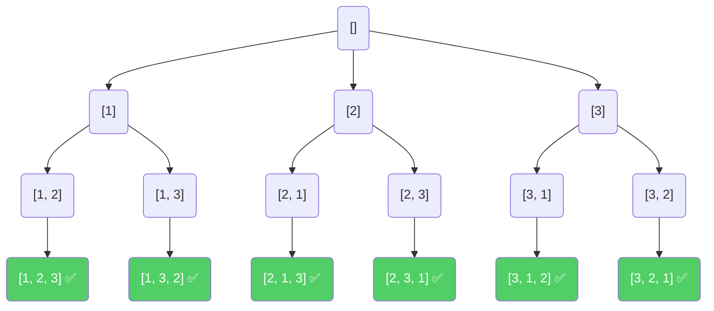

# Backtracking

**Backtracking** is an algorithmic technique for solving problems recursively by trying to build a solution incrementally, one piece at a time. If it realizes that the current path cannot possibly lead to a valid solution, it **abandons that path**, steps back (backtracks) to the previous choice, and tries another option.

Think of it like this: *"Let's go down this path. If we hit a dead end, we'll turn around, walk back to the last intersection, and try a different path."*

> [!NOTE]
> Backtracking is essentially just **Depth-First Search (DFS)** on a "State Space Tree" (a tree representing all possible states or choices of a problem).

## Real-Life Analogy: Navigating a Maze

Imagine you are standing at the entrance of a maze, trying to reach the exit.

1. You come to a fork with three paths: Left, Straight, and Right.
2. You choose **Left** and walk down the corridor.
3. You hit a solid wall. Dead end!
4. You **turn around and walk back** (this is the *backtrack*) to the fork.
5. Next, you try going **Straight**. You find the exit!

You didn't magically know which path was correct, but you systematically tried options and retreated the moment you realized a choice was wrong.

## Backtracking vs. Brute Force

Why not just generate every single possible answer and check them all?

* **Brute Force:** Generates *all* possible configurations, regardless of validity, and then checks them at the very end.
* **Backtracking:** Checks constraints *as it builds* the solution. The moment a rule is broken, it stops exploring that branch. This is called **Pruning**.

**Example:** Guessing a 3-letter password where no letter can repeat.
- Brute Force will generate "AAA", "AAB", etc., and later reject them.
- Backtracking says, "The first letter is 'A'. So the second letter cannot be 'A'." It entirely skips generating "AAA" or "AAB", saving massive amounts of time.

## The 3 Keys of Backtracking

To solve any backtracking problem, you need to answer three questions:

1. **Choice:** What choice am I making at this current step?
2. **Constraints:** Is this choice valid according to the problem's rules?
3. **Goal:** Have I reached the final target/solution?

## The Backtracking Template

Almost all backtracking problems can be solved using this logical template (pseudocode):

```pseudocode
function BACKTRACK(state)
    // 1. Base Case / Goal
    if is_goal(state) then
        add_to_results(state)
        return
    end if
        
    // 2. Iterate through all possible choices
    for each choice in possible_choices do
        
        // 3. Check Constraints (Pruning)
        if is_valid(choice) then
            
            // 4. Make the choice
            make_choice(choice)
            
            // 5. Recursively explore deeper
            BACKTRACK(state)
            
            // 6. UNDO the choice (Backtrack!)
            undo_choice(choice)
        end if
    end for
end function
```

> [!IMPORTANT]
> The **UNDO** step is the defining feature of backtracking. Since arrays/lists are often passed by reference, you must remove the choice you just made before moving on to the next iteration of the loop, restoring the "state" to a clean slate.

---

## Classic Problems & Examples

### Problem 1: Permutations

**Problem:** Given an array of distinct integers, return all the possible permutations.

> [!NOTE]
> A permutation is an arrangement of objects in a specific order. For example, the permutations of the letters A, B, and C are ABC, ACB, BAC, BCA, CAB, and CBA.

**Example:** `nums = [1, 2, 3]`
**Output:** `[[1,2,3], [1,3,2], [2,1,3], [2,3,1], [3,1,2], [3,2,1]]`

**The State Space Tree:**


#### Python

```python
def permute(nums):
    result = []
    
    def backtrack(current_path):
        # Goal: If the path is the same length as nums, we found a permutation
        if len(current_path) == len(nums):
            result.append(current_path[:]) # Append a COPY of the list
            return
            
        # Explore choices
        for i in range(len(nums)):
            # Constraint: Cannot use a number we've already used in this path
            if nums[i] in current_path:
                continue
                
            # Make choice
            current_path.append(nums[i])
            
            # Explore deep
            backtrack(current_path)
            
            # Undo choice (Backtrack)
            current_path.pop()
            
    backtrack([])
    return result

# Example
print(permute([1, 2, 3]))
```

#### Java

```java
import java.util.*;

public class Permutations {
    public static List<List<Integer>> permute(int[] nums) {
        List<List<Integer>> result = new ArrayList<>();
        backtrack(result, new ArrayList<>(), nums);
        return result;
    }
    
    private static void backtrack(List<List<Integer>> result, List<Integer> currentPath, int[] nums) {
        // Goal
        if (currentPath.size() == nums.length) {
            result.add(new ArrayList<>(currentPath)); // Append a copy
            return;
        }
        
        // Choices
        for (int i = 0; i < nums.length; i++) {
            // Constraint
            if (currentPath.contains(nums[i])) {
                continue;
            }
            
            // Make choice
            currentPath.add(nums[i]);
            
            // Explore
            backtrack(result, currentPath, nums);
            
            // Undo choice
            currentPath.remove(currentPath.size() - 1);
        }
    }

    public static void main(String[] args) {
        System.out.println(permute(new int[]{1, 2, 3}));
    }
}
```

---

### Problem 2: N-Queens

**Problem:** The $n$-queens puzzle is the problem of placing $n$ chess queens on an $n \times n$ chessboard so that no two queens threaten each other. (They cannot share the same row, column, or diagonal). Return all distinct solutions.

**Example:** $n = 4$

```text
. Q . .
. . . Q
Q . . .
. . Q .
```

**Backtracking Strategy:**
1. We try placing a queen row by row.
2. In the current row, we loop through every column.
3. Before placing the queen, we check the **Constraints**: Is this spot under attack vertically or diagonally from a previously placed queen?
4. If it's safe, we place the queen, move to the next row, and repeat.
5. If we reach the end of the board and no columns are safe, we **backtrack** to the previous row and move that queen to the next safe column.

#### Python

```python
def solveNQueens(n):
    cols = set()
    pos_diag = set() # (r + c) remains constant on a positive diagonal /
    neg_diag = set() # (r - c) remains constant on a negative diagonal \
    
    result = []
    board = [["."] * n for _ in range(n)]
    
    def backtrack(row):
        # Goal: We've successfully placed a queen in every row
        if row == n:
            copy = ["".join(r) for r in board]
            result.append(copy)
            return
            
        # Choices: Try every column in the current row
        for col in range(n):
            # Constraints: Is this square under attack?
            if col in cols or (row + col) in pos_diag or (row - col) in neg_diag:
                continue
                
            # Make Choice: Place Queen and record the threat zones
            cols.add(col)
            pos_diag.add(row + col)
            neg_diag.add(row - col)
            board[row][col] = "Q"
            
            # Explore next row
            backtrack(row + 1)
            
            # Undo Choice (Backtrack): Remove Queen and clear threat zones
            cols.remove(col)
            pos_diag.remove(row + col)
            neg_diag.remove(row - col)
            board[row][col] = "."
            
    backtrack(0)
    return result

# Example for 4 Queens
solutions = solveNQueens(4)
for sol in solutions:
    for row in sol:
        print(row)
    print("----")
```

#### Java

```java
import java.util.*;

public class NQueens {
    public static List<List<String>> solveNQueens(int n) {
        List<List<String>> result = new ArrayList<>();
        char[][] board = new char[n][n];
        for (int i = 0; i < n; i++) {
            Arrays.fill(board[i], '.');
        }
        
        Set<Integer> cols = new HashSet<>();
        Set<Integer> posDiag = new HashSet<>();
        Set<Integer> negDiag = new HashSet<>();
        
        backtrack(result, board, 0, n, cols, posDiag, negDiag);
        return result;
    }
    
    private static void backtrack(List<List<String>> result, char[][] board, int row, int n, 
                                  Set<Integer> cols, Set<Integer> posDiag, Set<Integer> negDiag) {
        if (row == n) {
            List<String> copy = new ArrayList<>();
            for (char[] r : board) copy.add(new String(r));
            result.add(copy);
            return;
        }
        
        for (int col = 0; col < n; col++) {
            if (cols.contains(col) || posDiag.contains(row + col) || negDiag.contains(row - col)) {
                continue;
            }
            
            // Make choice
            board[row][col] = 'Q';
            cols.add(col);
            posDiag.add(row + col);
            negDiag.add(row - col);
            
            // Explore
            backtrack(result, board, row + 1, n, cols, posDiag, negDiag);
            
            // Undo choice
            board[row][col] = '.';
            cols.remove(col);
            posDiag.remove(row + col);
            negDiag.remove(row - col);
        }
    }

    public static void main(String[] args) {
        List<List<String>> solutions = solveNQueens(4);
        for (List<String> sol : solutions) {
            for (String row : sol) {
                System.out.println(row);
            }
            System.out.println("----");
        }
    }
}
```

## Complexity

Backtracking algorithms are fundamentally trying to search through combinations, which means they are almost always **exponential** or **factorial** in time complexity.

| Problem | Time Complexity | Space Complexity |
| :--- | :--- | :--- |
| **Subsets** | $O(N \cdot 2^N)$ | $O(N)$ (for the recursion stack) |
| **Permutations** | $O(N \cdot N!)$ | $O(N)$ |
| **N-Queens** | $O(N!)$ | $O(N)$ |

> [!WARNING]
> Backtracking algorithms are inherently slow. If $N$ is larger than 15-20, a pure backtracking solution will likely Result in a Time Limit Exceeded (TLE) error. If $N$ is small, it's a huge hint that Backtracking is the expected solution!

## Common Pitfalls

1. **Forgetting to copy the array:** In languages like Python and Java, arrays are passed by reference. When you do `result.append(current_path)`, you are appending a reference. If you later pop items out of `current_path`, it modifies the list inside `result` too! 
   * *Fix:* Always append a clone/copy, e.g., `result.append(current_path[:])` or `new ArrayList<>(currentPath)`.
2. **Forgetting to Undo:** If you add an item before the recursive call but don't remove it after, your state becomes corrupted for all future recursive branches.
3. **Weak Pruning:** If your `is_valid` checks are slow or incomplete, your backtracking approaches brute-force efficiency. Optimization in backtracking is almost entirely about making your "pruning" logic faster.

## When to Use Backtracking

Look out for these keywords in a problem description:

- "Find **all** possible combinations..."
- "Find **all** permutations..."
- "Find **all** paths..."
- "Generate **every** valid..."
- The constraints strictly limit the input size (e.g., $N \le 15$).

## Key Takeaways

- Backtracking is a systematic way to explore all possible configurations of a search space.
- It differs from brute force by **pruning** paths as soon as they violate constraints.
- Follow the template: `Check Goal -> Loop Choices -> Check Valid -> Choose -> Recurse -> Undo Choose`.
- Always remember to **undo your choices** and **append a copy** of your path to the final results.