# Binary Search Tree (BST)

A **Binary Search Tree (BST)** is a binary tree with one special rule: for every node, **all values in its left subtree are smaller** and **all values in its right subtree are larger**.

Think of it like a **dictionary** — you don't read every page from beginning to end to find a word. You open the book roughly in the middle, check if your word comes before or after, and keep halving the remaining pages. A BST works the same way: at each node, you decide to go left or right, cutting the remaining data in half every time.

> [!NOTE]
> A BST combines the strengths of a sorted array (fast search via binary search) and a linked list (fast insert/delete without shifting). It keeps data **always sorted** while allowing efficient operations.

## The BST Rule

The rule is simple and applies to **every single node** in the tree:

- Everything in the **left subtree** < current node
- Everything in the **right subtree** > current node

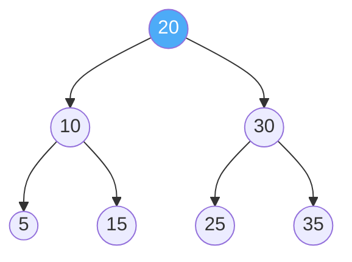

Let's verify the rule:

| Node | Left subtree values     | Right subtree values    | Rule satisfied? |
| ---- | ----------------------- | ----------------------- | --------------- |
| 20   | 10, 5, 15 (all < 20)   | 30, 25, 35 (all > 20)  | ✅               |
| 10   | 5 (< 10)               | 15 (> 10)              | ✅               |
| 30   | 25 (< 30)              | 35 (> 30)              | ✅               |
| 5    | None                    | None                    | ✅ (leaf)        |
| 15   | None                    | None                    | ✅ (leaf)        |
| 25   | None                    | None                    | ✅ (leaf)        |
| 35   | None                    | None                    | ✅ (leaf)        |

> [!IMPORTANT]
> The rule is NOT just about the immediate children. **All** values in the entire left subtree must be smaller, and **all** values in the entire right subtree must be larger. This is a common mistake — checking only direct children is not enough to validate a BST.

### Example: This is NOT a valid BST

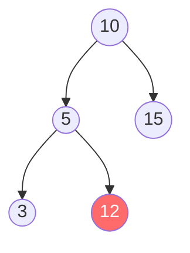

Node `12` is in the **left** subtree of `10`, but `12 > 10`. The direct parent (`5`) check passes (`12 > 5`), but the ancestor check fails. This is **not** a valid BST.

## Real-Life Analogy: A Library Bookshelf

Imagine a library organizes books by their ISBN numbers:

1. You walk to the **middle shelf** (the root node).
2. If your book's number is **smaller**, you go to the **left wing**.
3. If it's **larger**, you go to the **right wing**.
4. At each section, you repeat: go left or right based on comparison.
5. You keep halving the search space until you find the book or reach an empty spot (book not available).

This is exactly how searching in a BST works — you never need to scan every shelf.

## BST Operations

### 1. Search

**Goal:** Find if a value exists in the tree.

**Logic:**
1. Start at the root.
2. If the value **equals** the current node → Found it! ✅
3. If the value is **smaller** → Go left.
4. If the value is **larger** → Go right.
5. If you reach `null` → Not found. ❌

**Example:** Search for `15` in this tree:

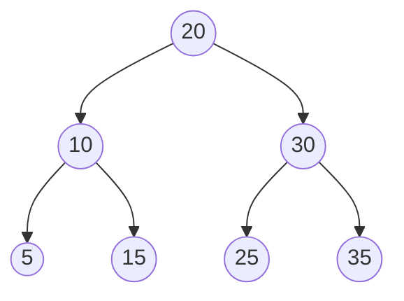

```text
Step 1: Start at 20 → 15 < 20, go LEFT
Step 2: At node 10  → 15 > 10, go RIGHT
Step 3: At node 15  → 15 == 15, FOUND! ✅
```

Only **3 comparisons** instead of checking all 7 nodes!

**Example:** Search for `22`:

```text
Step 1: Start at 20 → 22 > 20, go RIGHT
Step 2: At node 30  → 22 < 30, go LEFT
Step 3: At node 25  → 22 < 25, go LEFT
Step 4: null         → NOT FOUND ❌
```

### 2. Insert

**Goal:** Add a new value to the tree while keeping the BST rule.

**Logic:** Follow the same path as search. When you reach a `null` spot, that's where the new node goes. New nodes are always inserted as **leaf nodes**.

**Example:** Insert `17` into the tree:

```text
Step 1: Start at 20 → 17 < 20, go LEFT
Step 2: At node 10  → 17 > 10, go RIGHT
Step 3: At node 15  → 17 > 15, go RIGHT
Step 4: null         → INSERT 17 here!
```

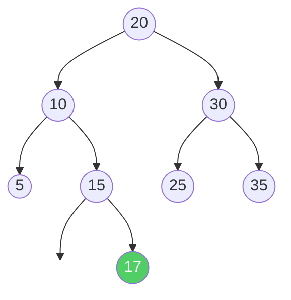

> [!TIP]
> The **order of insertion** determines the **shape** of the tree. Inserting `[20, 10, 30, 5, 15, 25, 35]` creates a balanced tree. Inserting `[5, 10, 15, 20, 25, 30, 35]` (sorted order) creates a skewed tree that looks like a linked list.

### 3. Delete

Deleting from a BST is the trickiest operation because we must **maintain the BST rule** after removal. There are **3 cases**:

#### Case 1: Node is a Leaf (No Children)

Simply remove it. Nothing else to fix.

**Example:** Delete `5`:

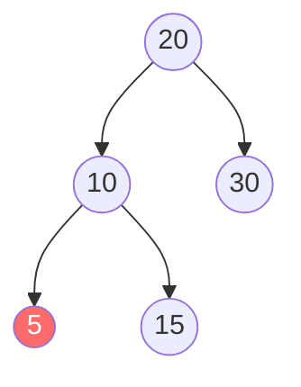

Just remove node `5`. Done!

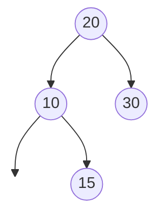

#### Case 2: Node has One Child

Replace the node with its only child. The child takes the deleted node's place.

**Example:** Delete `10` (which has only right child `15`):

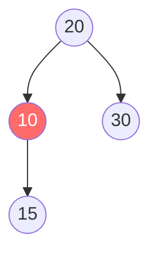

Replace `10` with its child `15`:

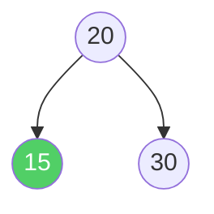

#### Case 3: Node has Two Children

This is the tricky one. We can't simply remove the node — both subtrees need a parent. The solution:

1. Find the **in-order successor** — the **smallest value in the right subtree** (go right once, then keep going left until you hit `null`).
2. **Copy** the successor's value into the node being deleted.
3. **Delete** the successor node (which will be Case 1 or Case 2, since it has at most one child).

**Example:** Delete `20` from this tree:

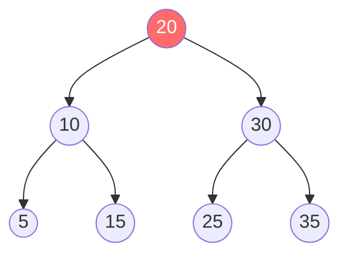

```text
Step 1: Node 20 has two children → find in-order successor
Step 2: Go right to 30, then go left to 25. No more left → successor is 25
Step 3: Copy 25 into node 20's position
Step 4: Delete old node 25 (it's a leaf → Case 1)
```

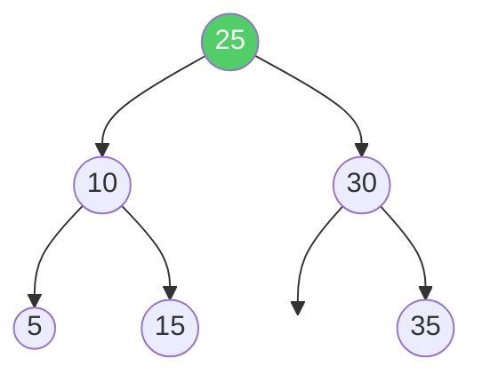

The BST rule is still satisfied — everything works! ✅

> [!NOTE]
> You can also use the **in-order predecessor** (largest value in the left subtree) instead of the in-order successor. Both approaches are valid. Using the successor is more common by convention.

## Traversals on a BST

The most important traversal for a BST is **In-Order (Left → Root → Right)** because it visits nodes in **sorted order**.

**Example tree:**


| Traversal       | Order Rule          | Result                    |
| --------------- | ------------------- | ------------------------- |
| **In-Order**    | Left → Root → Right | 5, 10, 15, 20, 25, 30, 35 |
| **Pre-Order**   | Root → Left → Right | 20, 10, 5, 15, 30, 25, 35 |
| **Post-Order**  | Left → Right → Root | 5, 15, 10, 25, 35, 30, 20 |
| **Level-Order** | Level by level      | 20, 10, 30, 5, 15, 25, 35 |

**In-Order gives sorted output** — this is a key property of BSTs. If you ever need to get sorted data from a BST, just do an in-order traversal.

## Balanced vs Skewed BSTs

The performance of a BST depends entirely on its **shape**. The same set of data can produce a tall, skinny tree or a short, wide tree depending on the insertion order.

### Balanced BST

Insert order: `[20, 10, 30, 5, 15, 25, 35]`


Height = 2. Search takes at most **3 steps**. ✅

### Skewed BST (Worst Case)

Insert order: `[5, 10, 15, 20, 25, 30, 35]`

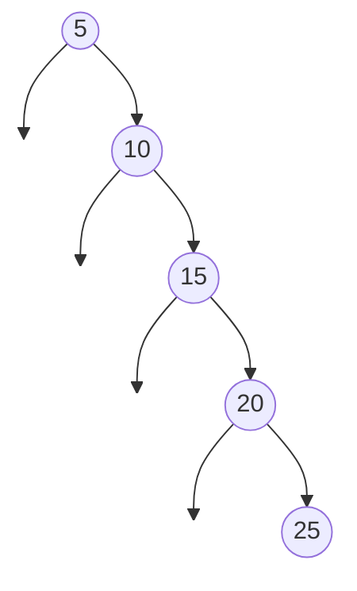

Height = 6. Search takes up to **7 steps** — no better than a linked list! ❌

> [!WARNING]
> If you insert sorted data into a BST, it degenerates into a linked list and all operations become $O(n)$. This is why **self-balancing BSTs** (AVL Tree, Red-Black Tree) exist — they automatically restructure the tree after insertions and deletions to keep it balanced.

## Complexity

| Operation     | Average (Balanced) | Worst Case (Skewed) |
| ------------- | ------------------ | ------------------- |
| **Search**    | $O(\log n)$        | $O(n)$              |
| **Insert**    | $O(\log n)$        | $O(n)$              |
| **Delete**    | $O(\log n)$        | $O(n)$              |
| **Traversal** | $O(n)$             | $O(n)$              |
| **Space**     | $O(n)$             | $O(n)$              |

**Why $O(\log n)$?** In a balanced BST with $n$ nodes, the height is approximately $\log_2 n$. Every operation travels from root to a leaf at most, so the work is proportional to the height. For 1,000,000 nodes, that's only about **20 steps**!

## Validating a BST

A common interview question: *"Given a binary tree, check if it is a valid BST."*

The trick is to keep track of the **allowed range** for each node. As you go left, the current node becomes the new upper bound. As you go right, the current node becomes the new lower bound.

```text
            20 (range: -∞ to +∞)
           /  \
         10    30 (range: 20 to +∞)
        /  \
       5    15
 (-∞,10) (10,20)   ← 15 must be between 10 and 20
```

## Finding Min and Max

The **minimum** value is the leftmost node — keep going left until there's no left child.
The **maximum** value is the rightmost node — keep going right until there's no right child.

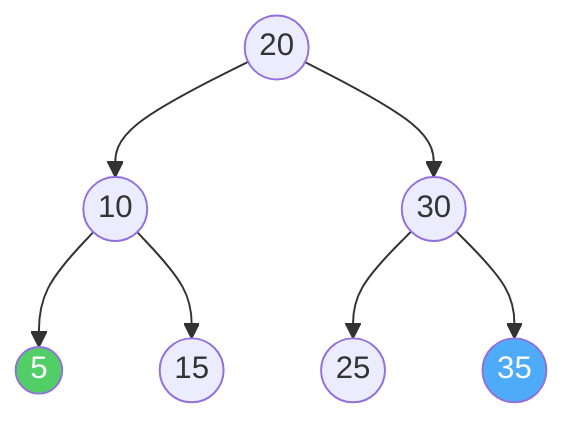

- **Min:** 20 → 10 → **5** (no more left)
- **Max:** 20 → 30 → **35** (no more right)

Both operations are $O(h)$ where $h$ is the height of the tree.

## Implementation

### Python

```python
class Node:
    def __init__(self, value):
        self.value = value
        self.left = None
        self.right = None


class BinarySearchTree:
    def __init__(self):
        self.root = None

    # --- Insert ---
    def insert(self, value):
        """Insert a new value into the BST."""
        if self.root is None:
            self.root = Node(value)
        else:
            self._insert_recursive(self.root, value)

    def _insert_recursive(self, node, value):
        if value < node.value:
            if node.left is None:
                node.left = Node(value)
            else:
                self._insert_recursive(node.left, value)
        else:
            if node.right is None:
                node.right = Node(value)
            else:
                self._insert_recursive(node.right, value)

    # --- Search ---
    def search(self, value):
        """Search for a value. Returns True if found."""
        return self._search_recursive(self.root, value)

    def _search_recursive(self, node, value):
        if node is None:
            return False            # Reached end — not found
        if value == node.value:
            return True             # Found it!
        elif value < node.value:
            return self._search_recursive(node.left, value)    # Go left
        else:
            return self._search_recursive(node.right, value)   # Go right

    # --- Delete ---
    def delete(self, value):
        """Delete a value from the BST."""
        self.root = self._delete_recursive(self.root, value)

    def _delete_recursive(self, node, value):
        if node is None:
            return None  # Value not found

        if value < node.value:
            node.left = self._delete_recursive(node.left, value)
        elif value > node.value:
            node.right = self._delete_recursive(node.right, value)
        else:
            # Found the node to delete

            # Case 1: Leaf node (no children)
            if node.left is None and node.right is None:
                return None

            # Case 2: One child
            if node.left is None:
                return node.right
            if node.right is None:
                return node.left

            # Case 3: Two children
            # Find in-order successor (smallest in right subtree)
            successor = self._find_min(node.right)
            node.value = successor.value
            node.right = self._delete_recursive(node.right, successor.value)

        return node

    # --- Find Min / Max ---
    def _find_min(self, node):
        """Find the node with the smallest value (leftmost node)."""
        current = node
        while current.left is not None:
            current = current.left
        return current

    def find_min(self):
        """Return the minimum value in the BST."""
        if self.root is None:
            return None
        return self._find_min(self.root).value

    def find_max(self):
        """Return the maximum value in the BST."""
        if self.root is None:
            return None
        current = self.root
        while current.right is not None:
            current = current.right
        return current.value

    # --- Validate BST ---
    def is_valid_bst(self):
        """Check if this tree is a valid BST."""
        return self._validate(self.root, float('-inf'), float('inf'))

    def _validate(self, node, min_val, max_val):
        if node is None:
            return True
        if node.value <= min_val or node.value >= max_val:
            return False
        return (self._validate(node.left, min_val, node.value) and
                self._validate(node.right, node.value, max_val))

    # --- In-Order Traversal (Sorted Output) ---
    def in_order(self):
        """Return all values in sorted order."""
        result = []
        self._in_order_recursive(self.root, result)
        return result

    def _in_order_recursive(self, node, result):
        if node:
            self._in_order_recursive(node.left, result)
            result.append(node.value)
            self._in_order_recursive(node.right, result)


# --- Example Usage ---
bst = BinarySearchTree()
for val in [20, 10, 30, 5, 15, 25, 35]:
    bst.insert(val)

print("In-Order (sorted):", bst.in_order())    # [5, 10, 15, 20, 25, 30, 35]
print("Search 15:", bst.search(15))             # True
print("Search 22:", bst.search(22))             # False
print("Min:", bst.find_min())                   # 5
print("Max:", bst.find_max())                   # 35
print("Is valid BST:", bst.is_valid_bst())      # True

bst.delete(20)  # Delete root (two children case)
print("After deleting 20:", bst.in_order())     # [5, 10, 15, 25, 30, 35]

bst.delete(5)   # Delete leaf
print("After deleting 5:", bst.in_order())      # [10, 15, 25, 30, 35]
```

### Java

```java
import java.util.*;

public class BinarySearchTree {

    static class Node {
        int value;
        Node left, right;

        Node(int value) {
            this.value = value;
            this.left = null;
            this.right = null;
        }
    }

    private Node root;

    // --- Insert ---
    public void insert(int value) {
        root = insertRecursive(root, value);
    }

    private Node insertRecursive(Node node, int value) {
        if (node == null) return new Node(value);

        if (value < node.value)
            node.left = insertRecursive(node.left, value);
        else
            node.right = insertRecursive(node.right, value);

        return node;
    }

    // --- Search ---
    public boolean search(int value) {
        return searchRecursive(root, value);
    }

    private boolean searchRecursive(Node node, int value) {
        if (node == null) return false;
        if (value == node.value) return true;
        return value < node.value
                ? searchRecursive(node.left, value)
                : searchRecursive(node.right, value);
    }

    // --- Delete ---
    public void delete(int value) {
        root = deleteRecursive(root, value);
    }

    private Node deleteRecursive(Node node, int value) {
        if (node == null) return null;

        if (value < node.value) {
            node.left = deleteRecursive(node.left, value);
        } else if (value > node.value) {
            node.right = deleteRecursive(node.right, value);
        } else {
            // Found the node to delete

            // Case 1 & 2: No children or one child
            if (node.left == null) return node.right;
            if (node.right == null) return node.left;

            // Case 3: Two children
            // Find in-order successor (smallest in right subtree)
            Node successor = findMinNode(node.right);
            node.value = successor.value;
            node.right = deleteRecursive(node.right, successor.value);
        }
        return node;
    }

    // --- Find Min / Max ---
    private Node findMinNode(Node node) {
        while (node.left != null) {
            node = node.left;
        }
        return node;
    }

    public int findMin() {
        return findMinNode(root).value;
    }

    public int findMax() {
        Node current = root;
        while (current.right != null) {
            current = current.right;
        }
        return current.value;
    }

    // --- Validate BST ---
    public boolean isValidBST() {
        return validate(root, Long.MIN_VALUE, Long.MAX_VALUE);
    }

    private boolean validate(Node node, long min, long max) {
        if (node == null) return true;
        if (node.value <= min || node.value >= max) return false;
        return validate(node.left, min, node.value)
            && validate(node.right, node.value, max);
    }

    // --- In-Order Traversal (Sorted Output) ---
    public List<Integer> inOrder() {
        List<Integer> result = new ArrayList<>();
        inOrderRecursive(root, result);
        return result;
    }

    private void inOrderRecursive(Node node, List<Integer> result) {
        if (node != null) {
            inOrderRecursive(node.left, result);
            result.add(node.value);
            inOrderRecursive(node.right, result);
        }
    }

    // --- Example ---
    public static void main(String[] args) {
        BinarySearchTree bst = new BinarySearchTree();
        for (int val : new int[]{20, 10, 30, 5, 15, 25, 35}) {
            bst.insert(val);
        }

        System.out.println("In-Order (sorted): " + bst.inOrder());   // [5, 10, 15, 20, 25, 30, 35]
        System.out.println("Search 15: " + bst.search(15));           // true
        System.out.println("Search 22: " + bst.search(22));           // false
        System.out.println("Min: " + bst.findMin());                  // 5
        System.out.println("Max: " + bst.findMax());                  // 35
        System.out.println("Is valid BST: " + bst.isValidBST());     // true

        bst.delete(20);  // Delete root (two children case)
        System.out.println("After deleting 20: " + bst.inOrder());   // [5, 10, 15, 25, 30, 35]

        bst.delete(5);   // Delete leaf
        System.out.println("After deleting 5: " + bst.inOrder());    // [10, 15, 25, 30, 35]
    }
}
```

## BST vs Other Data Structures

| Feature          | Sorted Array               | Linked List            | Hash Table          | BST (Balanced)             |
| ---------------- | -------------------------- | ---------------------- | ------------------- | -------------------------- |
| **Search**       | $O(\log n)$ binary search  | $O(n)$                 | $O(1)$ average      | $O(\log n)$                |
| **Insert**       | $O(n)$ (shifting)          | $O(1)$ at head         | $O(1)$ average      | $O(\log n)$                |
| **Delete**       | $O(n)$ (shifting)          | $O(n)$ search + $O(1)$ | $O(1)$ average      | $O(\log n)$                |
| **Ordered data** | ✅ Yes                     | ❌ No                   | ❌ No               | ✅ Yes (in-order traversal) |
| **Range queries** | ✅ Easy                   | ❌ Hard                 | ❌ Hard             | ✅ Easy                     |
| **Min / Max**    | $O(1)$                     | $O(n)$                 | $O(n)$              | $O(\log n)$                |

> [!TIP]
> Use a BST when you need **sorted data** with efficient **search, insert, and delete**. If you only need fast lookups and don't care about order, a **Hash Table** is usually faster. If your data is static (never changes), a **sorted array** with binary search might be simplest.

## Common Interview Problems

Here are some frequently asked BST problems worth practicing:

1. **Validate BST** — Check if a given binary tree is a valid BST (use min/max range tracking).
2. **Lowest Common Ancestor (LCA)** — Find the deepest node that is an ancestor of two given nodes. In a BST, if both values are smaller than the current node, go left; if both are larger, go right; otherwise, the current node is the LCA.
3. **Kth Smallest Element** — Do an in-order traversal and count; the k-th node visited is the answer.
4. **Convert Sorted Array to BST** — Pick the middle element as root, recursively build left and right subtrees from the two halves.
5. **BST Iterator** — Design an iterator that returns the next smallest element in $O(1)$ average time using a stack.
6. **Delete Node in BST** — Handle all three cases (leaf, one child, two children).

## Self-Balancing BSTs

Plain BSTs can become skewed. Self-balancing BSTs solve this by **automatically restructuring** after every insert/delete to keep the height at $O(\log n)$:

| Type               | Balance Guarantee                      | Use Case                                   |
| ------------------ | -------------------------------------- | ------------------------------------------ |
| **AVL Tree**       | Height difference between subtrees ≤ 1 | Frequent lookups (stricter balance)        |
| **Red-Black Tree** | No path is more than 2× any other      | Frequent inserts/deletes (Java `TreeMap`)  |
| **B-Tree**         | All leaves at same depth               | Databases and file systems                 |

> [!NOTE]
> In most real-world applications, you don't implement a BST from scratch. Languages provide self-balancing BST implementations: Java has `TreeMap` / `TreeSet` (Red-Black Tree), C++ has `std::map` / `std::set`, and Python has `sortedcontainers.SortedList` (third-party).

## Key Takeaways

- A BST keeps data **sorted** — in-order traversal gives values in ascending order.
- All core operations (search, insert, delete) are $O(\log n)$ on a **balanced** tree and $O(n)$ on a **skewed** tree.
- **Insertion order determines tree shape** — random order tends to produce balanced trees; sorted order produces skewed trees.
- **Deletion** has 3 cases: leaf, one child, two children (use in-order successor for two-children case).
- For guaranteed $O(\log n)$, use **self-balancing BSTs** (AVL, Red-Black Tree).
- BSTs shine when you need **ordered data + dynamic updates** — hash tables beat them for unordered lookups.
