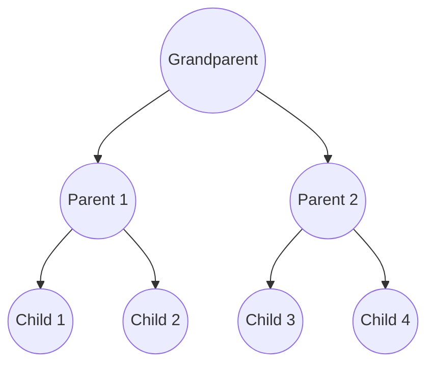
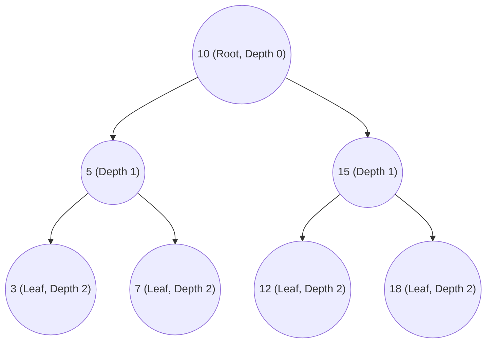
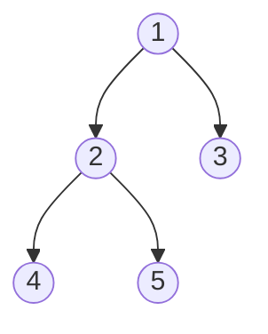
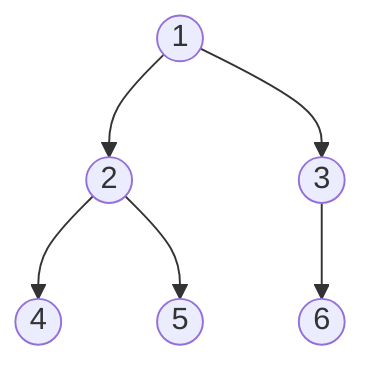
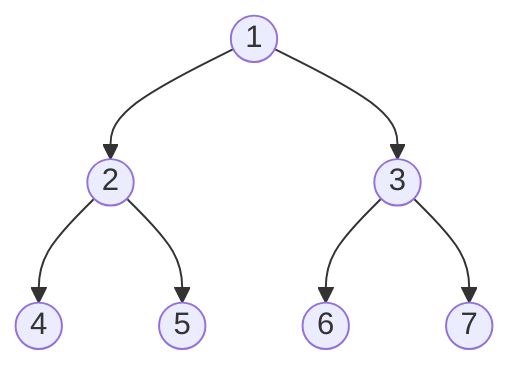
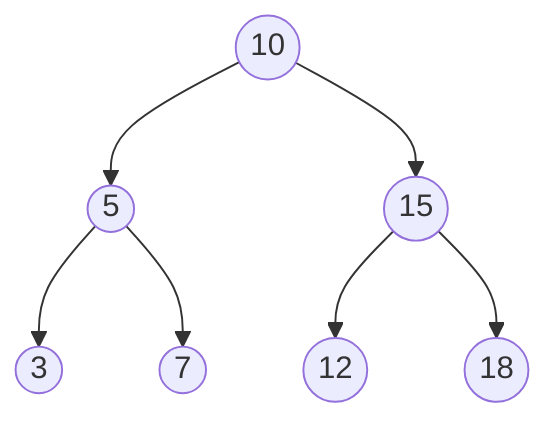
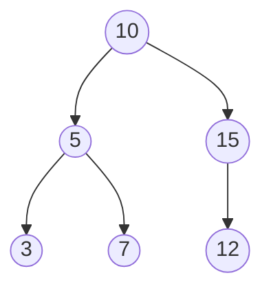
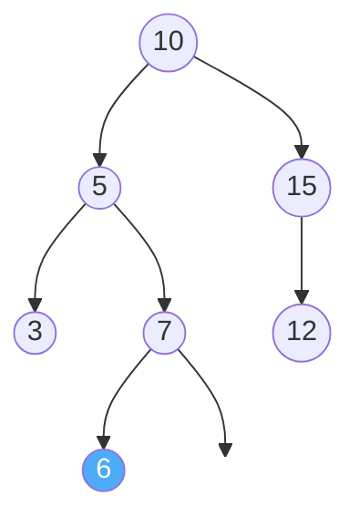
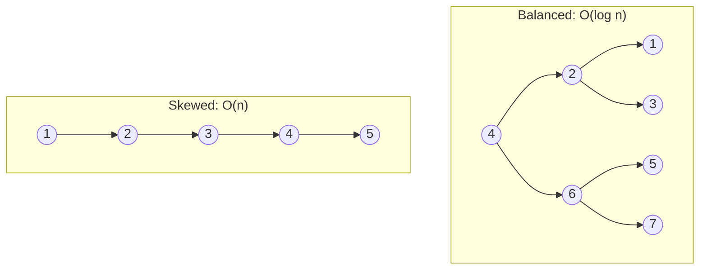

# Binary Tree

A **Binary Tree** is a data structure where each node has **at most two children**, referred to as the **left child** and the **right child**. It's one of the most important data structures in computer science — almost every interview and many real-world systems use trees.

Think of it like this: *"A tree is like an upside-down family tree — one ancestor (root) at the top, branching downward into children."*

> [!NOTE]
> Unlike arrays, linked lists, stacks, and queues which are **linear** (one item after another), a tree is **hierarchical** — it has levels, branches, and depth. This makes it powerful for organizing data that has natural parent-child relationships.

## Example: A Family Tree

The simplest way to understand a binary tree is through a family tree:



- **Grandparent** is the **root** (the topmost node).
- **Parent 1** and **Parent 2** are **children** of Grandparent.
- **Child 1** and **Child 2** are **children** of Parent 1.
- **Child 3** and **Child 4** are **children** of Parent 2.
- **Child 1**, **Child 2**, **Child 3**, **Child 4** are **leaf nodes** — they have no children of their own.

Every node has **at most 2 children**. That's what makes it a *binary* tree.

## Key Terminology

| Term        | Meaning                                                           |
| ----------- | ----------------------------------------------------------------- |
| **Root**    | The topmost node. The starting point of the tree.                 |
| **Node**    | Each element in the tree (contains data + links to children).     |
| **Edge**    | The connection between a parent and a child.                      |
| **Parent**  | A node that has children below it.                                |
| **Child**   | A node that has a parent above it.                                |
| **Leaf**    | A node with **no children** (the bottom-most nodes).              |
| **Height**  | The longest path from the root to a leaf (counted in edges).      |
| **Depth**   | The distance from the root to a specific node (counted in edges). |
| **Level**   | All nodes at the same depth. Root is level 0.                     |
| **Subtree** | Any node and all its descendants form a subtree.                  |

**Visual example:**



- **Height** of this tree = 2 (longest path: 10 → 5 → 3 = 2 edges).
- **Root** = 10, **Leaves** = 3, 7, 12, 18.

## Types of Binary Trees

### 1. Full Binary Tree
Every node has **0 or 2 children** (never just 1).



### 2. Complete Binary Tree
Every level is fully filled **except possibly the last**, and the last level is filled **from left to right**.



### 3. Perfect Binary Tree
Every level is **completely filled**. All leaves are at the same depth.



A perfect tree with height $h$ has exactly $2^{h+1} - 1$ nodes. (Height 2 → 7 nodes).

### 4. Binary Search Tree (BST)
A binary tree with a special rule: for every node, **all values in the left subtree are smaller** and **all values in the right subtree are larger**.



- Everything left of 10 (5, 3, 7) is **smaller** than 10.
- Everything right of 10 (15, 12, 18) is **larger** than 10.
- This rule applies at **every node** (not just the root).

> [!TIP]
> The BST property makes searching very fast — at each node, you know which half to look in, just like binary search. This gives $O(\log n)$ search time on balanced trees.

## Tree Traversals

**Traversal** means visiting every node in the tree exactly once. The question is: **in what order?**

There are 4 main ways, and the first 3 are named by **when you process the current node** relative to its children:

### 1. In-Order (Left → Root → Right)

Visit the left subtree first, then the current node, then the right subtree.

**Result on a BST:** Gives nodes in **sorted order**! This is the most important traversal for BSTs.

### 2. Pre-Order (Root → Left → Right)

Visit the current node first, then the left subtree, then the right subtree.

**Use case:** Creating a **copy** of the tree, or serializing it to save to a file.

### 3. Post-Order (Left → Right → Root)

Visit the left subtree, then the right subtree, then the current node last.

**Use case:** **Deleting** a tree (delete children before the parent), or calculating directory sizes.

### 4. Level-Order (BFS)

Visit nodes **level by level**, from top to bottom, left to right. This uses a **Queue** (same as Breadth-First Search).

### Step-by-Step Traversal Example

Let's trace **all 4 traversals** on this tree:



| Traversal       | Order Rule           | Result              |
| --------------- | -------------------- | ------------------- |
| **In-Order**    | Left → Root → Right  | 3, 5, 7, 10, 12, 15 |
| **Pre-Order**   | Root → Left → Right  | 10, 5, 3, 7, 15, 12 |
| **Post-Order**  | Left → Right → Root  | 3, 7, 5, 12, 15, 10 |
| **Level-Order** | Level by level (BFS) | 10, 5, 15, 3, 7, 12 |

**Tracing In-Order step by step:**

```text
Start at 10 → go left to 5 → go left to 3 → 3 has no left
  ✅ Visit 3
  Back to 5
  ✅ Visit 5
  Go right to 7 → 7 has no left
  ✅ Visit 7
  Back to 10
  ✅ Visit 10
  Go right to 15 → go left to 12 → 12 has no left
  ✅ Visit 12
  Back to 15
  ✅ Visit 15

Result: 3, 5, 7, 10, 12, 15  ← Sorted! ✅
```

> [!NOTE]
> A helpful memory trick: **In**-Order = **In** sorted order (for BSTs). **Pre**-Order = root comes **first** (pre = before). **Post**-Order = root comes **last** (post = after).

## Binary Search Tree (BST) Operations

### Search

**Logic:** Starting from the root, compare the target with the current node:
1. If target **equals** current node → Found it!
2. If target is **smaller** → Go left.
3. If target is **larger** → Go right.
4. If you reach `null` → Not found.

**Example:** Search for `7` in the tree above:

```text
10 → 7 < 10, go left
 5 → 7 > 5, go right
 7 → Found! ✅
```

Only 3 steps instead of checking all 6 nodes!

### Insert

**Logic:** Follow the same path as search. When you reach `null`, that's where the new node goes.

**Example:** Insert `6` into the tree:

```text
10 → 6 < 10, go left
 5 → 6 > 5, go right
 7 → 6 < 7, go left
 null → Insert 6 here!
```



### Delete

Deleting is the trickiest operation because we need to maintain the BST property. There are 3 cases:

1. **Node is a leaf** (no children): Simply remove it.
2. **Node has one child**: Replace the node with its child.
3. **Node has two children**: Find the **in-order successor** (smallest node in the right subtree), copy its value to the current node, then delete the successor.

## Complexity

| Operation     | Average (Balanced) | Worst Case (Skewed) |
| ------------- | ------------------ | ------------------- |
| **Search**    | $O(\log n)$        | $O(n)$              |
| **Insert**    | $O(\log n)$        | $O(n)$              |
| **Delete**    | $O(\log n)$        | $O(n)$              |
| **Traversal** | $O(n)$             | $O(n)$              |
| **Space**     | $O(n)$             | $O(n)$              |

> [!WARNING]
> The **worst case** $O(n)$ happens when the tree becomes **skewed** — basically a linked list. For example, inserting 1, 2, 3, 4, 5 in order creates a straight line to the right with no branching. To avoid this, use **self-balancing trees** (AVL, Red-Black Tree).



## Implementation

### Building a Binary Tree Node

**What the code will do:**

1. **Define a Node** with three parts: the data, a pointer to the left child, and a pointer to the right child.
2. **Insert:** Walk down the tree comparing values, go left if smaller, right if larger, until finding an empty spot.
3. **Search:** Walk down the tree the same way, return true if found.
4. **Traversals:** Use recursion — the function calls itself for the left and right subtrees.

### Python

```python
class Node:
    def __init__(self, value):
        self.value = value
        self.left = None    # Left child
        self.right = None   # Right child


class BinarySearchTree:
    def __init__(self):
        self.root = None

    def insert(self, value):
        """Insert a value into the BST."""
        if self.root is None:
            self.root = Node(value)
        else:
            self._insert_recursive(self.root, value)

    def _insert_recursive(self, node, value):
        if value < node.value:
            # Go left
            if node.left is None:
                node.left = Node(value)
            else:
                self._insert_recursive(node.left, value)
        else:
            # Go right
            if node.right is None:
                node.right = Node(value)
            else:
                self._insert_recursive(node.right, value)

    def search(self, value):
        """Search for a value in the BST. Returns True if found."""
        return self._search_recursive(self.root, value)

    def _search_recursive(self, node, value):
        if node is None:
            return False           # Reached end — not found
        if value == node.value:
            return True            # Found it!
        elif value < node.value:
            return self._search_recursive(node.left, value)   # Go left
        else:
            return self._search_recursive(node.right, value)  # Go right

    # --- Traversals ---

    def in_order(self, node, result=None):
        """Left → Root → Right (gives sorted order for BST)."""
        if result is None:
            result = []
        if node:
            self.in_order(node.left, result)
            result.append(node.value)
            self.in_order(node.right, result)
        return result

    def pre_order(self, node, result=None):
        """Root → Left → Right."""
        if result is None:
            result = []
        if node:
            result.append(node.value)
            self.pre_order(node.left, result)
            self.pre_order(node.right, result)
        return result

    def post_order(self, node, result=None):
        """Left → Right → Root."""
        if result is None:
            result = []
        if node:
            self.post_order(node.left, result)
            self.post_order(node.right, result)
            result.append(node.value)
        return result

    def level_order(self):
        """Level by level (BFS) using a Queue."""
        if self.root is None:
            return []
        from collections import deque
        result = []
        queue = deque([self.root])
        while queue:
            node = queue.popleft()
            result.append(node.value)
            if node.left:
                queue.append(node.left)
            if node.right:
                queue.append(node.right)
        return result


# --- Example ---
bst = BinarySearchTree()
for val in [10, 5, 15, 3, 7, 12]:
    bst.insert(val)

print("In-Order:   ", bst.in_order(bst.root))     # [3, 5, 7, 10, 12, 15]
print("Pre-Order:  ", bst.pre_order(bst.root))     # [10, 5, 3, 7, 15, 12]
print("Post-Order: ", bst.post_order(bst.root))    # [3, 7, 5, 12, 15, 10]
print("Level-Order:", bst.level_order())            # [10, 5, 15, 3, 7, 12]

print("Search 7: ", bst.search(7))    # True
print("Search 20:", bst.search(20))   # False
```

### Java

```java
import java.util.*;

public class BinarySearchTree {

    static class Node {
        int value;
        Node left, right;

        Node(int value) {
            this.value = value;
            this.left = null;
            this.right = null;
        }
    }

    private Node root;

    public void insert(int value) {
        root = insertRecursive(root, value);
    }

    private Node insertRecursive(Node node, int value) {
        if (node == null) return new Node(value);

        if (value < node.value)
            node.left = insertRecursive(node.left, value);
        else
            node.right = insertRecursive(node.right, value);

        return node;
    }

    public boolean search(int value) {
        return searchRecursive(root, value);
    }

    private boolean searchRecursive(Node node, int value) {
        if (node == null) return false;
        if (value == node.value) return true;
        return value < node.value
                ? searchRecursive(node.left, value)
                : searchRecursive(node.right, value);
    }

    // --- Traversals ---

    public List<Integer> inOrder(Node node) {
        List<Integer> result = new ArrayList<>();
        if (node != null) {
            result.addAll(inOrder(node.left));
            result.add(node.value);
            result.addAll(inOrder(node.right));
        }
        return result;
    }

    public List<Integer> preOrder(Node node) {
        List<Integer> result = new ArrayList<>();
        if (node != null) {
            result.add(node.value);
            result.addAll(preOrder(node.left));
            result.addAll(preOrder(node.right));
        }
        return result;
    }

    public List<Integer> postOrder(Node node) {
        List<Integer> result = new ArrayList<>();
        if (node != null) {
            result.addAll(postOrder(node.left));
            result.addAll(postOrder(node.right));
            result.add(node.value);
        }
        return result;
    }

    public List<Integer> levelOrder() {
        List<Integer> result = new ArrayList<>();
        if (root == null) return result;

        Queue<Node> queue = new LinkedList<>();
        queue.add(root);

        while (!queue.isEmpty()) {
            Node node = queue.poll();
            result.add(node.value);
            if (node.left != null) queue.add(node.left);
            if (node.right != null) queue.add(node.right);
        }
        return result;
    }

    public static void main(String[] args) {
        BinarySearchTree bst = new BinarySearchTree();
        for (int val : new int[]{10, 5, 15, 3, 7, 12}) {
            bst.insert(val);
        }

        System.out.println("In-Order:    " + bst.inOrder(bst.root));     // [3, 5, 7, 10, 12, 15]
        System.out.println("Pre-Order:   " + bst.preOrder(bst.root));    // [10, 5, 3, 7, 15, 12]
        System.out.println("Post-Order:  " + bst.postOrder(bst.root));   // [3, 7, 5, 12, 15, 10]
        System.out.println("Level-Order: " + bst.levelOrder());          // [10, 5, 15, 3, 7, 12]

        System.out.println("Search 7:  " + bst.search(7));    // true
        System.out.println("Search 20: " + bst.search(20));   // false
    }
}
```

## Trees vs. Other Data Structures

| Feature          | Array                        | Linked List            | Binary Search Tree         |
| ---------------- | ---------------------------- | ---------------------- | -------------------------- |
| **Search**       | $O(n)$ or $O(\log n)$ sorted | $O(n)$                 | $O(\log n)$ balanced       |
| **Insert**       | $O(n)$ (shifting)            | $O(1)$ at head         | $O(\log n)$ balanced       |
| **Delete**       | $O(n)$ (shifting)            | $O(1)$ if known        | $O(\log n)$ balanced       |
| **Ordered data** | Must sort                    | No                     | Always in order            |
| **Best for**     | Random access                | Frequent insert/delete | Ordered data + fast search |

## When to Use Binary Trees

- **Databases:** B-Trees (a generalization of binary trees) power database indexes. Every SQL query you run uses trees behind the scenes.
- **File Systems:** Your computer's folder structure is a tree. Each folder is a node, subfolders are children.
- **Expression Parsing:** Compilers use trees to parse math expressions like `(3 + 5) * 2`.
- **Autocomplete & Spell Check:** Trie trees (a type of tree) power the suggestions you see when typing in a search bar.
- **Decision Making:** Decision trees in machine learning split data at each node to make predictions.
- **Priority Queues:** Heaps (a type of complete binary tree) are used for priority queues, scheduling, and algorithms like Dijkstra's.

> [!TIP]
> If you need data that stays **sorted** and supports fast **search, insert, and delete**, a BST (or its self-balancing variants like AVL or Red-Black Tree) is usually the right choice.
