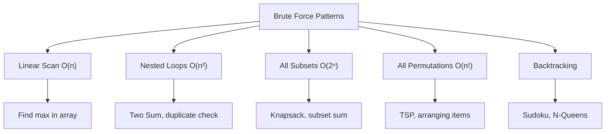
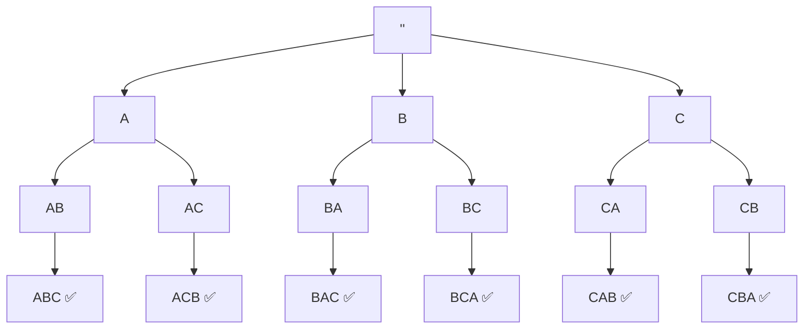
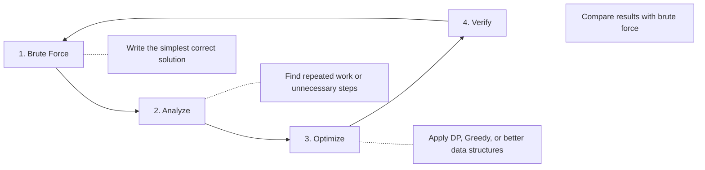

# Brute Force

**Brute Force** is the most straightforward problem-solving strategy in computer science: **try every possible solution** and pick the best one. No shortcuts, no cleverness — just raw, exhaustive checking.

Think of it like this: *"I don't know the trick, so I'll just try everything until I find the answer."*

> [!NOTE]
> Brute force is often the **first approach** you should think of when solving a new problem. It may not be fast, but it's almost always **correct** and gives you a baseline to compare smarter solutions against.

## Example: Cracking a 3-Digit Lock

Imagine you forgot the code to a 3-digit combination lock. Each digit can be 0–9.

**The brute force approach:** Try every combination from `000` to `999`.

```text
000, 001, 002, ... 009,
010, 011, 012, ... 019,
...
990, 991, 992, ... 999
```

That's **1,000 combinations** (10 × 10 × 10). You're guaranteed to find the right one — eventually. It's slow, but it works.

This is the essence of brute force: **exhaust all possibilities**.

## Why Learn Brute Force?

Brute force might sound useless compared to smarter algorithms, but it's actually essential:

1. **It always works.** When you don't know the trick for a problem, brute force gives you a correct starting point.
2. **It helps you understand the problem.** Writing a brute force solution forces you to understand what you're looking for.
3. **It's your baseline.** You can compare your optimized solution against brute force to verify correctness.
4. **Sometimes it's enough.** If the input is small (say n ≤ 20), brute force is perfectly fine.
5. **Interviewers expect it.** In coding interviews, starting with brute force before optimizing shows clear thinking.

## Common Brute Force Patterns

Most brute force solutions fall into a few patterns:

| Pattern              | What It Does                                    | Time Complexity   |
| -------------------- | ----------------------------------------------- | ----------------- |
| **Linear Scan**      | Check every element once                        | $O(n)$            |
| **Nested Loops**     | Check every pair (or triplet) of elements       | $O(n^2)$ or $O(n^3)$ |
| **Generate All Subsets** | Try every possible subset of items          | $O(2^n)$          |
| **Generate All Permutations** | Try every possible ordering           | $O(n!)$           |
| **Backtracking**     | Build solutions step by step, undo bad choices  | Varies            |



## Classic Problems & Examples

---

### Problem 1: Two Sum (Nested Loops)

**Problem:** Given an array of numbers and a target, find **two numbers** that add up to the target. Return their indices.

**Example:** `nums = [2, 7, 11, 15]`, `target = 9` → Answer: indices `[0, 1]` because `2 + 7 = 9`.

**Brute Force Strategy:** Check **every pair** of numbers.

```text
Pair (2, 7)  → 2 + 7 = 9  ✅ Found!
Pair (2, 11) → 2 + 11 = 13 ❌
Pair (2, 15) → 2 + 15 = 17 ❌
Pair (7, 11) → 7 + 11 = 18 ❌
... (we already found it)
```

#### Python

```python
def two_sum_brute(nums, target):
    """Check every pair of numbers."""
    n = len(nums)
    for i in range(n):
        for j in range(i + 1, n):
            if nums[i] + nums[j] == target:
                return [i, j]
    return []

# Example
print(two_sum_brute([2, 7, 11, 15], 9))  # Output: [0, 1]
```

#### Java

```java
public class TwoSum {
    public static int[] twoSum(int[] nums, int target) {
        for (int i = 0; i < nums.length; i++) {
            for (int j = i + 1; j < nums.length; j++) {
                if (nums[i] + nums[j] == target) {
                    return new int[]{i, j};
                }
            }
        }
        return new int[]{};
    }

    public static void main(String[] args) {
        int[] result = twoSum(new int[]{2, 7, 11, 15}, 9);
        System.out.println("[" + result[0] + ", " + result[1] + "]");
        // Output: [0, 1]
    }
}
```

**Complexity:** Time $O(n^2)$, Space $O(1)$.

> [!TIP]
> This can be optimized to $O(n)$ using a Hash Map — store each number as you go and check if `target - current` already exists. But the brute force version is the right starting point.

---

### Problem 2: Subset Sum (Generate All Subsets)

**Problem:** Given a set of numbers and a target sum, determine if **any subset** of the numbers adds up exactly to the target.

**Example:** `nums = [3, 7, 1, 8]`, `target = 11` → **Yes!** Subset `{3, 8}` adds to 11.

**Brute Force Strategy:** Generate **every possible subset** and check if its sum equals the target.

For `[3, 7, 1, 8]`, all subsets are:

```text
{}           → sum = 0
{3}          → sum = 3
{7}          → sum = 7
{1}          → sum = 1
{8}          → sum = 8
{3, 7}       → sum = 10
{3, 1}       → sum = 4
{3, 8}       → sum = 11  ✅ Found!
{7, 1}       → sum = 8
{7, 8}       → sum = 15
{1, 8}       → sum = 9
{3, 7, 1}    → sum = 11  ✅ Also works!
{3, 7, 8}    → sum = 18
{3, 1, 8}    → sum = 12
{7, 1, 8}    → sum = 16
{3, 7, 1, 8} → sum = 19
```

That's $2^4 = 16$ subsets to check.

#### Python

```python
def subset_sum_brute(nums, target):
    """Generate all subsets using bit manipulation."""
    n = len(nums)
    
    # Each number from 0 to 2^n - 1 represents a subset
    # Binary digits tell us which elements to include
    for mask in range(1 << n):  # 1 << n = 2^n
        subset = []
        total = 0
        
        for i in range(n):
            if mask & (1 << i):  # Is bit i set?
                subset.append(nums[i])
                total += nums[i]
        
        if total == target:
            return True, subset
    
    return False, []

# Example
found, subset = subset_sum_brute([3, 7, 1, 8], 11)
print(f"Found: {found}, Subset: {subset}")
# Output: Found: True, Subset: [3, 8]
```

#### Java

```java
import java.util.*;

public class SubsetSum {
    public static void main(String[] args) {
        int[] nums = {3, 7, 1, 8};
        int target = 11;
        int n = nums.length;

        // Try every subset using bit manipulation
        for (int mask = 0; mask < (1 << n); mask++) {
            int sum = 0;
            List<Integer> subset = new ArrayList<>();

            for (int i = 0; i < n; i++) {
                if ((mask & (1 << i)) != 0) {
                    sum += nums[i];
                    subset.add(nums[i]);
                }
            }

            if (sum == target) {
                System.out.println("Found! Subset: " + subset);
                return;
            }
        }
        System.out.println("No subset found.");
    }
}
// Output: Found! Subset: [3, 8]
```

**Complexity:** Time $O(2^n \times n)$, Space $O(n)$.

> [!WARNING]
> $O(2^n)$ grows extremely fast. For `n = 20`, it's about 1 million — fine. For `n = 30`, it's about 1 billion — too slow. For larger inputs, use **Dynamic Programming**.

---

### Problem 3: String Permutations (Generate All Orderings)

**Problem:** Generate **all possible arrangements** (permutations) of a string.

**Example:** `"ABC"` → `["ABC", "ACB", "BAC", "BCA", "CAB", "CBA"]`

**Brute Force Strategy:** Use **backtracking** — place each character in each position, one at a time. If a placement leads to a dead end, **undo** (backtrack) and try the next option.



#### Python

```python
def permutations(s):
    """Generate all permutations using backtracking."""
    result = []
    
    def backtrack(current, remaining):
        if not remaining:
            result.append(current)
            return
        
        for i in range(len(remaining)):
            # Choose: pick character at index i
            # Explore: recurse with remaining characters
            backtrack(
                current + remaining[i],
                remaining[:i] + remaining[i + 1:]
            )
            # Backtrack: the loop naturally moves to the next character
    
    backtrack("", s)
    return result

# Example
perms = permutations("ABC")
print(f"Total: {len(perms)}")
for p in perms:
    print(f"  {p}")

# Output:
#   Total: 6
#   ABC
#   ACB
#   BAC
#   BCA
#   CAB
#   CBA
```

#### Java

```java
import java.util.*;

public class StringPermutations {

    public static List<String> permutations(String s) {
        List<String> result = new ArrayList<>();
        backtrack("", s, result);
        return result;
    }

    private static void backtrack(String current, String remaining, List<String> result) {
        if (remaining.isEmpty()) {
            result.add(current);
            return;
        }

        for (int i = 0; i < remaining.length(); i++) {
            // Choose character at index i
            char chosen = remaining.charAt(i);
            String newRemaining = remaining.substring(0, i) + remaining.substring(i + 1);

            // Explore
            backtrack(current + chosen, newRemaining, result);
        }
    }

    public static void main(String[] args) {
        List<String> perms = permutations("ABC");
        System.out.println("Total: " + perms.size());
        for (String p : perms) {
            System.out.println("  " + p);
        }
    }
}
```

**Complexity:** Time $O(n \times n!)$, Space $O(n)$ for recursion depth.

---

### Problem 4: N-Queens (Backtracking)

**Problem:** Place **N queens** on an **N×N chessboard** so that no two queens attack each other (no two queens share the same row, column, or diagonal).

**Example:** For N = 4, one valid solution:

```text
. Q . .
. . . Q
Q . . .
. . Q .
```

**Brute Force Strategy:** Try placing a queen in each column of each row. After placing one, check if it's safe (no conflicts). If not, **backtrack** and try the next column.

#### Python

```python
def solve_n_queens(n):
    """Solve N-Queens using backtracking."""
    solutions = []
    board = [["." for _ in range(n)] for _ in range(n)]

    def is_safe(row, col):
        """Check if placing a queen at (row, col) is safe."""
        # Check column above
        for r in range(row):
            if board[r][col] == "Q":
                return False

        # Check upper-left diagonal
        r, c = row - 1, col - 1
        while r >= 0 and c >= 0:
            if board[r][c] == "Q":
                return False
            r -= 1
            c -= 1

        # Check upper-right diagonal
        r, c = row - 1, col + 1
        while r >= 0 and c < n:
            if board[r][c] == "Q":
                return False
            r -= 1
            c += 1

        return True

    def backtrack(row):
        if row == n:
            # All queens placed — save this solution
            solutions.append([r[:] for r in board])
            return

        for col in range(n):
            if is_safe(row, col):
                board[row][col] = "Q"   # Place queen
                backtrack(row + 1)       # Try next row
                board[row][col] = "."   # Backtrack (remove queen)

    backtrack(0)
    return solutions


# Example: 4-Queens
solutions = solve_n_queens(4)
print(f"Found {len(solutions)} solutions for 4-Queens:\n")

for idx, sol in enumerate(solutions):
    print(f"Solution {idx + 1}:")
    for row in sol:
        print("  " + " ".join(row))
    print()

# Output:
#   Found 2 solutions for 4-Queens:
#
#   Solution 1:
#     . Q . .
#     . . . Q
#     Q . . .
#     . . Q .
#
#   Solution 2:
#     . . Q .
#     Q . . .
#     . . . Q
#     . Q . .
```

#### Java

```java
import java.util.*;

public class NQueens {

    public static List<List<String>> solveNQueens(int n) {
        List<List<String>> solutions = new ArrayList<>();
        char[][] board = new char[n][n];
        for (char[] row : board) Arrays.fill(row, '.');

        backtrack(board, 0, n, solutions);
        return solutions;
    }

    private static boolean isSafe(char[][] board, int row, int col, int n) {
        // Check column above
        for (int r = 0; r < row; r++) {
            if (board[r][col] == 'Q') return false;
        }

        // Check upper-left diagonal
        for (int r = row - 1, c = col - 1; r >= 0 && c >= 0; r--, c--) {
            if (board[r][c] == 'Q') return false;
        }

        // Check upper-right diagonal
        for (int r = row - 1, c = col + 1; r >= 0 && c < n; r--, c++) {
            if (board[r][c] == 'Q') return false;
        }

        return true;
    }

    private static void backtrack(char[][] board, int row, int n,
                                   List<List<String>> solutions) {
        if (row == n) {
            List<String> solution = new ArrayList<>();
            for (char[] r : board) solution.add(new String(r));
            solutions.add(solution);
            return;
        }

        for (int col = 0; col < n; col++) {
            if (isSafe(board, row, col, n)) {
                board[row][col] = 'Q';
                backtrack(board, row + 1, n, solutions);
                board[row][col] = '.';  // Backtrack
            }
        }
    }

    public static void main(String[] args) {
        List<List<String>> solutions = solveNQueens(4);
        System.out.println("Found " + solutions.size() + " solutions for 4-Queens:\n");

        for (int i = 0; i < solutions.size(); i++) {
            System.out.println("Solution " + (i + 1) + ":");
            for (String row : solutions.get(i)) {
                System.out.println("  " + row.replace("", " ").trim());
            }
            System.out.println();
        }
    }
}
```

**Complexity:** Worst case $O(n!)$, but backtracking prunes many branches early, making it much faster in practice.

---

## Brute Force vs. Optimized: A Comparison

| Problem             | Brute Force          | Optimized Approach              | Speedup            |
| ------------------- | -------------------- | ------------------------------- | ------------------- |
| **Two Sum**         | $O(n^2)$ nested loop | $O(n)$ hash map                 | Much faster         |
| **Subset Sum**      | $O(2^n)$ all subsets | $O(n \times W)$ DP             | Exponential → polynomial |
| **Sorting**         | $O(n^2)$ selection sort | $O(n \log n)$ merge sort     | Significantly faster |
| **Shortest Path**   | $O(n!)$ try all paths | $O((V+E) \log V)$ Dijkstra's  | Astronomically faster |
| **String Search**   | $O(n \times m)$ scan | $O(n + m)$ KMP algorithm       | Linear improvement  |

## When Is Brute Force Acceptable?

Brute force is the right (or only) choice when:

-   **Input size is very small.** If `n ≤ 15-20`, even $O(2^n)$ runs in milliseconds. Don't over-optimize.
-   **You need a correct baseline.** Write brute force first, then use it to verify your optimized solution.
-   **No better algorithm exists.** Some problems are genuinely hard (NP-Hard). Brute force with pruning (backtracking) may be the best available.
-   **It's an interview.** Always start by describing the brute force approach, then optimize. This shows you understand the problem before jumping to tricks.

## The Brute Force to Optimization Pipeline



The best problem solvers follow this pipeline:

1. **Brute Force:** Write the simplest correct solution first. Don't worry about speed.
2. **Analyze:** Look at what the brute force is doing. Is it repeating work? (→ DP). Is it exploring paths it shouldn't? (→ Pruning/Greedy). Is it scanning too much? (→ Better data structure).
3. **Optimize:** Apply the right technique based on your analysis.
4. **Verify:** Test your optimized solution against the brute force on small inputs to make sure it's still correct.

> [!IMPORTANT]
> In coding interviews, **always mention the brute force approach first**, even if you know the optimal solution. Say: *"The brute force would be O(n²) using nested loops. Can I optimize it?"* This shows structured thinking and gives you a fallback if you get stuck on the optimization.
