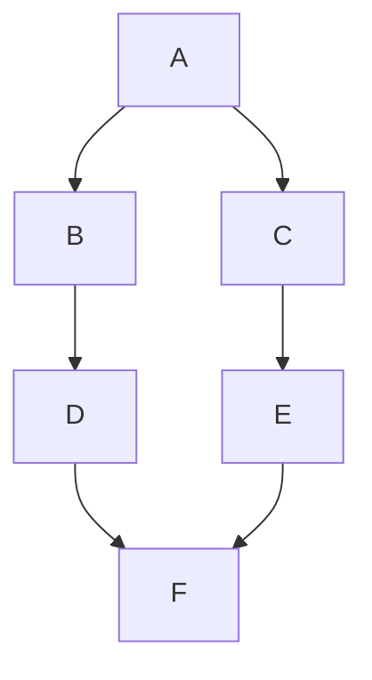
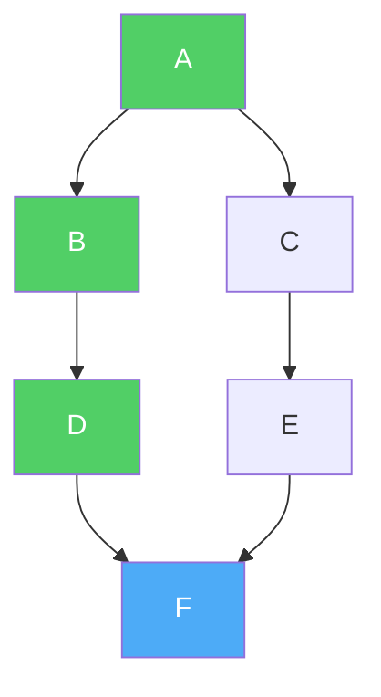
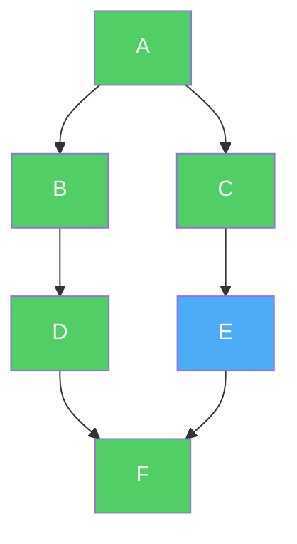
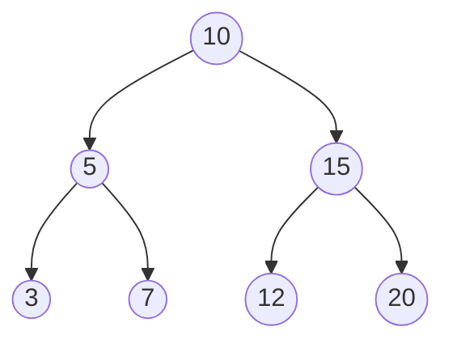

# Depth-First Search (DFS)

**Depth-First Search (DFS)** is a fundamental algorithm used for traversing or searching through data structures like **Trees** and **Graphs**.

It explores the data structure by going **as deep as possible** along one path before backtracking and trying another path. Instead of spreading out level by level like BFS, DFS dives straight down one branch until it hits a dead end, then comes back and tries the next branch.

## Real-Life Analogy: Exploring a Maze

Imagine you are trapped in a maze and need to find the exit.

**How DFS does it:**
1. **Pick a path** and keep walking forward. At every fork, always take the **leftmost** path you haven't tried yet.
2. **Hit a dead end?** Turn around and walk back to the last fork you passed.
3. **At the fork,** take the **next untried path** and keep going deep again.
4. **Repeat** until you find the exit or have explored every path.

You go as **deep** as possible in one direction before backtracking. This is the core idea of DFS.

*(Note: The opposite approach would be to explore all paths one step at a time, spreading outward evenly. That is called Breadth-First Search or BFS.)*

## The Secret Ingredient: A Stack

While Breadth-First Search (BFS) uses a **Queue** (First-In, First-Out), Depth-First Search (DFS) uses a **Stack** (Last-In, First-Out).

The stack keeps track of which nodes to visit next. When you visit a node, you push its neighbors onto the stack. Because a stack processes the **most recently added** item first, you always dive deeper before coming back to earlier nodes.

> [!TIP]
> DFS can be implemented in two ways: (1) **Explicitly** using a stack data structure, or (2) **Implicitly** using **recursion** (since the function call stack acts as the stack). The recursive approach is simpler and more commonly used.

## How It Works (The Logic)

### Recursive Approach (Most Common)

1. Start at a node. Mark it as **Visited**.
2. Process the node (e.g., print its value).
3. For each **unvisited neighbor** of this node:
   - **Recursively call DFS** on that neighbor.
4. When all neighbors are visited, the function returns (this is the **backtracking**).

### Iterative Approach (Using a Stack)

1. Pick a starting node and **push** it onto the **Stack**.
2. **While the Stack is not empty:**
   - **Pop** the top node from the stack. This is your `current_node`.
   - If `current_node` is **not visited**:
     - Mark it as **Visited** and process it.
     - **Push** all its **unvisited neighbors** onto the stack.

## Step-by-Step Example

Let's trace a DFS on a simple graph.

**The Graph:**


**Goal:** Traverse the whole graph starting from **A** using DFS (recursive).

```text
DFS(A):
  Visit A → neighbors are B, C
  │
  ├── DFS(B):
  │     Visit B → neighbor is D
  │     │
  │     └── DFS(D):
  │           Visit D → neighbor is F
  │           │
  │           └── DFS(F):
  │                 Visit F → neighbors are (none unvisited)
  │                 Backtrack to D ↩
  │           Backtrack to B ↩
  │     Backtrack to A ↩
  │
  └── DFS(C):
        Visit C → neighbor is E
        │
        └── DFS(E):
              Visit E → neighbor F is already visited
              Backtrack to C ↩
        Backtrack to A ↩

Done! ✅
```

**Final Traversal Order:** A, B, D, F, C, E

Notice the difference from BFS:
- **BFS order:** A, B, C, D, E, F (level by level — all neighbors first)
- **DFS order:** A, B, D, F, C, E (goes deep into A→B→D→F before backtracking to try C)

> [!NOTE]
> The exact DFS order can vary depending on which neighbor you visit first. If we visited C before B, the order would be: A, C, E, F, B, D. Both are valid DFS traversals.

## Visual Walkthrough

Let's see each step visually. Green = visited, blue = currently processing.

**Step 1:** Start at A, go deep → A → B → D → F



**Step 2:** F has no unvisited neighbors → backtrack to D → B → A, then explore C → E



**Step 3:** E's neighbor F is already visited → backtrack. All nodes visited. Done! ✅

## DFS on a Tree

DFS is especially natural on trees. In fact, the three classic tree traversals — **Pre-Order**, **In-Order**, and **Post-Order** — are all variations of DFS:

| Tree Traversal | DFS Variation                                 |
| -------------- | --------------------------------------------- |
| **Pre-Order**  | Process node **before** visiting children     |
| **In-Order**   | Process node **between** left and right child |
| **Post-Order** | Process node **after** visiting children      |

**Example tree:**



| Traversal      | Process When?    | Result                  |
| -------------- | ---------------- | ----------------------- |
| **Pre-Order**  | Before children  | 10, 5, 3, 7, 15, 12, 20 |
| **In-Order**   | Between children | 3, 5, 7, 10, 12, 15, 20 |
| **Post-Order** | After children   | 3, 7, 5, 12, 20, 15, 10 |

> [!NOTE]
> All three tree traversals are just DFS with different timing of when you "process" the current node. The visiting order of children stays the same — always left first, then right.

## Complexity

- **Time Complexity:** $O(V + E)$
  - `V` is the number of Vertices (nodes). You visit every node exactly once.
  - `E` is the number of Edges (connections). When visiting a node, you check all of its edges.
  - Same as BFS — both algorithms must look at every node and every edge.
- **Space Complexity:** $O(V)$
  - The recursion stack (or explicit stack) can grow up to the **depth** of the graph.
  - In the worst case (a long straight path), the stack holds all `V` nodes.
  - You also need memory for the `Visited` set, which grows up to `V`.

## Implementation

### Python

#### Recursive DFS (Most Common)

```python
def dfs_recursive(graph, node, visited=None):
    # Initialize visited set on the first call
    if visited is None:
        visited = set()

    # Mark the current node as visited
    visited.add(node)
    print(node, end=" ")

    # Visit all unvisited neighbors
    for neighbor in graph[node]:
        if neighbor not in visited:
            dfs_recursive(graph, neighbor, visited)

# Example Graph (Adjacency List)
# A -> B, C
# B -> D
# C -> E
# D -> F
# E -> F
# F -> (none)
my_graph = {
    'A': ['B', 'C'],
    'B': ['D'],
    'C': ['E'],
    'D': ['F'],
    'E': ['F'],
    'F': []
}

print("DFS Traversal (Recursive):")
dfs_recursive(my_graph, 'A')
# Output: A B D F C E
```

#### Iterative DFS (Using a Stack)

```python
def dfs_iterative(graph, start_node):
    visited = set()
    stack = [start_node]
    result = []

    while stack:
        # Pop the top node from the stack
        node = stack.pop()

        if node not in visited:
            visited.add(node)
            result.append(node)

            # Push neighbors onto the stack (reversed to maintain left-to-right order)
            for neighbor in reversed(graph[node]):
                if neighbor not in visited:
                    stack.append(neighbor)

    return result

my_graph = {
    'A': ['B', 'C'],
    'B': ['D'],
    'C': ['E'],
    'D': ['F'],
    'E': ['F'],
    'F': []
}

print("DFS Traversal (Iterative):", dfs_iterative(my_graph, 'A'))
# Output: DFS Traversal (Iterative): ['A', 'B', 'D', 'F', 'C', 'E']
```

> [!NOTE]
> In the iterative version, we push neighbors in **reversed** order onto the stack. Since a stack is LIFO (Last-In, First-Out), reversing ensures that the leftmost neighbor gets popped and processed first — matching the order of the recursive version.

### Java

#### Recursive DFS

```java
import java.util.*;

public class DepthFirstSearch {

    public static void dfsRecursive(Map<String, List<String>> graph, String node, Set<String> visited) {
        // Mark the current node as visited
        visited.add(node);
        System.out.print(node + " ");

        // Visit all unvisited neighbors
        List<String> neighbors = graph.getOrDefault(node, new ArrayList<>());
        for (String neighbor : neighbors) {
            if (!visited.contains(neighbor)) {
                dfsRecursive(graph, neighbor, visited);
            }
        }
    }

    public static void main(String[] args) {
        Map<String, List<String>> graph = new HashMap<>();
        graph.put("A", Arrays.asList("B", "C"));
        graph.put("B", Arrays.asList("D"));
        graph.put("C", Arrays.asList("E"));
        graph.put("D", Arrays.asList("F"));
        graph.put("E", Arrays.asList("F"));
        graph.put("F", new ArrayList<>());

        System.out.print("DFS Traversal (Recursive): ");
        dfsRecursive(graph, "A", new HashSet<>());
        // Output: DFS Traversal (Recursive): A B D F C E
    }
}
```

#### Iterative DFS

```java
import java.util.*;

public class DFSIterative {

    public static List<String> dfsIterative(Map<String, List<String>> graph, String startNode) {
        Set<String> visited = new HashSet<>();
        Stack<String> stack = new Stack<>();
        List<String> result = new ArrayList<>();

        stack.push(startNode);

        while (!stack.isEmpty()) {
            String node = stack.pop();

            if (!visited.contains(node)) {
                visited.add(node);
                result.add(node);

                // Push neighbors in reverse order to maintain left-to-right processing
                List<String> neighbors = graph.getOrDefault(node, new ArrayList<>());
                for (int i = neighbors.size() - 1; i >= 0; i--) {
                    if (!visited.contains(neighbors.get(i))) {
                        stack.push(neighbors.get(i));
                    }
                }
            }
        }
        return result;
    }

    public static void main(String[] args) {
        Map<String, List<String>> graph = new HashMap<>();
        graph.put("A", Arrays.asList("B", "C"));
        graph.put("B", Arrays.asList("D"));
        graph.put("C", Arrays.asList("E"));
        graph.put("D", Arrays.asList("F"));
        graph.put("E", Arrays.asList("F"));
        graph.put("F", new ArrayList<>());

        System.out.println("DFS Traversal (Iterative): " + dfsIterative(graph, "A"));
        // Output: DFS Traversal (Iterative): [A, B, D, F, C, E]
    }
}
```

## When to Use DFS

DFS is the go-to algorithm when you need to **explore all possibilities** or work with **paths and connectivity**:

- **Maze Solving:** Finding a path from start to exit — go deep into one corridor, backtrack if it's a dead end.
- **Cycle Detection:** Detecting if a graph has a cycle (loop). If DFS encounters a node that's already on the current path, there's a cycle.
- **Topological Sorting:** Ordering tasks with dependencies (e.g., course prerequisites). DFS processes nodes in an order that respects dependencies.
- **Connected Components:** Finding all groups of connected nodes in an undirected graph — run DFS from each unvisited node to discover each group.
- **Path Finding:** Checking if a path exists between two nodes, or finding all possible paths.
- **Puzzle Solving:** Sudoku, N-Queens, and other constraint-satisfaction problems use DFS (backtracking) to try possibilities and undo choices that don't work.

## Example: Detecting a Cycle in a Directed Graph

A common DFS application. We use a `rec_stack` (recursion stack) to track nodes in the **current DFS path**. If we encounter a node already in the current path, we've found a cycle.

### Python Cycle Detection

```python
def has_cycle(graph):
    visited = set()
    rec_stack = set()  # Tracks nodes in the current DFS path

    def dfs(node):
        visited.add(node)
        rec_stack.add(node)

        for neighbor in graph.get(node, []):
            if neighbor not in visited:
                if dfs(neighbor):
                    return True  # Cycle found deeper in the path
            elif neighbor in rec_stack:
                return True      # Found a back edge → cycle!

        rec_stack.remove(node)   # Remove from path when backtracking
        return False

    # Run DFS from every unvisited node (handles disconnected graphs)
    for node in graph:
        if node not in visited:
            if dfs(node):
                return True

    return False

# Graph WITH a cycle: A → B → C → A
cyclic_graph = {
    'A': ['B'],
    'B': ['C'],
    'C': ['A']   # ← This creates a cycle!
}

# Graph WITHOUT a cycle: A → B → C
acyclic_graph = {
    'A': ['B'],
    'B': ['C'],
    'C': []
}

print("Cyclic graph has cycle:", has_cycle(cyclic_graph))    # True
print("Acyclic graph has cycle:", has_cycle(acyclic_graph))  # False
```

### Java Cycle Detection

```java
import java.util.*;

public class CycleDetection {

    public static boolean hasCycle(Map<String, List<String>> graph) {
        Set<String> visited = new HashSet<>();
        Set<String> recStack = new HashSet<>();

        for (String node : graph.keySet()) {
            if (!visited.contains(node)) {
                if (dfs(graph, node, visited, recStack)) {
                    return true;
                }
            }
        }
        return false;
    }

    private static boolean dfs(Map<String, List<String>> graph, String node,
                               Set<String> visited, Set<String> recStack) {
        visited.add(node);
        recStack.add(node);

        List<String> neighbors = graph.getOrDefault(node, new ArrayList<>());
        for (String neighbor : neighbors) {
            if (!visited.contains(neighbor)) {
                if (dfs(graph, neighbor, visited, recStack)) {
                    return true;
                }
            } else if (recStack.contains(neighbor)) {
                return true; // Back edge found → cycle!
            }
        }

        recStack.remove(node);
        return false;
    }

    public static void main(String[] args) {
        // Graph WITH a cycle
        Map<String, List<String>> cyclicGraph = new HashMap<>();
        cyclicGraph.put("A", Arrays.asList("B"));
        cyclicGraph.put("B", Arrays.asList("C"));
        cyclicGraph.put("C", Arrays.asList("A")); // Cycle!

        // Graph WITHOUT a cycle
        Map<String, List<String>> acyclicGraph = new HashMap<>();
        acyclicGraph.put("A", Arrays.asList("B"));
        acyclicGraph.put("B", Arrays.asList("C"));
        acyclicGraph.put("C", new ArrayList<>());

        System.out.println("Cyclic graph has cycle: " + hasCycle(cyclicGraph));    // true
        System.out.println("Acyclic graph has cycle: " + hasCycle(acyclicGraph));  // false
    }
}
```

## BFS vs DFS — When to Use Which?

| Criteria                       | BFS                                 | DFS                                 |
| ------------------------------ | ----------------------------------- | ----------------------------------- |
| **Data structure**             | Queue (FIFO)                        | Stack / Recursion (LIFO)            |
| **Exploration style**          | Level by level (wide)               | Path by path (deep)                 |
| **Shortest path (unweighted)** | ✅ Guaranteed                        | ❌ Not guaranteed                    |
| **Memory usage**               | Can be high (stores entire level)   | Usually lower (stores one path)     |
| **Complete?**                  | ✅ Always finds a solution if exists | ✅ Always finds a solution if exists |
| **Best for**                   | Shortest path, nearest neighbor     | Exhaustive search, backtracking     |
| **Cycle detection**            | Possible                            | ✅ Natural fit                       |
| **Topological sort**           | ✅ Kahn's algorithm                  | ✅ Natural fit                       |

> [!TIP]
> **Rule of thumb:** If the question asks for the **shortest** path or **minimum** steps → use **BFS**. If the question asks you to **explore all possibilities**, **detect cycles**, or involves **backtracking** → use **DFS**.

## Key Takeaways

- DFS explores by going **as deep as possible** before backtracking — think of it as exploring a maze one corridor at a time.
- It uses a **Stack** (explicitly or via recursion's call stack).
- Time and space complexity are both **$O(V + E)$** — same as BFS.
- DFS is the foundation for **tree traversals** (pre-order, in-order, post-order).
- Use DFS for **cycle detection**, **topological sorting**, **connected components**, and **backtracking** problems (puzzles, permutations).
- Use BFS (not DFS) when you need the **shortest path** in an unweighted graph.
- DFS can be **recursive** (simpler to write) or **iterative** (avoids stack overflow on very deep graphs).
