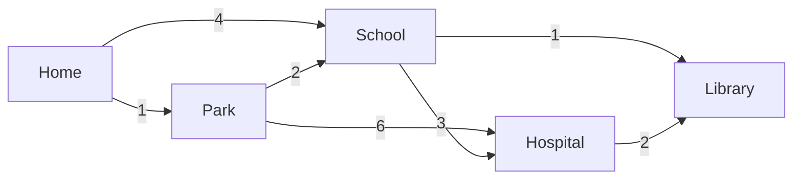

# Dijkstra's Algorithm

Dijkstra's Algorithm finds the **shortest path** from a starting node to every other node in a **weighted graph** (where edges have costs/distances). It was invented by computer scientist Edsger W. Dijkstra in 1956.

Think of it as answering the question: *"What is the cheapest way to get from point A to every other point?"*

> [!NOTE]
> BFS can find the shortest path in an **unweighted** graph (where every edge costs the same). Dijkstra's goes further — it works on **weighted** graphs where each edge has a different cost. However, it does **not** work with **negative edge weights**. For that, you need the Bellman-Ford algorithm.

## Example: Finding the Cheapest Route

Imagine you are at **Home** and want to figure out the cheapest taxi fare to every other place in your city. Each road has a different fare printed on it.



You could take many different routes to get to the **Hospital**:
-   Home → School → Hospital = 4 + 3 = **7**
-   Home → Park → Hospital = 1 + 6 = **7**
-   Home → Park → School → Hospital = 1 + 2 + 3 = **6** ✅ Cheapest!

Dijkstra's Algorithm finds these cheapest routes to **all** destinations automatically, without you having to manually check every possibility.

## The Core Idea: Greedy & Relaxation

Dijkstra's works on two simple principles:

1.  **Greedy Choice:** Always pick the unvisited node with the **smallest known distance** next. If we've found a cheap way to get somewhere, explore from there first.
2.  **Relaxation:** When you visit a node, check all its neighbors. If going *through this node* offers a shorter path to a neighbor than what we previously knew, **update** (relax) the neighbor's distance.

> [!TIP]
> "Relaxation" means: *"Hey, I found a shorter route to you! Let me update your distance."* The word comes from the idea of "loosening" an overestimate down to the true shortest distance.

## The Secret Ingredient: A Priority Queue (Min-Heap)

To always pick the node with the smallest distance efficiently, Dijkstra's uses a **Priority Queue** (often implemented as a Min-Heap). Instead of scanning all nodes to find the minimum (which would be slow), the priority queue hands you the smallest one instantly.

| Without Priority Queue | With Priority Queue (Min-Heap) |
| ---------------------- | ------------------------------ |
| Pick minimum: $O(V)$   | Pick minimum: $O(\log V)$      |
| Total: $O(V^2)$        | Total: $O((V + E) \log V)$     |

## How It Works (Step-by-Step Logic)

1.  Set the distance to the **start node** as `0` and the distance to **all other nodes** as `∞` (infinity).
2.  Add the start node to the **Priority Queue**.
3.  **While the Priority Queue is not empty:**
    *   Pull out the node with the **smallest distance** (call it `current`).
    *   If `current` has already been visited, skip it.
    *   Mark `current` as **visited**.
    *   For each **neighbor** of `current`:
        *   Calculate `new_distance = distance[current] + edge_weight(current, neighbor)`.
        *   If `new_distance < distance[neighbor]` (we found a shorter path!):
            *   Update `distance[neighbor] = new_distance`.
            *   Add the neighbor to the Priority Queue with its new distance.

## Step-by-Step Example

Let's trace Dijkstra's on the city map from our example. We start at **Home** and want to find the shortest distance to every node.

**The Graph:**


**Setup:**

| Node     | Distance | Visited |
| -------- | -------- | ------- |
| Home     | 0        | No      |
| Park     | ∞        | No      |
| School   | ∞        | No      |
| Hospital | ∞        | No      |
| Library  | ∞        | No      |

Priority Queue: `[(0, Home)]`

---

**Step 1: Process `Home` (distance = 0)**

Pull `Home` from the queue. Look at its neighbors:
-   Park: `0 + 1 = 1` < ∞ → Update Park to **1**
-   School: `0 + 4 = 4` < ∞ → Update School to **4**

| Node     | Distance | Visited |
| -------- | -------- | ------- |
| Home     | 0        | ✅ Yes   |
| Park     | **1**    | No      |
| School   | **4**    | No      |
| Hospital | ∞        | No      |
| Library  | ∞        | No      |

Priority Queue: `[(1, Park), (4, School)]`

---

**Step 2: Process `Park` (distance = 1)** — smallest in queue

Pull `Park` from the queue. Look at its neighbors:
-   School: `1 + 2 = 3` < 4 → Update School to **3** *(Relaxation! We found a shorter route via Park)*
-   Hospital: `1 + 6 = 7` < ∞ → Update Hospital to **7**

| Node     | Distance | Visited |
| -------- | -------- | ------- |
| Home     | 0        | ✅ Yes   |
| Park     | 1        | ✅ Yes   |
| School   | **3**    | No      |
| Hospital | **7**    | No      |
| Library  | ∞        | No      |

Priority Queue: `[(3, School), (4, School), (7, Hospital)]`

> [!NOTE]
> Notice the queue has School listed twice (with distance 4 and distance 3). That's okay — when we later pull `(4, School)`, School will already be visited, so we'll just skip it.

---

**Step 3: Process `School` (distance = 3)** — smallest in queue

Pull `School`. Look at its neighbors:
-   Hospital: `3 + 3 = 6` < 7 → Update Hospital to **6** *(Relaxation again!)*
-   Library: `3 + 1 = 4` < ∞ → Update Library to **4**

| Node     | Distance | Visited |
| -------- | -------- | ------- |
| Home     | 0        | ✅ Yes   |
| Park     | 1        | ✅ Yes   |
| School   | 3        | ✅ Yes   |
| Hospital | **6**    | No      |
| Library  | **4**    | No      |

Priority Queue: `[(4, School), (4, Library), (6, Hospital), (7, Hospital)]`

---

**Step 4: Process `(4, School)` — already visited, SKIP**

**Step 5: Process `Library` (distance = 4)** — next smallest

Pull `Library`. It has no outgoing neighbors in our graph. Nothing to update.

| Node     | Distance | Visited |
| -------- | -------- | ------- |
| Home     | 0        | ✅ Yes   |
| Park     | 1        | ✅ Yes   |
| School   | 3        | ✅ Yes   |
| Hospital | 6        | No      |
| Library  | 4        | ✅ Yes   |

---

**Step 6: Process `Hospital` (distance = 6)**

Pull `Hospital`. Neighbor:
-   Library: `6 + 2 = 8` > 4 → No update (current path to Library is already shorter).

| Node     | Distance | Visited |
| -------- | -------- | ------- |
| Home     | 0        | ✅ Yes   |
| Park     | 1        | ✅ Yes   |
| School   | 3        | ✅ Yes   |
| Hospital | 6        | ✅ Yes   |
| Library  | 4        | ✅ Yes   |

**Step 7: Process `(7, Hospital)` — already visited, SKIP**

Priority Queue is empty. **Done!**

---

### Final Shortest Distances from Home

| Destination | Shortest Distance | Shortest Path                   |
| ----------- | ----------------- | ------------------------------- |
| Home        | 0                 | Home                            |
| Park        | 1                 | Home → Park                     |
| School      | 3                 | Home → Park → School            |
| Library     | 4                 | Home → Park → School → Library  |
| Hospital    | 6                 | Home → Park → School → Hospital |

## Complexity

-   **Time Complexity:** $O((V + E) \log V)$ when using a **Min-Heap** (Priority Queue).
    -   Each vertex is pulled from the heap at most once: $O(V \log V)$.
    -   Each edge may cause a heap insertion: $O(E \log V)$.
    -   Combined: $O((V + E) \log V)$.
-   **Space Complexity:** $O(V + E)$
    -   $O(V)$ for the distance array and visited set.
    -   $O(E)$ for the adjacency list.
    -   $O(V)$ for the priority queue in the worst case.

## Implementation

### Python

Python's `heapq` module provides a Min-Heap that works perfectly for Dijkstra's.

```python
import heapq

def dijkstra(graph, start):
    # 1. Initialize distances to infinity for all nodes
    distances = {node: float('inf') for node in graph}
    distances[start] = 0

    # 2. Priority queue: (distance, node)
    # heapq is a min-heap, so the smallest distance is always popped first
    priority_queue = [(0, start)]

    # 3. Keep track of visited nodes
    visited = set()

    # 4. To reconstruct the shortest path, track the previous node
    previous = {node: None for node in graph}

    while priority_queue:
        # Pop the node with the smallest distance
        current_distance, current_node = heapq.heappop(priority_queue)

        # If already visited, skip (we found a shorter path before)
        if current_node in visited:
            continue

        visited.add(current_node)

        # Look at all neighbors of the current node
        for neighbor, weight in graph[current_node]:
            if neighbor in visited:
                continue

            new_distance = current_distance + weight

            # Relaxation: Did we find a shorter path to this neighbor?
            if new_distance < distances[neighbor]:
                distances[neighbor] = new_distance
                previous[neighbor] = current_node
                heapq.heappush(priority_queue, (new_distance, neighbor))

    return distances, previous


def reconstruct_path(previous, start, target):
    """Walk backwards from target to start using the 'previous' map."""
    path = []
    current = target
    while current is not None:
        path.append(current)
        current = previous[current]
    path.reverse()

    # If the path doesn't start with 'start', the target is unreachable
    if path[0] != start:
        return []
    return path


# --- Example: The city map from our analogy ---
# Graph is represented as: { node: [(neighbor, weight), ...] }
city_map = {
    "Home":     [("School", 4), ("Park", 1)],
    "Park":     [("School", 2), ("Hospital", 6)],
    "School":   [("Hospital", 3), ("Library", 1)],
    "Hospital": [("Library", 2)],
    "Library":  []
}

distances, previous = dijkstra(city_map, "Home")

print("Shortest distances from Home:")
for node, dist in distances.items():
    path = reconstruct_path(previous, "Home", node)
    print(f"  {node}: {dist}  |  Path: {' → '.join(path)}")

# Output:
#   Home: 0       |  Path: Home
#   Park: 1       |  Path: Home → Park
#   School: 3     |  Path: Home → Park → School
#   Hospital: 6   |  Path: Home → Park → School → Hospital
#   Library: 4    |  Path: Home → Park → School → Library
```

### Java

In Java, we use `PriorityQueue` for the min-heap. We store `(distance, node)` pairs and let the priority queue sort by distance.

```java
import java.util.*;

public class DijkstrasAlgorithm {

    /**
     * Runs Dijkstra's algorithm and returns shortest distances
     * and a 'previous' map for path reconstruction.
     */
    public static Map<String, Integer> dijkstra(
            Map<String, List<int[]>> graph,   // node -> [(neighborIndex, weight)]
            Map<String, List<String>> adjList, // node -> [neighbor names]
            String start) {

        // Simpler approach: store adjacency as node -> list of (neighbor, weight) pairs
        // We'll use a combined structure below.
        return null; // See the cleaner version below
    }

    // --- Clean implementation using a Pair class ---

    static class Edge {
        String target;
        int weight;

        Edge(String target, int weight) {
            this.target = target;
            this.weight = weight;
        }
    }

    public static void main(String[] args) {
        // Build the graph: node -> list of edges
        Map<String, List<Edge>> graph = new HashMap<>();
        graph.put("Home",     List.of(new Edge("School", 4), new Edge("Park", 1)));
        graph.put("Park",     List.of(new Edge("School", 2), new Edge("Hospital", 6)));
        graph.put("School",   List.of(new Edge("Hospital", 3), new Edge("Library", 1)));
        graph.put("Hospital", List.of(new Edge("Library", 2)));
        graph.put("Library",  List.of());

        // --- Run Dijkstra's ---
        Map<String, Integer> distances = new HashMap<>();
        Map<String, String> previous = new HashMap<>();
        Set<String> visited = new HashSet<>();

        // Initialize all distances to infinity
        for (String node : graph.keySet()) {
            distances.put(node, Integer.MAX_VALUE);
            previous.put(node, null);
        }
        distances.put("Home", 0);

        // Priority queue: (distance, node) — sorted by distance
        PriorityQueue<int[]> pq = new PriorityQueue<>(Comparator.comparingInt(a -> a[0]));
        // We need String mapping, so let's use a different approach:
        // Store (distance, nodeIndex) but for clarity, let's use a simple pair-like array
        // with a list to map index -> node name.

        // Cleaner: use PriorityQueue of String[] or a record
        PriorityQueue<Map.Entry<Integer, String>> minHeap = new PriorityQueue<>(
                Comparator.comparingInt(Map.Entry::getKey)
        );
        minHeap.add(Map.entry(0, "Home"));

        while (!minHeap.isEmpty()) {
            Map.Entry<Integer, String> entry = minHeap.poll();
            int currentDist = entry.getKey();
            String currentNode = entry.getValue();

            // Skip if already visited
            if (visited.contains(currentNode)) {
                continue;
            }
            visited.add(currentNode);

            // Explore neighbors
            for (Edge edge : graph.getOrDefault(currentNode, List.of())) {
                if (visited.contains(edge.target)) {
                    continue;
                }

                int newDist = currentDist + edge.weight;

                // Relaxation
                if (newDist < distances.get(edge.target)) {
                    distances.put(edge.target, newDist);
                    previous.put(edge.target, currentNode);
                    minHeap.add(Map.entry(newDist, edge.target));
                }
            }
        }

        // --- Print results ---
        System.out.println("Shortest distances from Home:");
        for (String node : graph.keySet()) {
            // Reconstruct path
            List<String> path = new ArrayList<>();
            String curr = node;
            while (curr != null) {
                path.add(curr);
                curr = previous.get(curr);
            }
            Collections.reverse(path);

            System.out.println("  " + node + ": " + distances.get(node)
                    + "  |  Path: " + String.join(" → ", path));
        }
        // Output:
        //   Home: 0       |  Path: Home
        //   Park: 1       |  Path: Home → Park
        //   School: 3     |  Path: Home → Park → School
        //   Hospital: 6   |  Path: Home → Park → School → Hospital
        //   Library: 4    |  Path: Home → Park → School → Library
    }
}
```

## Dijkstra's vs. Other Shortest Path Algorithms

| Feature               | Dijkstra's                           | BFS                       | Bellman-Ford                      |
| --------------------- | ------------------------------------ | ------------------------- | --------------------------------- |
| **Graph type**        | Weighted (no negative edges)         | Unweighted only           | Weighted (handles negative edges) |
| **Time Complexity**   | $O((V + E) \log V)$                  | $O(V + E)$                | $O(V \cdot E)$                    |
| **Approach**          | Greedy (priority queue)              | Level-by-level (queue)    | Relax all edges V-1 times         |
| **Negative weights?** | ❌ No                                 | N/A                       | ✅ Yes                             |
| **Use when**          | Need shortest path in weighted graph | All edges have equal cost | Graph has negative edge weights   |

## When to Use Dijkstra's

-   **GPS Navigation (Google Maps, Waze):** Roads have different lengths. Find the shortest/fastest route from your location to a destination.
-   **Network Routing (OSPF Protocol):** Routers use Dijkstra's to determine the best path for data packets across the internet.
-   **Flight/Train Booking:** Find the cheapest connecting flights or train routes between two cities.
-   **Game AI:** Pathfinding for characters on a weighted grid (terrain with different movement costs like grass, mud, water).
-   **Social Networks:** Find the "closest" connection between two people where edges are weighted by relationship strength.

> [!CAUTION]
> Dijkstra's algorithm **does not work** with negative edge weights. If a graph has negative weights, the greedy assumption breaks — a path that looks expensive now might become cheaper later through a negative edge. Use **Bellman-Ford** for those cases.
