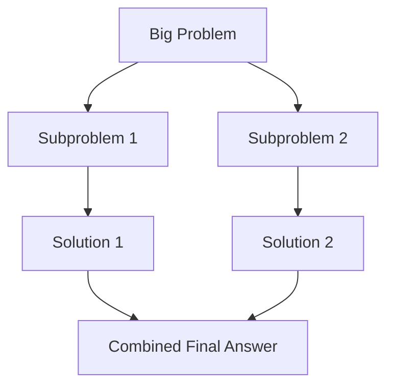

# Divide and Conquer (D&C)

**Divide and Conquer** is not a specific algorithm — it's a **strategy** (a way of thinking) for solving problems. The idea is simple: if a problem is too big to solve directly, **break it into smaller pieces**, solve each piece, and then **combine the answers**.

Many famous algorithms — Merge Sort, Quicksort, Binary Search — are all built on this one strategy.

## The Three Steps

Every Divide and Conquer algorithm follows the same three steps:

1. **Divide:** Break the problem into smaller subproblems of the same type.
2. **Conquer:** Solve each subproblem. If a subproblem is small enough, solve it directly (this is the **base case**).
3. **Combine:** Merge the solutions of the subproblems to get the final answer.



## Real-Life Analogy: Counting a Huge Crowd

Imagine you're a volunteer at a concert and the organizer asks: *"How many people are here?"*

**Without D&C (Brute Force):** You stand at the entrance and try to count every single person in the crowd. It takes forever, you lose track, and you have to restart.

**With D&C:**
1. **Divide:** You split the crowd into **4 sections** — front-left, front-right, back-left, back-right. You assign one volunteer to each section.
2. **Conquer:** Each volunteer counts their smaller section. If a section is still too big, they split it further and pass it on. Eventually, someone is counting a small group of 5-10 people — easy! (base case).
3. **Combine:** Each volunteer reports back their number. You **add them all up** to get the total.

The same counting work gets done, but by breaking it into smaller pieces, each piece becomes manageable, and the whole job finishes much faster.

> [!NOTE]
> The key insight is: **solving two small problems is easier (and often faster) than solving one big problem.** D&C exploits this over and over by recursively shrinking the problem until it's trivial.

## Step-by-Step Example: Finding the Maximum

Let's see D&C in action on a simple problem: finding the **maximum value** in an array.

**The array:** `[3, 7, 2, 9, 5, 1, 8, 4]`

**Without D&C:** Scan through all 8 elements, keeping track of the largest. That works, but let's see the D&C approach to understand the pattern.

**With D&C:**

```text
                     [3, 7, 2, 9, 5, 1, 8, 4]
                    /                          \
            [3, 7, 2, 9]                  [5, 1, 8, 4]          ← DIVIDE
            /          \                  /          \
         [3, 7]      [2, 9]           [5, 1]      [8, 4]       ← DIVIDE
         /    \       /    \           /    \       /    \
       [3]   [7]    [2]   [9]       [5]   [1]    [8]   [4]     ← BASE CASE
         \    /       \    /           \    /       \    /
         max=7       max=9           max=5       max=8          ← CONQUER
            \          /                \          /
            max=9                      max=8                    ← COMBINE
                    \                  /
                        max = 9                                 ← FINAL ANSWER
```

At each level:
- **Divide:** Split the array in half.
- **Conquer (Base Case):** A single element is its own maximum.
- **Combine:** Compare the max from the left half with the max from the right half — the bigger one wins.

## Implementation: Finding Maximum with D&C

This is a simple, pure example of Divide and Conquer that clearly shows the three steps without any complex logic.

### Python

```python
def find_max(arr, left, right):
    # Base case: only one element
    if left == right:
        return arr[left]

    # Divide: find the middle
    mid = (left + right) // 2

    # Conquer: find max in each half
    left_max = find_max(arr, left, mid)
    right_max = find_max(arr, mid + 1, right)

    # Combine: return the larger of the two
    return max(left_max, right_max)


# Example usage
numbers = [3, 7, 2, 9, 5, 1, 8, 4]
result = find_max(numbers, 0, len(numbers) - 1)
print(f"Maximum: {result}")  # Output: Maximum: 9
```

### Java

```java
public class DivideAndConquer {

    public static int findMax(int[] arr, int left, int right) {
        // Base case: only one element
        if (left == right) {
            return arr[left];
        }

        // Divide: find the middle
        int mid = (left + right) / 2;

        // Conquer: find max in each half
        int leftMax = findMax(arr, left, mid);
        int rightMax = findMax(arr, mid + 1, right);

        // Combine: return the larger of the two
        return Math.max(leftMax, rightMax);
    }

    public static void main(String[] args) {
        int[] numbers = {3, 7, 2, 9, 5, 1, 8, 4};
        int result = findMax(numbers, 0, numbers.length - 1);
        System.out.println("Maximum: " + result);  // Output: Maximum: 9
    }
}
```

> [!TIP]
> Finding the max in an array doesn't *need* D&C — a simple loop works fine. But this example clearly shows the **pattern** that powers more complex algorithms like Merge Sort and Quicksort. Once you see the pattern (split → solve halves → combine), you can apply it to harder problems.

## Another Example: Sum of an Array

The same pattern works for adding up numbers:

```python
def dc_sum(arr, left, right):
    # Base case: single element
    if left == right:
        return arr[left]

    # Divide
    mid = (left + right) // 2

    # Conquer
    left_sum = dc_sum(arr, left, mid)
    right_sum = dc_sum(arr, mid + 1, right)

    # Combine: add the two halves
    return left_sum + right_sum


numbers = [1, 2, 3, 4, 5, 6, 7, 8]
print(f"Sum: {dc_sum(numbers, 0, len(numbers) - 1)}")  # Output: Sum: 36
```

Notice how the **only thing that changes** between "find max" and "find sum" is the **Combine step** — one uses `max()`, the other uses `+`. The Divide and Conquer structure stays the same.

## Famous Algorithms That Use D&C

Divide and Conquer is the foundation for some of the most important algorithms in computer science:

| Algorithm         | Divide                          | Conquer                 | Combine                          | Time              |
| ----------------- | ------------------------------- | ----------------------- | -------------------------------- | ----------------- |
| **Merge Sort**    | Split array in half             | Sort each half          | Merge two sorted halves          | $O(n \log n)$     |
| **Quicksort**     | Pick pivot, partition around it | Sort each partition     | Nothing (already in place)       | $O(n \log n)$ avg |
| **Binary Search** | Compare with middle element     | Search the correct half | Nothing (just return the answer) | $O(\log n)$       |
| **Strassen's**    | Split matrices into 4 parts     | Multiply sub-matrices   | Add/subtract to get final matrix | $O(n^{2.81})$     |

> [!NOTE]
> **Binary Search** is sometimes called *"Decrease and Conquer"* instead of Divide and Conquer, because it **discards** one half entirely rather than solving both halves. There's no real "Combine" step — you just return the answer from whichever half contained it.

### How Merge Sort Uses D&C

```text
              [38, 27, 43, 3]
             /               \
      [38, 27]                [43, 3]       ← DIVIDE
      /      \                /      \
   [38]      [27]          [43]      [3]    ← CONQUER (Base Case)
      \      /                \      /
      [27, 38]                [3, 43]       ← COMBINE (Merge sorted halves)
             \               /
              [3, 27, 38, 43]               ← FINAL
```

For the full implementation and detailed explanation of Merge Sort, see [merge-sort.md](merge-sort.md).

### How Quicksort Uses D&C

```text
              [10, 80, 30, 90, 40]    pivot = 40
             /          |          \
      [10, 30]        [40]       [80, 90]   ← DIVIDE (partition around pivot)
         |              |            |
      [10, 30]        [40]       [80, 90]   ← CONQUER (sort each part)
             \          |          /
          [10, 30, 40, 80, 90]              ← COMBINE (already in place!)
```

For the full implementation, see [quicksort.md](quicksort.md).

> [!IMPORTANT]
> Notice the difference: In Merge Sort, the **hard work is in the Combine step** (merging). In Quicksort, the **hard work is in the Divide step** (partitioning). The D&C pattern is the same — but where the effort goes differs.

## Divide and Conquer vs Dynamic Programming

Both strategies break problems into smaller subproblems, but there is one critical difference:

| Criteria        | Divide and Conquer               | Dynamic Programming                          |
| --------------- | -------------------------------- | -------------------------------------------- |
| **Subproblems** | Independent, don't overlap       | Overlap (same subproblem repeats)            |
| **Approach**    | Solve each subproblem separately | Save results to avoid re-solving             |
| **Technique**   | Recursion                        | Memoization or tabulation                    |
| **Example**     | Merge Sort (left half ≠ right)   | Fibonacci ($fib(3)$ computed multiple times) |

- **D&C:** Sorting the left half of an array is completely independent of the right half. No repeated work.
- **DP:** Computing $fib(5)$ requires $fib(4)$ and $fib(3)$. Computing $fib(4)$ also requires $fib(3)$. Without saving results, $fib(3)$ gets computed multiple times — wasted work. DP fixes this by remembering answers.

## Advantages and Disadvantages

### Advantages
- **Simplifies complex problems:** Breaking a big problem into small, identical subproblems makes it easier to think about and solve.
- **Efficiency:** Often turns $O(n^2)$ problems into $O(n \log n)$ — a massive speedup for large inputs.
- **Parallelism:** Since subproblems are independent, they can run on different CPU cores at the same time.

### Disadvantages
- **Recursion overhead:** Each recursive call uses memory on the call stack. Very deep recursion can cause stack overflow.
- **Not always the best fit:** If subproblems overlap (same work done repeatedly), Dynamic Programming is better. If the problem doesn't naturally split into halves, D&C may not help.
- **Combine step can be tricky:** The logic to merge subproblem solutions (like the merge step in Merge Sort) can be complex to implement correctly.

## Key Takeaways

- Divide and Conquer is a **strategy**, not a specific algorithm — it's a way of thinking about problems.
- The pattern is always the same: **Divide** → **Conquer** → **Combine**.
- It works best when a problem can be **split into independent subproblems** of the same type.
- Famous D&C algorithms: **Merge Sort** (hard combine), **Quicksort** (hard divide), **Binary Search** (no combine).
- If subproblems **overlap** (same work repeated), use **Dynamic Programming** instead.
- D&C often reduces time complexity from $O(n^2)$ to $O(n \log n)$ by halving the problem at each step.
