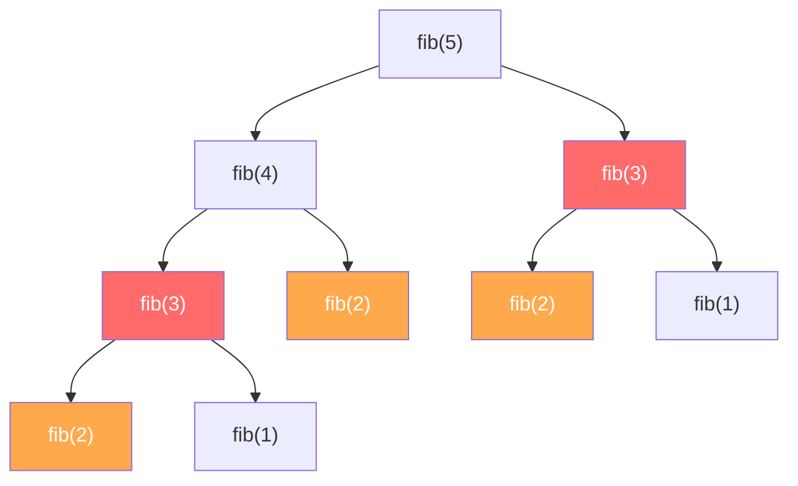
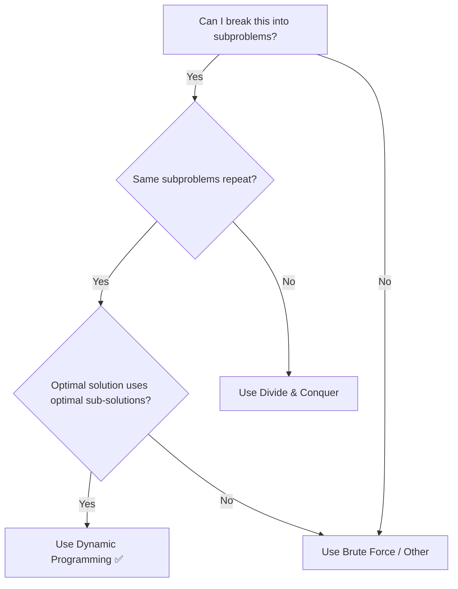
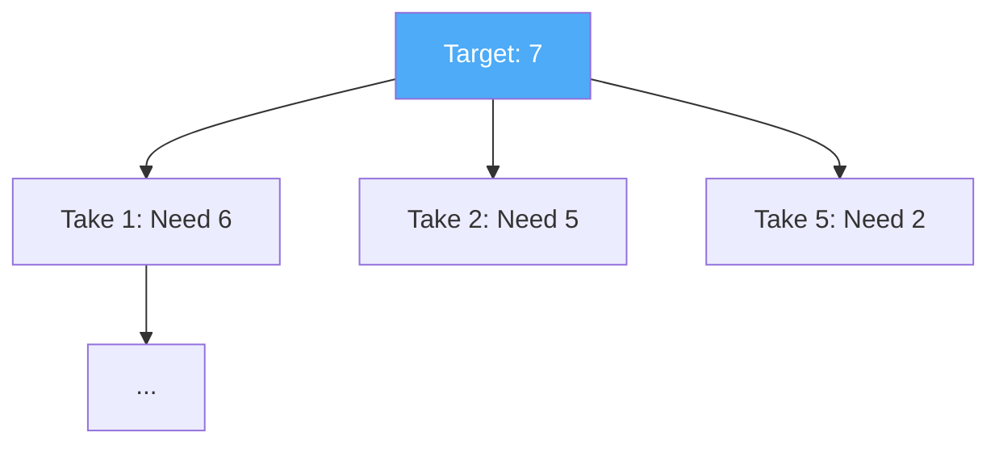

# Dynamic Programming (DP)

**Dynamic Programming** is a problem-solving technique that breaks a big problem into **smaller subproblems**, solves each subproblem **only once**, and **stores the result** so it never has to solve the same subproblem again.

Think of it like this: *"If I've already solved this smaller problem before, why solve it again? Let me just look up the answer I saved."*

> [!NOTE]
> **Why is it called "Dynamic Programming"?**
> The name was coined by Richard Bellman in the 1950s. At the time, he wanted to hide the fact that he was doing mathematical research from a boss who hated the word "mathematics." He chose "Dynamic" because it sounded cool and "Programming" because it referred to planning/scheduling (not computer coding!). So, don't let the name intimidate you — it's just **smart caching**.

> [!IMPORTANT]
> Dynamic Programming is not a specific algorithm — it's a **strategy** for solving problems. It's one of the most important concepts in computer science and shows up everywhere, from interview questions to real-world optimization.

## Example: The Fibonacci Problem

The Fibonacci sequence goes: 0, 1, 1, 2, 3, 5, 8, 13, 21, ...

Each number is the sum of the two numbers before it: `fib(n) = fib(n-1) + fib(n-2)`.

Let's compute `fib(5)`:

**Without DP (Brute Force Recursion):**



Notice the problem? `fib(3)` is calculated **twice**. `fib(2)` is calculated **three times**. For `fib(50)`, the same subproblems are recalculated **billions** of times. This is incredibly wasteful.

**With DP:** Calculate each value once, store it, and reuse it.

| n      | 0 | 1 | 2 | 3 | 4 | 5 |
| ------ | - | - | - | - | - | - |
| fib(n) | 0 | 1 | 1 | 2 | 3 | 5 |

Once we compute `fib(3) = 2`, we save it. Next time we need `fib(3)`, we just look it up — no recalculation.

| Approach           | Time for fib(50)       | Why                                    |
| ------------------ | ---------------------- | -------------------------------------- |
| Brute Force        | $O(2^n)$ — over a day  | Recalculates the same values billions of times |
| Dynamic Programming | $O(n)$ — instant      | Calculates each value exactly once     |

## When Does DP Apply?

A problem can be solved with DP when it has **two properties**:

### 1. Overlapping Subproblems

The same smaller problems are solved **multiple times** during the computation. If every subproblem were unique (no repetition), DP wouldn't help — there'd be nothing to reuse.

### 2. Optimal Substructure

The **optimal solution** to the overall problem can be built from the **optimal solutions** of its subproblems. In other words, the best answer to the big problem uses the best answers to the smaller problems.



## The 4-Step DP Mental Model

When you encounter a problem that looks like DP, follow these four steps to build your solution:

1.  **Define the "State":** What does your DP array/table represent? 
    *   *Example (Fibonacci):* `dp[i]` is the $i^{th}$ Fibonacci number.
    *   *Example (Knapsack):* `dp[w]` is the max value I can get with capacity `w`.
2.  **Find the "Recurrence Relation":** How do you calculate the current state using previous ones?
    *   *Formula:* `dp[i] = dp[i-1] + dp[i-2]`
3.  **Identify "Base Cases":** What are the simplest possible versions of the problem?
    *   *Example:* `dp[0] = 0`, `dp[1] = 1`.
4.  **Determine the "Order of Computation":** Do you go from $0 \to n$ (Bottom-Up) or $n \to 0$ (Top-Down)?

## Two Approaches: Top-Down vs. Bottom-Up

There are two ways to implement DP. Both give the same result — the difference is in how you build the solution.

### Top-Down (Memoization)

Start from the **big problem** and break it down recursively. Before solving a subproblem, check if you've already solved it. If yes, return the saved result. If no, solve it, save the result, then return it.

Think of it as: *"Start at the top, work your way down, and take notes."*

```python
# Top-Down: Fibonacci with Memoization
def fib_memo(n, memo={}):
    if n in memo:
        return memo[n]       # Already solved? Return saved answer
    if n <= 1:
        return n

    memo[n] = fib_memo(n - 1, memo) + fib_memo(n - 2, memo)
    return memo[n]

print(fib_memo(50))  # 12586269025 — instant!
```

### Bottom-Up (Tabulation)

Start from the **smallest subproblems** and build up to the big problem. Fill a table (array) from the base cases upward.

Think of it as: *"Start at the bottom, build your way up, filling in a table."*

```python
# Bottom-Up: Fibonacci with Tabulation
def fib_tab(n):
    if n <= 1:
        return n

    table = [0] * (n + 1)
    table[1] = 1

    for i in range(2, n + 1):
        table[i] = table[i - 1] + table[i - 2]

    return table[n]

print(fib_tab(50))  # 12586269025 — instant!
```

### Comparison

| Feature         | Top-Down (Memoization)           | Bottom-Up (Tabulation)            |
| --------------- | -------------------------------- | --------------------------------- |
| **Direction**   | Big problem → small subproblems  | Small subproblems → big problem   |
| **Technique**   | Recursion + cache (memo)         | Iteration + table (array)         |
| **Solves**      | Only subproblems that are needed | All subproblems, even if not needed |
| **Stack risk**  | Can hit recursion limit for large inputs | No recursion limit issues   |
| **Easier to**   | Write (natural recursive thinking) | Optimize (can reduce space)     |

> [!TIP]
> If you find it easier to think recursively, start with **Top-Down**. Once it works, you can convert it to **Bottom-Up** for better performance (no recursion overhead, easier space optimization).

## Classic DP Problems

---

### Problem 1: Climbing Stairs

**Problem:** You are climbing a staircase with `n` steps. Each time you can climb **1 step** or **2 steps**. How many **distinct ways** can you reach the top?

**Example:** For `n = 4` steps:

```text
Way 1: 1 + 1 + 1 + 1
Way 2: 1 + 1 + 2
Way 3: 1 + 2 + 1
Way 4: 2 + 1 + 1
Way 5: 2 + 2
```

**Answer:** 5 ways.

**The DP Insight:** To reach step `n`, you either came from step `n-1` (took 1 step) or step `n-2` (took 2 steps). So:

$$\text{ways}(n) = \text{ways}(n-1) + \text{ways}(n-2)$$

This is just Fibonacci! Base cases: `ways(1) = 1`, `ways(2) = 2`.

| Step (n) | 1 | 2 | 3 | 4 | 5  | 6  |
| -------- | - | - | - | - | -- | -- |
| Ways     | 1 | 2 | 3 | 5 | 8  | 13 |

#### Python

```python
def climb_stairs(n):
    """Bottom-Up DP with space optimization."""
    if n <= 2:
        return n

    prev2 = 1  # ways(1)
    prev1 = 2  # ways(2)

    for i in range(3, n + 1):
        current = prev1 + prev2
        prev2 = prev1
        prev1 = current

    return prev1

# Example
for n in range(1, 7):
    print(f"  Stairs={n}: {climb_stairs(n)} ways")

# Output:
#   Stairs=1: 1 ways
#   Stairs=2: 2 ways
#   Stairs=3: 3 ways
#   Stairs=4: 5 ways
#   Stairs=5: 8 ways
#   Stairs=6: 13 ways
```

#### Java

```java
public class ClimbingStairs {
    public static int climbStairs(int n) {
        if (n <= 2) return n;

        int prev2 = 1;  // ways(1)
        int prev1 = 2;  // ways(2)

        for (int i = 3; i <= n; i++) {
            int current = prev1 + prev2;
            prev2 = prev1;
            prev1 = current;
        }
        return prev1;
    }

    public static void main(String[] args) {
        for (int n = 1; n <= 6; n++) {
            System.out.println("  Stairs=" + n + ": " + climbStairs(n) + " ways");
        }
    }
}
```

**Complexity:** Time $O(n)$, Space $O(1)$ (we only keep two previous values).

---

### Problem 2: Coin Change (Minimum Coins)

**Problem:** You are given an array of `coins` (e.g., `[1, 2, 5]`) and a total `amount`. Find the **minimum number of coins** needed to make that amount. If it's impossible, return -1.

**The DP Insight:** To make 7 cents, you could:
- Take a 1-cent coin + (min coins for 6 cents)
- Take a 2-cent coin + (min coins for 5 cents)
- Take a 5-cent coin + (min coins for 2 cents)

We pick the one that uses the fewest total coins!

**Formula:** `dp[i] = min(dp[i - coin] + 1)` for all `coin` in `coins`.



#### Python

```python
def coin_change(coins, amount):
    # Initialize table with a value larger than any possible answer
    dp = [float('inf')] * (amount + 1)
    dp[0] = 0  # Base case: 0 coins to make 0 amount

    for a in range(1, amount + 1):
        for coin in coins:
            if a - coin >= 0:
                dp[a] = min(dp[a], 1 + dp[a - coin])

    return dp[amount] if dp[amount] != float('inf') else -1

print(coin_change([1, 2, 5], 11))  # Output: 3 (5+5+1)
```

**Complexity:** Time $O(n \times \text{amount})$, Space $O(\text{amount})$.

---

### Problem 3: 0/1 Knapsack

**Problem:** You have a bag that can carry at most **W** kg. You have items, each with a weight and a value. You must take an item **completely or leave it** (no fractions). What is the **maximum value** you can carry?

> [!NOTE]
> The Fractional Knapsack (where you can take fractions) is solvable with Greedy. But the 0/1 Knapsack requires DP because skipping a heavy item now might allow picking two smaller, more valuable items later. Greedy can't see this tradeoff.

**Example:** Bag capacity = **7 kg**

| Item     | Weight | Value |
| -------- | ------ | ----- |
| Laptop   | 3 kg   | 4     |
| Camera   | 4 kg   | 5     |
| Phone    | 2 kg   | 3     |
| Headset  | 5 kg   | 7     |

**The DP Table:**

We build a table where `dp[i][w]` = max value using the first `i` items with a bag of capacity `w`.

For each item, we have two choices:
- **Skip it:** `dp[i][w] = dp[i-1][w]` (same value as without this item)
- **Take it:** `dp[i][w] = dp[i-1][w - weight[i]] + value[i]` (add item's value, reduce capacity)

We pick whichever gives more value.

**Building the table (capacity = 7):**

|              | w=0 | w=1 | w=2 | w=3 | w=4 | w=5 | w=6 | w=7 |
| ------------ | --- | --- | --- | --- | --- | --- | --- | --- |
| No items     | 0   | 0   | 0   | 0   | 0   | 0   | 0   | 0   |
| +Laptop (3,4) | 0  | 0   | 0   | 4   | 4   | 4   | 4   | 4   |
| +Camera (4,5) | 0  | 0   | 0   | 4   | 5   | 5   | 5   | 9   |
| +Phone (2,3) | 0   | 0   | 3   | 4   | 5   | 7   | 8   | 9   |
| +Headset (5,7)| 0  | 0   | 3   | 4   | 5   | 7   | 8   | 10  |

**Answer:** `dp[4][7] = 10` — Take Phone (2kg, $3) + Headset (5kg, $7) = 7kg, value $10.

**Mental Walkthrough (The "Aha!" Moment):**
Look at **Laptop (3kg, $4)** vs **Camera (4kg, $5)** for a bag of **7kg**:
1.  **Skip Camera:** We keep the value from the previous row (just Laptop) = **$4**.
2.  **Take Camera:** We add Camera's value (**$5**) to the best we could do with the *remaining* 3kg (7kg - 4kg). Looking at the Laptop row for 3kg, we see **$4**.
3.  **Total:** $5 + $4 = **$9**.
Since $9 > $4, we update the cell to $9.

#### Python

```python
def knapsack(capacity, weights, values, names):
    """
    0/1 Knapsack using Bottom-Up DP.
    Returns the maximum value and the items selected.
    """
    n = len(weights)

    # Build DP table: dp[i][w] = max value with first i items, capacity w
    dp = [[0] * (capacity + 1) for _ in range(n + 1)]

    for i in range(1, n + 1):
        for w in range(capacity + 1):
            # Option 1: Skip this item
            dp[i][w] = dp[i - 1][w]

            # Option 2: Take this item (if it fits)
            if weights[i - 1] <= w:
                take = dp[i - 1][w - weights[i - 1]] + values[i - 1]
                dp[i][w] = max(dp[i][w], take)

    # Backtrack to find which items were selected
    selected = []
    w = capacity
    for i in range(n, 0, -1):
        if dp[i][w] != dp[i - 1][w]:
            selected.append(names[i - 1])
            w -= weights[i - 1]

    return dp[n][capacity], selected


# Example
weights = [3, 4, 2, 5]
values =  [4, 5, 3, 7]
names =   ["Laptop", "Camera", "Phone", "Headset"]
capacity = 7

max_value, items = knapsack(capacity, weights, values, names)
print(f"Max value: {max_value}")
print(f"Items: {items}")

# Output:
#   Max value: 10
#   Items: ['Headset', 'Phone']
```

#### Java

```java
import java.util.*;

public class Knapsack {

    public static void main(String[] args) {
        int[] weights = {3, 4, 2, 5};
        int[] values =  {4, 5, 3, 7};
        String[] names = {"Laptop", "Camera", "Phone", "Headset"};
        int capacity = 7;
        int n = weights.length;

        // Build DP table
        int[][] dp = new int[n + 1][capacity + 1];

        for (int i = 1; i <= n; i++) {
            for (int w = 0; w <= capacity; w++) {
                // Option 1: Skip
                dp[i][w] = dp[i - 1][w];

                // Option 2: Take (if it fits)
                if (weights[i - 1] <= w) {
                    int take = dp[i - 1][w - weights[i - 1]] + values[i - 1];
                    dp[i][w] = Math.max(dp[i][w], take);
                }
            }
        }

        // Backtrack to find selected items
        List<String> selected = new ArrayList<>();
        int w = capacity;
        for (int i = n; i > 0; i--) {
            if (dp[i][w] != dp[i - 1][w]) {
                selected.add(names[i - 1]);
                w -= weights[i - 1];
            }
        }

        System.out.println("Max value: " + dp[n][capacity]);
        System.out.println("Items: " + selected);

        // Output:
        //   Max value: 10
        //   Items: [Headset, Phone]
    }
}
```

**Complexity:** Time $O(n \times W)$, Space $O(n \times W)$ where $n$ = number of items and $W$ = capacity.

---

### Problem 4: Longest Common Subsequence (LCS)

**Problem:** Given two strings, find the length of their **longest common subsequence**. A subsequence is a sequence that appears in the same order but not necessarily contiguously.

**Example:**

```text
String 1: "ABCDE"
String 2: "ACE"

Common subsequences: "A", "C", "E", "AC", "AE", "CE", "ACE"
Longest: "ACE" (length 3)
```

**The DP Insight:** Compare characters one by one:
- If `text1[i] == text2[j]`: this character is part of the LCS. `dp[i][j] = dp[i-1][j-1] + 1`
- If they differ: skip one character from either string. `dp[i][j] = max(dp[i-1][j], dp[i][j-1])`

**Building the table for "ABCDE" and "ACE":**

|       |   "" | A | C | E |
| ----- | ---- | - | - | - |
| **""**|   0  | 0 | 0 | 0 |
| **A** |   0  | 1 | 1 | 1 |
| **B** |   0  | 1 | 1 | 1 |
| **C** |   0  | 1 | 2 | 2 |
| **D** |   0  | 1 | 2 | 2 |
| **E** |   0  | 1 | 2 | 3 |

**Answer:** `dp[5][3] = 3` → The LCS is **"ACE"**.

#### Python

```python
def longest_common_subsequence(text1, text2):
    """
    Bottom-Up DP for Longest Common Subsequence.
    Returns the length and the actual subsequence.
    """
    m, n = len(text1), len(text2)

    # Build DP table
    dp = [[0] * (n + 1) for _ in range(m + 1)]

    for i in range(1, m + 1):
        for j in range(1, n + 1):
            if text1[i - 1] == text2[j - 1]:
                # Characters match — extend the LCS
                dp[i][j] = dp[i - 1][j - 1] + 1
            else:
                # Characters differ — take the best so far
                dp[i][j] = max(dp[i - 1][j], dp[i][j - 1])

    # Backtrack to find the actual subsequence
    lcs = []
    i, j = m, n
    while i > 0 and j > 0:
        if text1[i - 1] == text2[j - 1]:
            lcs.append(text1[i - 1])
            i -= 1
            j -= 1
        elif dp[i - 1][j] > dp[i][j - 1]:
            i -= 1
        else:
            j -= 1

    lcs.reverse()
    return dp[m][n], ''.join(lcs)


# Example
text1 = "ABCDE"
text2 = "ACE"

length, subsequence = longest_common_subsequence(text1, text2)
print(f"LCS of '{text1}' and '{text2}':")
print(f"  Length: {length}")
print(f"  Subsequence: {subsequence}")

# Output:
#   LCS of 'ABCDE' and 'ACE':
#     Length: 3
#     Subsequence: ACE
```

#### Java

```java
public class LongestCommonSubsequence {

    public static void main(String[] args) {
        String text1 = "ABCDE";
        String text2 = "ACE";
        int m = text1.length();
        int n = text2.length();

        // Build DP table
        int[][] dp = new int[m + 1][n + 1];

        for (int i = 1; i <= m; i++) {
            for (int j = 1; j <= n; j++) {
                if (text1.charAt(i - 1) == text2.charAt(j - 1)) {
                    dp[i][j] = dp[i - 1][j - 1] + 1;
                } else {
                    dp[i][j] = Math.max(dp[i - 1][j], dp[i][j - 1]);
                }
            }
        }

        // Backtrack to find subsequence
        StringBuilder lcs = new StringBuilder();
        int i = m, j = n;
        while (i > 0 && j > 0) {
            if (text1.charAt(i - 1) == text2.charAt(j - 1)) {
                lcs.append(text1.charAt(i - 1));
                i--;
                j--;
            } else if (dp[i - 1][j] > dp[i][j - 1]) {
                i--;
            } else {
                j--;
            }
        }

        lcs.reverse();
        System.out.println("LCS of '" + text1 + "' and '" + text2 + "':");
        System.out.println("  Length: " + dp[m][n]);
        System.out.println("  Subsequence: " + lcs);

        // Output:
        //   LCS of 'ABCDE' and 'ACE':
        //     Length: 3
        //     Subsequence: ACE
    }
}
```

**Complexity:** Time $O(m \times n)$, Space $O(m \times n)$ where $m$ and $n$ are the lengths of the two strings.

---

## The DP Problem-Solving Framework

When you see a new problem, follow these steps:

1. **Can I break it into subproblems?** Define the subproblem clearly (e.g., "max value using the first `i` items with capacity `w`").
2. **Do subproblems overlap?** If the same subproblem is solved multiple times, DP will help.
3. **Write the recurrence relation.** Express the answer in terms of smaller subproblems (e.g., `dp[i][w] = max(skip, take)`).
4. **Identify base cases.** What are the simplest subproblems with known answers? (e.g., `dp[0][w] = 0`).
5. **Choose Top-Down or Bottom-Up.** Start with whichever feels more natural.
6. **Optimize space if possible.** Often, you only need the previous row of the table, not the entire table.

## Summary: Classic DP Problems

| Problem                 | Subproblem Definition                     | Recurrence                                        | Time           | Space         |
| ----------------------- | ----------------------------------------- | ------------------------------------------------- | -------------- | ------------- |
| **Fibonacci**           | `fib(n)`                                  | `fib(n) = fib(n-1) + fib(n-2)`                   | $O(n)$         | $O(1)$        |
| **Climbing Stairs**     | Ways to reach step `n`                    | `dp[n] = dp[n-1] + dp[n-2]`                      | $O(n)$         | $O(1)$        |
| **0/1 Knapsack**        | Max value with first `i` items, cap `w`   | `dp[i][w] = max(skip, take)`                      | $O(n \times W)$ | $O(n \times W)$ |
| **LCS**                 | LCS of first `i` and `j` characters       | Match → `+1`, else → `max(skip either)`          | $O(m \times n)$ | $O(m \times n)$ |
| **Coin Change**         | Min coins to make amount `a`              | `dp[a] = min(dp[a - coin] + 1)` for each coin    | $O(n \times a)$ | $O(a)$        |
| **Longest Increasing Subsequence** | LIS ending at index `i`       | `dp[i] = max(dp[j] + 1)` for `j < i`             | $O(n^2)$       | $O(n)$        |

## DP vs. Greedy vs. Divide & Conquer

| Feature                 | Dynamic Programming            | Greedy                          | Divide & Conquer              |
| ----------------------- | ------------------------------ | ------------------------------- | ----------------------------- |
| **Subproblems overlap?** | ✅ Yes                         | N/A                             | ❌ No                         |
| **Explores all options?** | ✅ Yes (picks the best)       | ❌ No (picks locally best)      | ✅ Yes                        |
| **Guarantees optimal?** | ✅ Always                      | Only if greedy properties hold  | ✅ Always                     |
| **Speed**               | Polynomial (moderate)          | Very fast                       | Varies                        |
| **Examples**            | Knapsack, LCS, Coin Change     | Activity Selection, Huffman     | Merge Sort, Quick Sort        |

> [!IMPORTANT]
> If a problem has the **greedy choice property**, use Greedy — it's faster. Only use DP when greedy doesn't guarantee the optimal answer. DP is more powerful but slower because it explores all possibilities.

## When to Use Dynamic Programming

-   **Optimization problems:** Finding the maximum, minimum, shortest, longest, or total number of ways.
-   **Counting problems:** "How many ways can I do X?"
-   **Decision problems:** "Is it possible to achieve X?"
-   **Overlapping subproblems are present:** The same calculation repeats many times in a brute force approach.

## Common Pitfalls & Tips

-   **Off-by-One Errors:** DP tables are often size `n + 1` to accommodate the base case of `0`. Always double-check if your loop should go to `n` or `n + 1`.
-   **Recursion Depth:** Top-Down solutions can crash with `RecursionError` on very large inputs (like `n=10,000`). Use `sys.setrecursionlimit()` or switch to Bottom-Up.
-   **Space Optimization:** If you only ever look at `dp[i-1]` to calculate `dp[i]`, you don't need a full 2D array! You can just use two rows (or even one) to save memory.
-   **Initializing with Infinity:** In "Minimum" problems (like Coin Change), initialize your table with a very large number (Infinity) so that any real answer will be smaller.

## Real-world applications:

-   **Text Editors (Diff tools):** LCS is used by `git diff` to show what changed between two file versions.
-   **Spell Checkers:** Edit Distance (a DP problem) finds the closest word to a misspelling.
-   **Finance:** Portfolio optimization, option pricing, and resource allocation.
-   **Bioinformatics:** DNA sequence alignment uses DP to find similarities between genetic sequences.
-   **Speech Recognition & NLP:** The Viterbi algorithm (a DP algorithm) is used in speech-to-text and part-of-speech tagging.
-   **Game Theory:** Finding optimal strategies in sequential decision-making.
