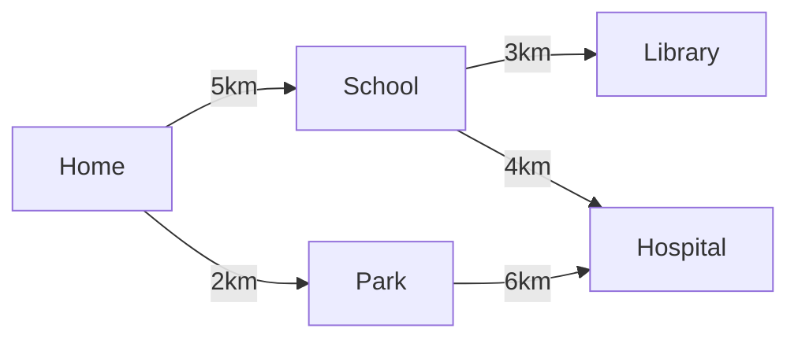
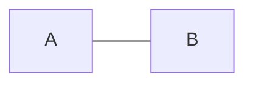
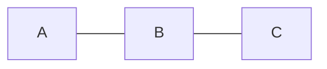
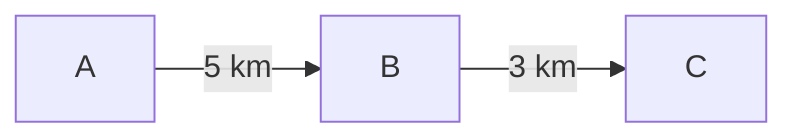
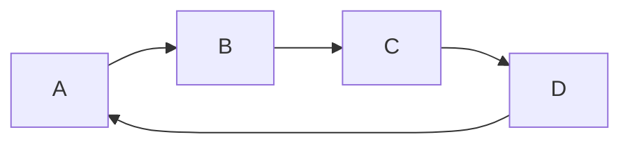
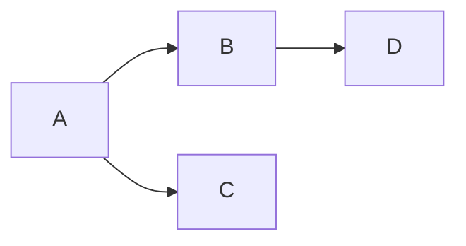
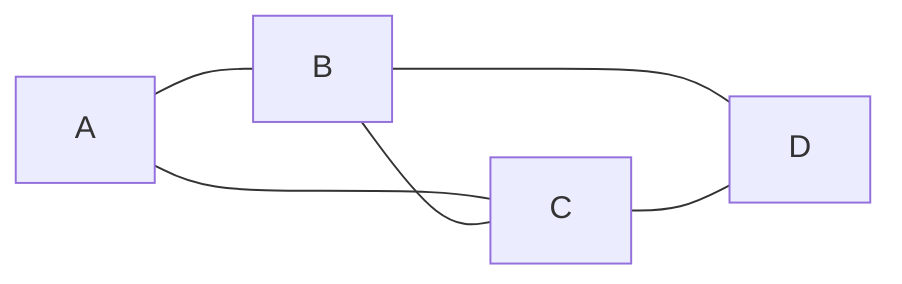

# Graph

A **Graph** is a data structure made up of a set of **nodes** (also called **vertices**) connected by **edges**. Unlike trees or linked lists which have a strict hierarchy, a graph can represent any kind of relationship between things — with no rules about who connects to whom.

Graphs are one of the most versatile data structures in computer science. They power everything from social networks and GPS navigation to recommendation engines and the internet itself.

## Real-Life Example: A City Map

Think of a **city map**.

-   Each **intersection** or **landmark** is a **node** (vertex).
-   Each **road** connecting two intersections is an **edge**.

Some roads are one-way (directed), some are two-way (undirected). Some roads are longer than others (weighted). A city map is, at its core, a graph.



Here, `Home`, `School`, `Library`, `Park`, and `Hospital` are **nodes**. The roads with distances between them are **weighted edges**.

## Key Terminology

Before diving deeper, here are the core terms you need to know:

| Term              | Meaning                                                                                          |
|-------------------|--------------------------------------------------------------------------------------------------|
| **Vertex (Node)** | A single entity in the graph (e.g., a city, a person, a web page).                               |
| **Edge**          | A connection between two vertices (e.g., a road, a friendship, a hyperlink).                     |
| **Adjacent**      | Two vertices are adjacent if they are directly connected by an edge.                             |
| **Degree**        | The number of edges connected to a vertex.                                                       |
| **Path**          | A sequence of vertices where each consecutive pair is connected by an edge.                      |
| **Cycle**         | A path that starts and ends at the same vertex without repeating any other vertex.               |
| **Connected**     | A graph where there is a path between every pair of vertices.                                    |

## Types of Graphs

### 1. Directed vs. Undirected

-   **Undirected Graph:** Edges have no direction. If A connects to B, then B also connects to A. Think of a **two-way road** or a **Facebook friendship** (if you're friends with someone, they're friends with you too).


A is connected to B, and B is connected to A.

-   **Directed Graph (Digraph):** Edges have a direction. If A points to B, it doesn't mean B points to A. Think of a **one-way road** or **following someone on Twitter/X** (you can follow someone without them following you back).


A points to B, but B does NOT point to A.

### 2. Weighted vs. Unweighted

-   **Unweighted Graph:** All edges are treated equally. No edge is "heavier" or "costlier" than another. Think of a **social network** — you either are friends or you aren't.
-   **Weighted Graph:** Each edge has a numerical value (weight/cost). Think of a **road map** where edges represent distances, or a **flight network** where weights are ticket prices.

**Unweighted:**


**Weighted:**


### 3. Cyclic vs. Acyclic

-   **Cyclic Graph:** Contains at least one cycle (a path that loops back to the start).
-   **Acyclic Graph:** Has no cycles. A **Directed Acyclic Graph (DAG)** is extremely common — it's used in task scheduling, build systems, and version control.

**Cyclic:**


**Acyclic (DAG):**


## How to Represent a Graph in Code

There are two main ways to store a graph in memory:

### 1. Adjacency List (Most Common)

Each vertex stores a list of its neighbors. This is efficient for **sparse graphs** (graphs where most nodes are NOT connected to each other, which is the common case in real life).



```text
Adjacency List:
  A  ->  [B, C]
  B  ->  [A, C, D]
  C  ->  [A, B, D]
  D  ->  [B, C]
```

### 2. Adjacency Matrix

A 2D grid (matrix) where `matrix[i][j] = 1` means there is an edge from vertex `i` to vertex `j`. This is efficient for **dense graphs** (graphs where most nodes ARE connected to each other).


```text
Adjacency Matrix:
       A  B  C  D
  A  [ 0, 1, 1, 0 ]
  B  [ 1, 0, 1, 1 ]
  C  [ 1, 1, 0, 1 ]
  D  [ 0, 1, 1, 0 ]
```

### When to Use Which?

| Feature              | Adjacency List       | Adjacency Matrix    |
|----------------------|----------------------|---------------------|
| **Space**            | $O(V + E)$           | $O(V^2)$            |
| **Check if edge exists** | $O(\text{degree})$ | $O(1)$             |
| **Get all neighbors** | $O(\text{degree})$  | $O(V)$              |
| **Add edge**         | $O(1)$               | $O(1)$              |
| **Best for**         | Sparse graphs        | Dense graphs         |

> [!TIP]
> In most real-world problems and interviews, you'll use an **Adjacency List** because most graphs are sparse.

## Complexity

The complexity of graph operations depends on the representation:

-   **Time Complexity (Traversals - BFS/DFS):** $O(V + E)$
    -   `V` is the number of vertices.
    -   `E` is the number of edges.
    -   You visit every vertex once and look at every edge once.
-   **Space Complexity:** $O(V + E)$ for an adjacency list, $O(V^2)$ for an adjacency matrix.

## Implementation

### Python

Python's dictionary makes a natural adjacency list.

#### Building and Displaying a Graph

```python
class Graph:
    def __init__(self, directed=False):
        self.adj_list = {}       # Adjacency list stored as a dictionary
        self.directed = directed

    def add_vertex(self, vertex):
        """Add a vertex to the graph if it doesn't exist."""
        if vertex not in self.adj_list:
            self.adj_list[vertex] = []

    def add_edge(self, vertex1, vertex2):
        """Add an edge between two vertices."""
        # Ensure both vertices exist
        self.add_vertex(vertex1)
        self.add_vertex(vertex2)

        self.adj_list[vertex1].append(vertex2)
        if not self.directed:
            # For undirected graphs, the connection goes both ways
            self.adj_list[vertex2].append(vertex1)

    def remove_edge(self, vertex1, vertex2):
        """Remove an edge between two vertices."""
        if vertex1 in self.adj_list:
            self.adj_list[vertex1] = [v for v in self.adj_list[vertex1] if v != vertex2]
        if not self.directed and vertex2 in self.adj_list:
            self.adj_list[vertex2] = [v for v in self.adj_list[vertex2] if v != vertex1]

    def display(self):
        """Print the adjacency list."""
        for vertex, neighbors in self.adj_list.items():
            print(f"  {vertex} -> {neighbors}")


# --- Example: A social network (undirected) ---
social_network = Graph(directed=False)
social_network.add_edge("Alice", "Bob")
social_network.add_edge("Alice", "Charlie")
social_network.add_edge("Bob", "David")
social_network.add_edge("Charlie", "David")

print("Social Network:")
social_network.display()
# Output:
#   Alice -> ['Bob', 'Charlie']
#   Bob -> ['Alice', 'David']
#   Charlie -> ['Alice', 'David']
#   David -> ['Bob', 'Charlie']
```

#### BFS and DFS Traversal

```python
from collections import deque

class Graph:
    def __init__(self, directed=False):
        self.adj_list = {}
        self.directed = directed

    def add_vertex(self, vertex):
        if vertex not in self.adj_list:
            self.adj_list[vertex] = []

    def add_edge(self, vertex1, vertex2):
        self.add_vertex(vertex1)
        self.add_vertex(vertex2)
        self.adj_list[vertex1].append(vertex2)
        if not self.directed:
            self.adj_list[vertex2].append(vertex1)

    def bfs(self, start):
        """Breadth-First Search: explores level by level (uses a Queue)."""
        visited = set()
        queue = deque([start])
        visited.add(start)
        result = []

        while queue:
            current = queue.popleft()
            result.append(current)

            for neighbor in self.adj_list.get(current, []):
                if neighbor not in visited:
                    visited.add(neighbor)
                    queue.append(neighbor)

        return result

    def dfs(self, start):
        """Depth-First Search: explores as deep as possible first (uses a Stack)."""
        visited = set()
        stack = [start]
        result = []

        while stack:
            current = stack.pop()
            if current not in visited:
                visited.add(current)
                result.append(current)

                # Add neighbors in reverse order so we visit them in order
                for neighbor in reversed(self.adj_list.get(current, [])):
                    if neighbor not in visited:
                        stack.append(neighbor)

        return result


# --- Example ---
g = Graph()
g.add_edge("A", "B")
g.add_edge("A", "C")
g.add_edge("B", "D")
g.add_edge("C", "E")
g.add_edge("D", "F")
g.add_edge("E", "F")

print("BFS from A:", g.bfs("A"))   # Output: ['A', 'B', 'C', 'D', 'E', 'F']
print("DFS from A:", g.dfs("A"))   # Output: ['A', 'B', 'D', 'F', 'E', 'C']
```

### Java

In Java, we use a `HashMap` with `ArrayList` values to build an adjacency list.

#### Building and Displaying a Graph

```java
import java.util.*;

public class Graph {
    private Map<String, List<String>> adjList;
    private boolean directed;

    public Graph(boolean directed) {
        this.adjList = new HashMap<>();
        this.directed = directed;
    }

    public void addVertex(String vertex) {
        adjList.putIfAbsent(vertex, new ArrayList<>());
    }

    public void addEdge(String vertex1, String vertex2) {
        addVertex(vertex1);
        addVertex(vertex2);

        adjList.get(vertex1).add(vertex2);
        if (!directed) {
            // For undirected graphs, the connection goes both ways
            adjList.get(vertex2).add(vertex1);
        }
    }

    public void removeEdge(String vertex1, String vertex2) {
        adjList.getOrDefault(vertex1, new ArrayList<>()).remove(vertex2);
        if (!directed) {
            adjList.getOrDefault(vertex2, new ArrayList<>()).remove(vertex1);
        }
    }

    public void display() {
        for (Map.Entry<String, List<String>> entry : adjList.entrySet()) {
            System.out.println("  " + entry.getKey() + " -> " + entry.getValue());
        }
    }

    public static void main(String[] args) {
        // Example: A social network (undirected)
        Graph socialNetwork = new Graph(false);
        socialNetwork.addEdge("Alice", "Bob");
        socialNetwork.addEdge("Alice", "Charlie");
        socialNetwork.addEdge("Bob", "David");
        socialNetwork.addEdge("Charlie", "David");

        System.out.println("Social Network:");
        socialNetwork.display();
        // Output:
        //   Alice -> [Bob, Charlie]
        //   Bob -> [Alice, David]
        //   Charlie -> [Alice, David]
        //   David -> [Bob, Charlie]
    }
}
```

#### BFS and DFS Traversal

```java
import java.util.*;

public class GraphTraversal {
    private Map<String, List<String>> adjList;

    public GraphTraversal() {
        this.adjList = new HashMap<>();
    }

    public void addEdge(String vertex1, String vertex2) {
        adjList.putIfAbsent(vertex1, new ArrayList<>());
        adjList.putIfAbsent(vertex2, new ArrayList<>());
        adjList.get(vertex1).add(vertex2);
        adjList.get(vertex2).add(vertex1); // Undirected
    }

    public List<String> bfs(String start) {
        List<String> result = new ArrayList<>();
        Set<String> visited = new HashSet<>();
        Queue<String> queue = new LinkedList<>();

        visited.add(start);
        queue.add(start);

        while (!queue.isEmpty()) {
            String current = queue.poll();
            result.add(current);

            for (String neighbor : adjList.getOrDefault(current, new ArrayList<>())) {
                if (!visited.contains(neighbor)) {
                    visited.add(neighbor);
                    queue.add(neighbor);
                }
            }
        }
        return result;
    }

    public List<String> dfs(String start) {
        List<String> result = new ArrayList<>();
        Set<String> visited = new HashSet<>();
        Deque<String> stack = new ArrayDeque<>();

        stack.push(start);

        while (!stack.isEmpty()) {
            String current = stack.pop();
            if (!visited.contains(current)) {
                visited.add(current);
                result.add(current);

                List<String> neighbors = adjList.getOrDefault(current, new ArrayList<>());
                // Add in reverse order so we visit them in natural order
                for (int i = neighbors.size() - 1; i >= 0; i--) {
                    if (!visited.contains(neighbors.get(i))) {
                        stack.push(neighbors.get(i));
                    }
                }
            }
        }
        return result;
    }

    public static void main(String[] args) {
        GraphTraversal g = new GraphTraversal();
        g.addEdge("A", "B");
        g.addEdge("A", "C");
        g.addEdge("B", "D");
        g.addEdge("C", "E");
        g.addEdge("D", "F");
        g.addEdge("E", "F");

        System.out.println("BFS from A: " + g.bfs("A"));   // [A, B, C, D, E, F]
        System.out.println("DFS from A: " + g.dfs("A"));   // [A, B, D, F, E, C]
    }
}
```

## Graph Traversal: BFS vs DFS at a Glance

| Feature          | BFS (Breadth-First Search)         | DFS (Depth-First Search)            |
|------------------|------------------------------------|-------------------------------------|
| **Data Structure** | Queue (FIFO)                     | Stack (LIFO)                        |
| **Strategy**     | Explores level by level            | Explores as deep as possible first  |
| **Best for**     | Shortest path (unweighted)         | Cycle detection, topological sort   |
| **Memory**       | Can be high (stores entire level)  | Generally lower                     |

> [!NOTE]
> For a deeper dive into BFS with shortest path examples, see the [breadth-first-search.md](./breadth-first-search.md) document.

## Common Graph Algorithms

Here are some well-known algorithms built on top of graphs:

| Algorithm               | Purpose                                             | Key Idea                                        |
|-------------------------|-----------------------------------------------------|-------------------------------------------------|
| **BFS**                 | Shortest path in unweighted graphs                  | Level-by-level exploration using a queue         |
| **DFS**                 | Explore all paths, cycle detection                  | Go as deep as possible, then backtrack           |
| **Dijkstra's**          | Shortest path in weighted graphs (no negative edges)| Greedy approach using a priority queue           |
| **Bellman-Ford**        | Shortest path (handles negative edge weights)       | Relax all edges $V-1$ times                      |
| **Topological Sort**    | Order tasks with dependencies (DAGs only)           | Process nodes with no incoming edges first       |
| **Kruskal's / Prim's**  | Minimum Spanning Tree                               | Find the cheapest way to connect all nodes       |

## When to Use a Graph

Graphs are the right choice whenever you need to model **relationships** or **connections** between things:

-   **Social Networks:** People are nodes, friendships are edges. Find mutual friends, degrees of separation, or suggest new connections.
-   **Maps & Navigation:** Intersections are nodes, roads are edges. Find the shortest route from point A to point B (Google Maps, Uber).
-   **The Internet:** Web pages are nodes, hyperlinks are edges. Web crawlers (like Google's) traverse this massive graph to index the web.
-   **Task Scheduling:** Tasks are nodes, dependencies are edges. A DAG ensures tasks are completed in the right order (e.g., a build system like `make` or `gradle`).
-   **Recommendation Engines:** Products and users are nodes, purchases/views are edges. "Customers who bought X also bought Y."
-   **Network Routing:** Routers are nodes, connections are edges. Protocols like OSPF use graph algorithms to find the best path for data packets.
