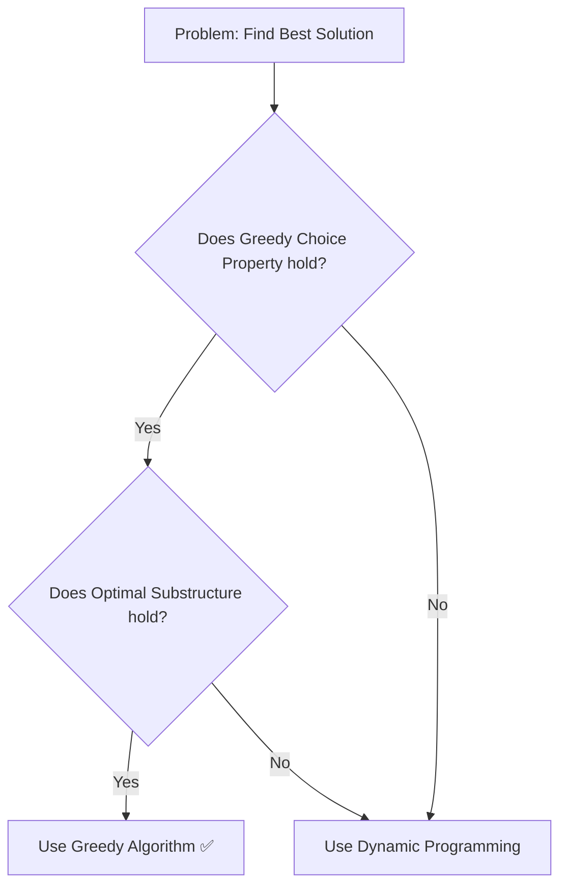
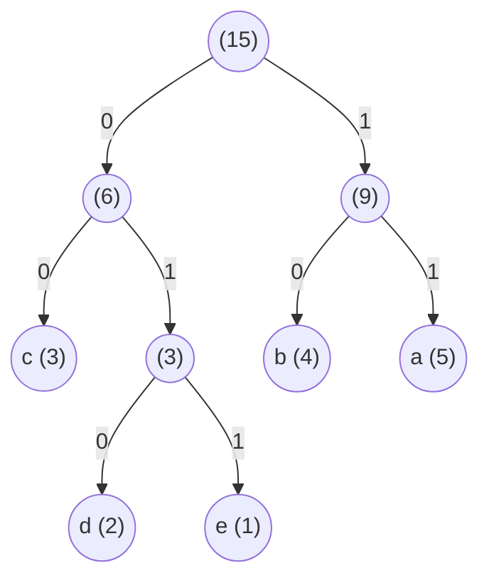

# Greedy Algorithms

A **Greedy Algorithm** builds a solution step by step, always picking the option that looks **best right now** — without worrying about the future. At each step, it makes the **locally optimal choice**, hoping that these small "best" decisions will add up to a **globally optimal solution**.

Think of it like this: *"Don't overthink it. Just pick the best option available right now, and move on."*

> [!NOTE]
> Greedy algorithms don't always give the perfect answer for every problem. They work brilliantly when the problem has two special properties: **Greedy Choice Property** and **Optimal Substructure** (explained below). When these properties hold, greedy is often the fastest and simplest approach.

## Example: Making Change with the Fewest Bills

Imagine you're a cashier and you need to give a customer **$36** in change. You have bills of **$20, $10, $5, and $1**.

**The greedy approach:** Always pick the **largest bill** that doesn't exceed the remaining amount.

| Step | Remaining | Largest Bill That Fits | Bills Used So Far     |
| ---- | --------- | ---------------------- | --------------------- |
| 1    | 36        | 20                     | [20]                  |
| 2    | 16        | 10                     | [20, 10]              |
| 3    | 6         | 5                      | [20, 10, 5]           |
| 4    | 1         | 1                      | [20, 10, 5, 1]        |

**Result:** 4 bills. And this is indeed the minimum number of bills needed!

You never looked ahead. You never asked *"What if I skip the 20 and use two 10s instead?"* You just grabbed the biggest bill each time. That's greedy.

> [!WARNING]
> This greedy approach works for standard currency systems, but it **does not** work for every arbitrary system. For example, with denominations of `[1, 3, 4]` and a target of `6`: Greedy picks `4 + 1 + 1 = 3 bills`, but the optimal answer is `3 + 3 = 2 bills`. For arbitrary systems, you need **Dynamic Programming**.

## When Does Greedy Work?

A greedy algorithm guarantees the optimal solution only when the problem has these two properties:

### 1. Greedy Choice Property
Making the locally best choice at each step leads to a globally best solution. You never need to go back and change a previous decision.

### 2. Optimal Substructure
An optimal solution to the problem contains optimal solutions to its subproblems. After making a greedy choice, the remaining problem is a smaller version of the same problem.

**If either property is missing, greedy may give a wrong answer.** Always verify before using greedy on a new problem.

## Greedy vs. Other Approaches

| Approach              | Strategy                                    | Guarantee              | Speed        |
| --------------------- | ------------------------------------------- | ---------------------- | ------------ |
| **Greedy**            | Pick the best option now, never look back   | Only if properties hold | Very fast     |
| **Dynamic Programming** | Try all options, remember past results     | Always optimal         | Moderate      |
| **Brute Force**       | Try every possible combination              | Always optimal         | Very slow     |



## Classic Greedy Problems

Let's walk through three well-known greedy problems with full explanations and code.

---

### Problem 1: Activity Selection

**Problem:** You have a list of activities, each with a start time and end time. You can only do **one activity at a time** (no overlapping). What is the **maximum number of activities** you can attend?

**Greedy Strategy:** Always pick the activity that **ends the earliest**. This leaves the most room for future activities.

**Example:**

| Activity | Start | End |
| -------- | ----- | --- |
| A        | 1     | 3   |
| B        | 2     | 5   |
| C        | 4     | 7   |
| D        | 1     | 8   |
| E        | 5     | 9   |
| F        | 8     | 10  |

**Step-by-step:**



```mermaid
gantt
    title Activity Selection (Greedy)
    dateFormat D
    axisFormat %d

    section Selected
    A (1-3) ✅           :done, a, 1, 3
    C (4-7) ✅           :done, c, 4, 7
    F (8-10) ✅          :done, f, 8, 10

    section Rejected
    B (2-5) ❌           :crit, b, 2, 5
    D (1-8) ❌           :crit, d, 1, 8
    E (5-9) ❌           :crit, e, 5, 9
```

1. Sort activities by end time: A(3), B(5), C(7), D(8), E(9), F(10)
2. Pick **A** (ends at 3). Next activity must start at or after 3.
3. Skip **B** (starts at 2, overlaps with A). Pick **C** (starts at 4 ≥ 3 ✅). Next must start at or after 7.
4. Skip **D** (starts at 1). Skip **E** (starts at 5). Pick **F** (starts at 8 ≥ 7 ✅).

**Result:** 3 activities (A, C, F) — this is the maximum possible.

#### Python

```python
def activity_selection(activities):
    """
    activities: list of (start, end, name) tuples
    Returns the maximum set of non-overlapping activities.
    """
    # Step 1: Sort by end time (greedy choice)
    sorted_activities = sorted(activities, key=lambda x: x[1])
    
    selected = [sorted_activities[0]]  # Always pick the first (earliest end)
    last_end_time = sorted_activities[0][1]
    
    # Step 2: For each remaining activity, pick it if it doesn't overlap
    for start, end, name in sorted_activities[1:]:
        if start >= last_end_time:
            selected.append((start, end, name))
            last_end_time = end
    
    return selected

# Example
activities = [
    (1, 3, "A"),
    (2, 5, "B"),
    (4, 7, "C"),
    (1, 8, "D"),
    (5, 9, "E"),
    (8, 10, "F")
]

result = activity_selection(activities)
print(f"Max activities: {len(result)}")
for start, end, name in result:
    print(f"  Activity {name}: {start} to {end}")

# Output:
#   Max activities: 3
#   Activity A: 1 to 3
#   Activity C: 4 to 7
#   Activity F: 8 to 10
```

#### Java

```java
import java.util.*;

public class ActivitySelection {

    public static void main(String[] args) {
        // Each activity: {start, end, name}
        int[][] times = {{1,3}, {2,5}, {4,7}, {1,8}, {5,9}, {8,10}};
        String[] names = {"A", "B", "C", "D", "E", "F"};

        // Step 1: Sort by end time (greedy choice)
        Integer[] indices = {0, 1, 2, 3, 4, 5};
        Arrays.sort(indices, Comparator.comparingInt(i -> times[i][1]));

        // Step 2: Always pick the first activity
        List<String> selected = new ArrayList<>();
        selected.add(names[indices[0]]);
        int lastEndTime = times[indices[0]][1];

        // Step 3: Pick each activity that doesn't overlap
        for (int i = 1; i < indices.length; i++) {
            int idx = indices[i];
            if (times[idx][0] >= lastEndTime) {
                selected.add(names[idx]);
                lastEndTime = times[idx][1];
            }
        }

        System.out.println("Max activities: " + selected.size());
        for (String name : selected) {
            System.out.println("  Activity " + name);
        }
        // Output:
        //   Max activities: 3
        //   Activity A
        //   Activity C
        //   Activity F
    }
}
```

**Complexity:** $O(n \log n)$ for sorting + $O(n)$ for one scan = $O(n \log n)$ overall.

---

### Problem 2: Fractional Knapsack

**Problem:** You have a bag (knapsack) that can carry at most **W** kg. You have several items, each with a weight and a value. Unlike the 0/1 Knapsack, you **can take fractions** of an item. What is the **maximum value** you can carry?

**Greedy Strategy:** Calculate the **value-per-kg** ratio for each item. Always pick the item with the **highest ratio** first. If it doesn't fit entirely, take a fraction of it.

**Example:** Bag capacity = **15 kg**

| Item   | Weight | Value | Value/kg |
| ------ | ------ | ----- | -------- |
| Gold   | 10 kg  | 500   | 50       |
| Silver | 5 kg   | 200   | 40       |
| Bronze | 15 kg  | 300   | 20       |

**Step-by-step:**
1. Sort by value/kg: Gold (50), Silver (40), Bronze (20)
2. Take all **Gold** (10 kg, value 500). Remaining capacity: 15 - 10 = **5 kg**
3. Take all **Silver** (5 kg, value 200). Remaining capacity: 5 - 5 = **0 kg**
4. Bag is full. Stop.

**Result:** Total value = 500 + 200 = **700**

#### Python

```python
def fractional_knapsack(capacity, items):
    """
    items: list of (weight, value, name) tuples
    Returns the maximum value that fits in the knapsack.
    """
    # Step 1: Calculate value/weight ratio and sort by it (highest first)
    items_with_ratio = [(w, v, name, v / w) for w, v, name in items]
    items_with_ratio.sort(key=lambda x: x[3], reverse=True)
    
    total_value = 0
    remaining_capacity = capacity
    taken = []
    
    # Step 2: Take as much as possible of each item, starting from the best ratio
    for weight, value, name, ratio in items_with_ratio:
        if remaining_capacity <= 0:
            break
        
        if weight <= remaining_capacity:
            # Take the whole item
            taken.append((name, weight, value, "100%"))
            total_value += value
            remaining_capacity -= weight
        else:
            # Take a fraction of the item
            fraction = remaining_capacity / weight
            taken_value = value * fraction
            taken.append((name, remaining_capacity, taken_value, f"{fraction:.0%}"))
            total_value += taken_value
            remaining_capacity = 0
    
    return total_value, taken

# Example
items = [
    (10, 500, "Gold"),
    (5, 200, "Silver"),
    (15, 300, "Bronze")
]

max_value, details = fractional_knapsack(15, items)
print(f"Maximum value: {max_value}")
for name, weight, value, pct in details:
    print(f"  {name}: took {weight}kg ({pct}), value = {value}")

# Output:
#   Maximum value: 700
#   Gold: took 10kg (100%), value = 500
#   Silver: took 5kg (100%), value = 200
```

#### Java

```java
import java.util.*;

public class FractionalKnapsack {

    public static void main(String[] args) {
        double capacity = 15;
        // Each item: {weight, value}
        double[][] items = {{10, 500}, {5, 200}, {15, 300}};
        String[] names = {"Gold", "Silver", "Bronze"};

        // Step 1: Sort by value/weight ratio (highest first)
        Integer[] indices = {0, 1, 2};
        Arrays.sort(indices, (a, b) -> {
            double ratioA = items[a][1] / items[a][0];
            double ratioB = items[b][1] / items[b][0];
            return Double.compare(ratioB, ratioA); // Descending
        });

        double totalValue = 0;
        double remaining = capacity;

        // Step 2: Take as much as possible of each item
        for (int idx : indices) {
            if (remaining <= 0) break;

            double weight = items[idx][0];
            double value = items[idx][1];

            if (weight <= remaining) {
                // Take the whole item
                totalValue += value;
                remaining -= weight;
                System.out.printf("  %s: took %.0fkg (100%%), value = %.0f%n",
                        names[idx], weight, value);
            } else {
                // Take a fraction
                double fraction = remaining / weight;
                double takenValue = value * fraction;
                totalValue += takenValue;
                System.out.printf("  %s: took %.0fkg (%.0f%%), value = %.0f%n",
                        names[idx], remaining, fraction * 100, takenValue);
                remaining = 0;
            }
        }

        System.out.printf("Maximum value: %.0f%n", totalValue);
        // Output:
        //   Gold: took 10kg (100%), value = 500
        //   Silver: took 5kg (100%), value = 200
        //   Maximum value: 700
    }
}
```

**Complexity:** $O(n \log n)$ for sorting + $O(n)$ for one scan = $O(n \log n)$ overall.

> [!IMPORTANT]
> Fractional Knapsack works with greedy because you can take fractions. The **0/1 Knapsack** (where you must take an item fully or leave it) does **not** have the greedy choice property. For 0/1 Knapsack, you need **Dynamic Programming**.

---

### Problem 3: Huffman Coding

**Problem:** Given a set of characters and their frequencies, build the most efficient **binary encoding** (using the fewest total bits). Characters that appear more often should get **shorter** codes.

**Greedy Strategy:** Repeatedly merge the **two least frequent** nodes into a new combined node until only one tree remains.

**Example:** Encode the characters in the word **"aaaaabbbbcccdde"**

| Character | Frequency |
| --------- | --------- |
| a         | 5         |
| b         | 4         |
| c         | 3         |
| d         | 2         |
| e         | 1         |

**Step-by-step:**

```text
Step 1: Merge two smallest → d(2) + e(1) = [de](3)
Step 2: Merge two smallest → c(3) + [de](3) = [cde](6)
Step 3: Merge two smallest → b(4) + a(5) = [ba](9)
Step 4: Merge two smallest → [cde](6) + [ba](9) = [root](15)
```

**Resulting tree:**



**Final Codes:**

| Character | Frequency | Huffman Code | Bits Used (freq × code length) |
| --------- | --------- | ------------ | ------------------------------ |
| a         | 5         | `11`         | 5 × 2 = 10                    |
| b         | 4         | `10`         | 4 × 2 = 8                     |
| c         | 3         | `00`         | 3 × 2 = 6                     |
| d         | 2         | `010`        | 2 × 3 = 6                     |
| e         | 1         | `011`        | 1 × 3 = 3                     |

**Total bits = 33.** With fixed-length encoding (3 bits each, since 5 unique characters require at least 3 bits), it would take 15 × 3 = 45 bits. Huffman saves **27%**!

#### Python

```python
import heapq

class HuffmanNode:
    def __init__(self, char, freq):
        self.char = char
        self.freq = freq
        self.left = None
        self.right = None
    
    # Needed for heapq to compare nodes by frequency
    def __lt__(self, other):
        return self.freq < other.freq

def build_huffman_tree(text):
    """Build a Huffman Tree from the given text."""
    # Step 1: Count character frequencies
    freq_map = {}
    for char in text:
        freq_map[char] = freq_map.get(char, 0) + 1
    
    # Step 2: Create a min-heap of leaf nodes
    heap = [HuffmanNode(char, freq) for char, freq in freq_map.items()]
    heapq.heapify(heap)
    
    # Step 3: Merge the two smallest nodes until one tree remains
    while len(heap) > 1:
        left = heapq.heappop(heap)   # Smallest
        right = heapq.heappop(heap)  # Second smallest
        
        # Create a new internal node with combined frequency
        merged = HuffmanNode(None, left.freq + right.freq)
        merged.left = left
        merged.right = right
        
        heapq.heappush(heap, merged)
    
    return heap[0]  # Root of the Huffman Tree

def generate_codes(node, current_code="", codes=None):
    """Traverse the tree to generate Huffman codes for each character."""
    if codes is None:
        codes = {}
    
    if node.char is not None:
        # Leaf node — assign the code
        codes[node.char] = current_code if current_code else "0"
        return codes
    
    generate_codes(node.left, current_code + "0", codes)
    generate_codes(node.right, current_code + "1", codes)
    
    return codes

# Example
text = "aaaaabbbbcccdde"
root = build_huffman_tree(text)
codes = generate_codes(root)

print("Huffman Codes:")
for char, code in sorted(codes.items()):
    print(f"  '{char}': {code}")

total_bits = sum(len(codes[c]) for c in text)
print(f"Total bits needed: {total_bits}")
print(f"Fixed-length would need: {len(text) * 3} bits")

# Output:
#   Huffman Codes:
#     'a': 11
#     'b': 10
#     'c': 00
#     'd': 010
#     'e': 011
#   Total bits needed: 33
#   Fixed-length would need: 45 bits
```

#### Java

```java
import java.util.*;

public class HuffmanCoding {

    static class HuffmanNode implements Comparable<HuffmanNode> {
        char ch;
        int freq;
        HuffmanNode left, right;

        HuffmanNode(char ch, int freq) {
            this.ch = ch;
            this.freq = freq;
        }

        @Override
        public int compareTo(HuffmanNode other) {
            return this.freq - other.freq;
        }
    }

    public static void main(String[] args) {
        String text = "aaaaabbbbcccdde";

        // Step 1: Count frequencies
        Map<Character, Integer> freqMap = new HashMap<>();
        for (char c : text.toCharArray()) {
            freqMap.merge(c, 1, Integer::sum);
        }

        // Step 2: Build min-heap of leaf nodes
        PriorityQueue<HuffmanNode> heap = new PriorityQueue<>();
        for (var entry : freqMap.entrySet()) {
            heap.add(new HuffmanNode(entry.getKey(), entry.getValue()));
        }

        // Step 3: Merge two smallest until one tree remains
        while (heap.size() > 1) {
            HuffmanNode left = heap.poll();
            HuffmanNode right = heap.poll();

            HuffmanNode merged = new HuffmanNode('\0', left.freq + right.freq);
            merged.left = left;
            merged.right = right;

            heap.add(merged);
        }

        // Step 4: Generate codes by traversing the tree
        Map<Character, String> codes = new TreeMap<>();
        generateCodes(heap.poll(), "", codes);

        System.out.println("Huffman Codes:");
        int totalBits = 0;
        for (var entry : codes.entrySet()) {
            System.out.println("  '" + entry.getKey() + "': " + entry.getValue());
            totalBits += entry.getValue().length() * freqMap.get(entry.getKey());
        }
        System.out.println("Total bits needed: " + totalBits);
        System.out.println("Fixed-length would need: " + (text.length() * 3) + " bits");
    }

    private static void generateCodes(HuffmanNode node, String code, Map<Character, String> codes) {
        if (node == null) return;

        if (node.ch != '\0') {
            codes.put(node.ch, code.isEmpty() ? "0" : code);
            return;
        }

        generateCodes(node.left, code + "0", codes);
        generateCodes(node.right, code + "1", codes);
    }
}
```

**Complexity:** $O(n \log n)$ where $n$ is the number of unique characters (heap operations).

---

## Summary: Greedy Algorithms at a Glance

| Problem               | Greedy Strategy                     | Time Complexity  |
| --------------------- | ----------------------------------- | ---------------- |
| **Coin Change**       | Pick the largest coin first         | $O(n)$           |
| **Activity Selection** | Pick activity with earliest end    | $O(n \log n)$    |
| **Fractional Knapsack** | Pick item with best value/weight | $O(n \log n)$    |
| **Huffman Coding**    | Merge two least frequent nodes      | $O(n \log n)$    |
| **Dijkstra's**        | Pick unvisited node with min dist   | $O((V+E) \log V)$ |
| **Prim's/Kruskal's MST** | Pick cheapest edge               | $O(E \log V)$    |

> [!TIP]
> For a deeper dive into Dijkstra's Algorithm (the most famous greedy graph algorithm), see the [dijkstras-algorithm.md](./dijkstras-algorithm.md) document.

## When to Use Greedy Algorithms

Greedy works best when:

-   **The problem has the Greedy Choice Property:** A local best choice leads to a global best solution.
-   **The problem has Optimal Substructure:** After making one choice, the remaining problem is a smaller version of the original.
-   **You need speed:** Greedy solutions are typically $O(n)$ or $O(n \log n)$ — much faster than Dynamic Programming or Brute Force.

Common real-world uses:

-   **Data Compression:** Huffman coding in ZIP, GZIP, JPEG, and MP3 formats.
-   **Network Design:** Minimum Spanning Trees for connecting all nodes at the lowest cost (internet cables, power grids).
-   **Scheduling:** Job scheduling, CPU task scheduling, classroom allocation.
-   **Navigation:** Dijkstra's and A* for GPS and game pathfinding.
-   **Resource Allocation:** Fractional Knapsack for budget or resource distribution.
