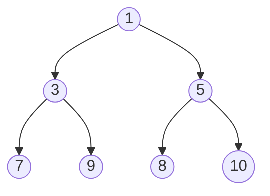
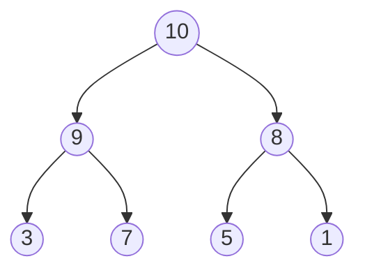
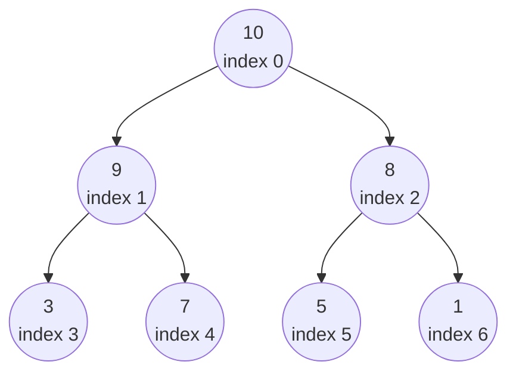
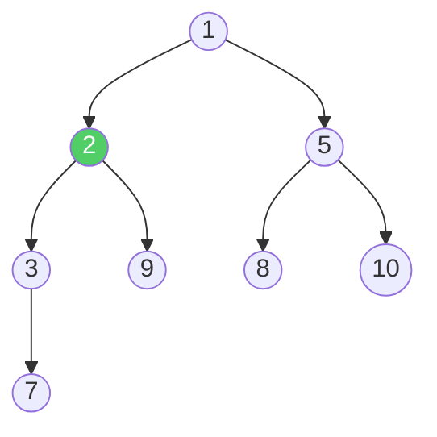
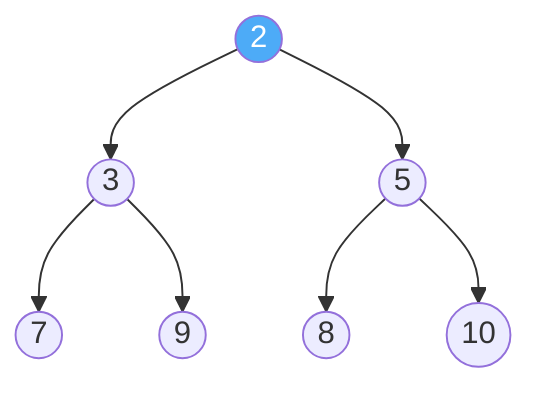

# Heaps / Priority Queues

A **Heap** is a special type of binary tree that satisfies one simple rule: the parent node is always "more important" than its children. A **Priority Queue** is the abstract concept — a queue where elements come out in order of priority, not in the order they were added. A Heap is the most common way to implement a Priority Queue.

Think of an **emergency room**. Patients don't get treated in the order they arrive (that would be a regular queue). Instead, the most critical patient is always treated first, regardless of when they walked in. A priority queue works the same way — the highest-priority item always comes out first.

> [!NOTE]
> A **Priority Queue** is the *Concept* (what it does). A **Heap** is the *implementation* (how it does it). You can build a priority queue with a sorted array or a linked list too, but a Heap does it most efficiently.

## Two Types of Heaps

### Min-Heap

The **smallest** value is always at the top (root). Every parent is **smaller than or equal to** its children.



Root = 1 (the smallest value). This is useful when you always want the **minimum** element first.

### Max-Heap

The **largest** value is always at the top (root). Every parent is **greater than or equal to** its children.



Root = 10 (the largest value). This is useful when you always want the **maximum** element first.

> [!IMPORTANT]
> The heap property only says **parent vs children** — it does NOT say anything about left vs right or about ordering between siblings. Node 9 and node 8 are both children of 10, but 9 being on the left doesn't mean anything. A heap is NOT a Binary Search Tree.

## Heap vs Binary Search Tree

This is a common confusion. Let's clear it up:

| Feature          | Heap                            | BST                         |
| ---------------- | ------------------------------- | --------------------------- |
| **Rule**         | Parent > children (or parent <) | Left < parent < right       |
| **Goal**         | Quick access to min/max         | Quick search for any value  |
| **Shape**        | Always a complete binary tree   | Can be any shape            |
| **Find min/max** | $O(1)$ — it's the root          | $O(\log n)$ — go left/right |
| **Search**       | $O(n)$ — no ordering to exploit | $O(\log n)$ — binary search |
| **Use case**     | Priority queues, scheduling     | Sorted data, range queries  |

## How a Heap is Stored: Array Representation

Here's a key insight: a heap is a **complete binary tree**, which means it can be stored as a simple **array** — no pointers, no node objects needed.



**Array:** `[10, 9, 8, 3, 7, 5, 1]`

The magic formulas to navigate the tree using array indices:

| Relationship    | Formula        | Example (index 1 = node 9) |
| --------------- | -------------- | -------------------------- |
| **Parent**      | `(i - 1) // 2` | `(1-1)//2 = 0` → node 10   |
| **Left child**  | `2 * i + 1`    | `2*1+1 = 3` → node 3       |
| **Right child** | `2 * i + 2`    | `2*1+2 = 4` → node 7       |

> [!TIP]
> Because the heap is stored as an array, there's no wasted space for pointers. This makes heaps very **cache-friendly** and memory-efficient compared to tree structures with node objects.

## Heap Operations

### 1. Peek (Get Min or Max) — $O(1)$

The minimum (min-heap) or maximum (max-heap) is always at index 0. Just return it.

```text
Heap: [1, 3, 5, 7, 9, 8, 10]
Peek: return arr[0] → 1
```

### 2. Insert — $O(\log n)$

**Steps:**
1. Add the new element at the **end** of the array (bottom-right of tree).
2. **Bubble up (Heapify up):** Compare with parent. If the new element is smaller (min-heap), swap with parent. Repeat until the heap property is restored.

**Example:** Insert `2` into this min-heap:

```text
Before: [1, 3, 5, 7, 9, 8, 10]

Step 1: Add 2 at the end
        [1, 3, 5, 7, 9, 8, 10, 2]
                                ^  index 7

Step 2: Bubble up
        Parent of index 7 = index 3 (value 7)
        2 < 7 → SWAP
        [1, 3, 5, 2, 9, 8, 10, 7]
                  ^

        Parent of index 3 = index 1 (value 3)
        2 < 3 → SWAP
        [1, 2, 5, 3, 9, 8, 10, 7]
            ^

        Parent of index 1 = index 0 (value 1)
        2 > 1 → STOP ✅

After: [1, 2, 5, 3, 9, 8, 10, 7]
```



### 3. Extract Min/Max (Remove Root) — $O(\log n)$

This removes and returns the root element (the most important one).

**Steps:**
1. Save the root value (the answer).
2. Move the **last element** to the root position.
3. **Bubble down (Heapify down):** Compare the new root with its children. Swap with the **smaller child** (min-heap). Repeat until the heap property is restored.

**Example:** Extract min from `[1, 2, 5, 3, 9, 8, 10, 7]`:

```text
Step 1: Save root → 1 (this is our return value)

Step 2: Move last element (7) to root
        [7, 2, 5, 3, 9, 8, 10]
         ^

Step 3: Bubble down
        Children of index 0: index 1 (2), index 2 (5)
        Smaller child = 2 at index 1
        7 > 2 → SWAP
        [2, 7, 5, 3, 9, 8, 10]
            ^

        Children of index 1: index 3 (3), index 4 (9)
        Smaller child = 3 at index 3
        7 > 3 → SWAP
        [2, 3, 5, 7, 9, 8, 10]
                  ^

        Children of index 3: none (leaf node)
        STOP ✅

After: [2, 3, 5, 7, 9, 8, 10]
Returned: 1
```



## Complexity

| Operation           | Time Complexity | Why                                         |
| ------------------- | --------------- | ------------------------------------------- |
| **Peek (min/max)**  | $O(1)$          | Root is always at index 0                   |
| **Insert**          | $O(\log n)$     | Bubble up at most the height of the tree    |
| **Extract min/max** | $O(\log n)$     | Bubble down at most the height of the tree  |
| **Build heap**      | $O(n)$          | Heapify from bottom up (not $O(n \log n)$!) |
| **Search**          | $O(n)$          | No ordering to exploit — must scan          |
| **Space**           | $O(n)$          | Array of n elements                         |

> [!NOTE]
> Building a heap from an unsorted array is $O(n)$, **not** $O(n \log n)$. This might seem counterintuitive (inserting one element is $O(\log n)$, so $n$ elements should be $O(n \log n)$?), but the bottom-up heapify approach is more efficient because most nodes are near the bottom and need very few swaps.

## Implementation

### Python

Python's `heapq` module provides a built-in **min-heap**. Let's first build one from scratch, then use the built-in.

#### From Scratch (Min-Heap)

```python
class MinHeap:
    def __init__(self):
        self.heap = []

    def _parent(self, i):
        return (i - 1) // 2

    def _left_child(self, i):
        return 2 * i + 1

    def _right_child(self, i):
        return 2 * i + 2

    def _swap(self, i, j):
        self.heap[i], self.heap[j] = self.heap[j], self.heap[i]

    def peek(self):
        """Return the minimum element without removing it."""
        if not self.heap:
            return None
        return self.heap[0]

    def insert(self, value):
        """Insert a value and maintain heap property."""
        self.heap.append(value)        # Add to end
        self._bubble_up(len(self.heap) - 1)

    def _bubble_up(self, i):
        """Move element up until heap property is restored."""
        while i > 0 and self.heap[i] < self.heap[self._parent(i)]:
            self._swap(i, self._parent(i))
            i = self._parent(i)

    def extract_min(self):
        """Remove and return the minimum element."""
        if not self.heap:
            return None
        if len(self.heap) == 1:
            return self.heap.pop()

        min_val = self.heap[0]           # Save root
        self.heap[0] = self.heap.pop()   # Move last to root
        self._bubble_down(0)             # Fix heap property
        return min_val

    def _bubble_down(self, i):
        """Move element down until heap property is restored."""
        size = len(self.heap)
        while True:
            smallest = i
            left = self._left_child(i)
            right = self._right_child(i)

            if left < size and self.heap[left] < self.heap[smallest]:
                smallest = left
            if right < size and self.heap[right] < self.heap[smallest]:
                smallest = right

            if smallest == i:
                break  # Heap property satisfied

            self._swap(i, smallest)
            i = smallest


# --- Example ---
heap = MinHeap()
for val in [10, 5, 3, 8, 2, 7, 1]:
    heap.insert(val)

print("Min:", heap.peek())              # 1
print("Extract:", heap.extract_min())   # 1
print("Extract:", heap.extract_min())   # 2
print("Extract:", heap.extract_min())   # 3
print("New min:", heap.peek())          # 5
```

#### Using Python's Built-in `heapq`

```python
import heapq

# Create a min-heap from a list
numbers = [10, 5, 3, 8, 2, 7, 1]
heapq.heapify(numbers)    # Converts list to a heap in-place — O(n)

print("Min:", numbers[0])                     # 1

# Insert
heapq.heappush(numbers, 4)
print("After inserting 4, min:", numbers[0])  # 1

# Extract min
smallest = heapq.heappop(numbers)
print("Extracted:", smallest)                  # 1
print("New min:", numbers[0])                  # 2

# Get the 3 smallest elements
print("3 smallest:", heapq.nsmallest(3, numbers))  # [2, 3, 4]
```

> [!TIP]
> Python's `heapq` is a **min-heap only**. To simulate a **max-heap**, negate the values: push `-x` and pop `-x`. For example, `heapq.heappush(heap, -10)` makes 10 act as the highest priority.

### Java

Java provides `PriorityQueue` as a built-in min-heap. Let's build from scratch first, then use the built-in.

#### From Scratch (Min-Heap)

```java
import java.util.ArrayList;
import java.util.List;

public class MinHeap {
    private List<Integer> heap;

    public MinHeap() {
        this.heap = new ArrayList<>();
    }

    private int parent(int i) { return (i - 1) / 2; }
    private int leftChild(int i) { return 2 * i + 1; }
    private int rightChild(int i) { return 2 * i + 2; }

    private void swap(int i, int j) {
        int temp = heap.get(i);
        heap.set(i, heap.get(j));
        heap.set(j, temp);
    }

    public int peek() {
        return heap.get(0);
    }

    public void insert(int value) {
        heap.add(value);                  // Add to end
        bubbleUp(heap.size() - 1);
    }

    private void bubbleUp(int i) {
        while (i > 0 && heap.get(i) < heap.get(parent(i))) {
            swap(i, parent(i));
            i = parent(i);
        }
    }

    public int extractMin() {
        int min = heap.get(0);                          // Save root
        heap.set(0, heap.get(heap.size() - 1));         // Move last to root
        heap.remove(heap.size() - 1);                   // Remove last
        if (!heap.isEmpty()) {
            bubbleDown(0);                              // Fix heap property
        }
        return min;
    }

    private void bubbleDown(int i) {
        int size = heap.size();
        while (true) {
            int smallest = i;
            int left = leftChild(i);
            int right = rightChild(i);

            if (left < size && heap.get(left) < heap.get(smallest)) {
                smallest = left;
            }
            if (right < size && heap.get(right) < heap.get(smallest)) {
                smallest = right;
            }
            if (smallest == i) break;

            swap(i, smallest);
            i = smallest;
        }
    }

    public static void main(String[] args) {
        MinHeap heap = new MinHeap();
        for (int val : new int[]{10, 5, 3, 8, 2, 7, 1}) {
            heap.insert(val);
        }

        System.out.println("Min: " + heap.peek());               // 1
        System.out.println("Extract: " + heap.extractMin());     // 1
        System.out.println("Extract: " + heap.extractMin());     // 2
        System.out.println("Extract: " + heap.extractMin());     // 3
        System.out.println("New min: " + heap.peek());           // 5
    }
}
```

#### Using Java's Built-in `PriorityQueue`

```java
import java.util.PriorityQueue;
import java.util.Collections;

public class PriorityQueueExample {
    public static void main(String[] args) {
        // Min-Heap (default)
        PriorityQueue<Integer> minHeap = new PriorityQueue<>();
        minHeap.add(10);
        minHeap.add(5);
        minHeap.add(3);
        minHeap.add(8);

        System.out.println("Min: " + minHeap.peek());      // 3
        System.out.println("Extract: " + minHeap.poll());   // 3
        System.out.println("New min: " + minHeap.peek());   // 5

        // Max-Heap (reverse order)
        PriorityQueue<Integer> maxHeap = new PriorityQueue<>(Collections.reverseOrder());
        maxHeap.add(10);
        maxHeap.add(5);
        maxHeap.add(3);
        maxHeap.add(8);

        System.out.println("Max: " + maxHeap.peek());      // 10
        System.out.println("Extract: " + maxHeap.poll());   // 10
        System.out.println("New max: " + maxHeap.peek());   // 8
    }
}
```

## When to Use Heaps / Priority Queues

Heaps are the go-to data structure whenever you need to repeatedly find the **most important** element:

- **Task Scheduling:** Operating systems use priority queues to decide which process runs next — high-priority tasks jump the queue.
- **Dijkstra's Algorithm:** Finding the shortest path in a weighted graph uses a min-heap to always pick the closest unvisited node.
- **Median Finding:** Use two heaps (a max-heap for the lower half and a min-heap for the upper half) to find the median of a data stream in $O(\log n)$.
- **Merge K Sorted Lists:** Use a min-heap to efficiently merge multiple sorted lists into one — always pick the smallest front element.
- **Heap Sort:** Extract elements one at a time from a heap to sort an array in $O(n \log n)$.
- **Top K Elements:** Find the K largest or smallest elements in a dataset efficiently.

## Common Interview Problems

1. **Kth Largest Element** — Maintain a min-heap of size K. The root is always the Kth largest.
2. **Merge K Sorted Lists** — Push the head of each list into a min-heap. Pop the smallest, push its next node.
3. **Find Median from Data Stream** — Use a max-heap (lower half) + min-heap (upper half). Balance their sizes.
4. **Top K Frequent Elements** — Count frequencies, then use a heap to extract the top K.
5. **Task Scheduler** — Use a max-heap to always pick the task with the highest remaining count.

## Key Takeaways

- A **Priority Queue** is the concept (highest priority out first); a **Heap** is the most efficient implementation.
- **Min-Heap:** smallest at the root. **Max-Heap:** largest at the root.
- A heap is a **complete binary tree** stored as an **array** — parent at `(i-1)//2`, children at `2i+1` and `2i+2`.
- **Peek** is $O(1)$, **Insert** and **Extract** are $O(\log n)$, **Build heap** is $O(n)$.
- A heap is NOT a BST — siblings are not ordered, and you can't efficiently search for arbitrary values.
- Use heaps when you repeatedly need the min or max: scheduling, shortest paths (Dijkstra's), top-K problems.
- Built-in: Python has `heapq` (min-heap only, negate for max), Java has `PriorityQueue` (use `Collections.reverseOrder()` for max).
