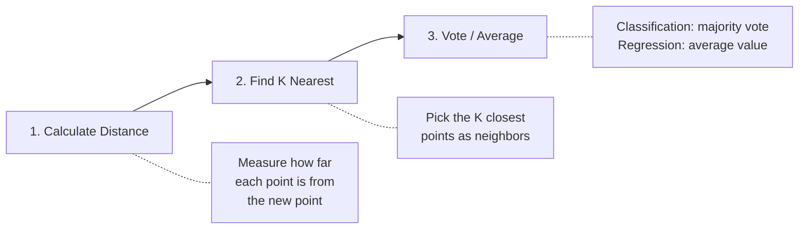
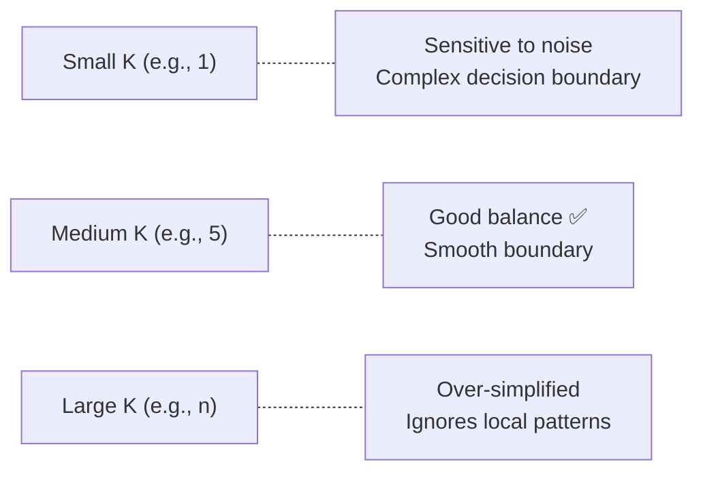

# K-Nearest Neighbors (KNN)

**K-Nearest Neighbors** is one of the simplest and most intuitive algorithms in machine learning. It answers one question: *"What are the K most similar things to this new thing, and what do they tell me about it?"*

Instead of learning a formula or building a model, KNN simply **remembers all the data** and makes decisions by looking at what's nearby.

Think of it like this: *"Tell me who your neighbors are, and I'll tell you who you are."*

> [!NOTE]
> KNN is not just a machine learning algorithm — it's also a fundamental concept in DSA. It teaches you about **distance metrics**, **sorting by proximity**, and **classification** — ideas that appear in recommendation systems, search engines, and data analysis.

## Example: Is This Fruit an Orange or a Grapefruit?

Imagine you find an unknown fruit at the market. You don't know what it is, but you can measure its **weight** and **color intensity** (how orange it is on a scale of 1–10).

You have data from fruits you already know:

| Fruit      | Weight (g) | Color Intensity |
| ---------- | ---------- | --------------- |
| Orange A   | 150        | 8               |
| Orange B   | 160        | 7               |
| Orange C   | 140        | 9               |
| Grapefruit D | 300      | 5               |
| Grapefruit E | 320      | 4               |
| Grapefruit F | 280      | 6               |

Your unknown fruit has **weight = 155g** and **color intensity = 7.5**.

**KNN approach (K = 3):** Find the 3 closest fruits to our unknown fruit, then take a vote.

How do we find "closest"? We calculate the distance from our unknown fruit to every known fruit:

- Distance to Orange A: $\sqrt{(155-150)^2 + (7.5-8)^2} = \sqrt{25.25} ≈ 5.02$
- Distance to Orange B: $\sqrt{(155-160)^2 + (7.5-7)^2} = \sqrt{25.25} ≈ 5.02$
- Distance to Orange C: $\sqrt{(155-140)^2 + (7.5-9)^2} = \sqrt{227.25} ≈ 15.07$
- Distance to Grapefruit D: $\sqrt{(155-300)^2 + (7.5-5)^2} = \sqrt{21031.25} ≈ 145.02$
- *(Grapefruits E and F are even farther away)*

The 3 nearest neighbors:

| Rank | Neighbor   | Distance | Type       |
| ---- | ---------- | -------- | ---------- |
| 1    | Orange A   | 5.02     | Orange     |
| 2    | Orange B   | 5.02     | Orange     |
| 3    | Orange C   | 15.07    | Orange     |

**Vote:** 3 Oranges, 0 Grapefruits → The unknown fruit is classified as an **Orange**! 🍊

The grapefruits were far away because they're much heavier (280–320g vs 140–160g). KNN naturally captured that.

## How It Works

KNN follows a simple 3-step process:



### Step 1: Calculate Distance

Measure the distance between the new data point and **every existing data point**. The most common distance formulas are:

**Euclidean Distance** (straight-line distance — the most common):

$$d = \sqrt{(x_2 - x_1)^2 + (y_2 - y_1)^2}$$

**Manhattan Distance** (grid-based distance — like walking city blocks):

$$d = |x_2 - x_1| + |y_2 - y_1|$$

**Example:** Distance from Unknown (155, 7.5) to Orange A (150, 8):
- Euclidean: $\sqrt{(155-150)^2 + (7.5-8)^2} = \sqrt{25 + 0.25} = \sqrt{25.25} ≈ 5.02$
- Manhattan: $|155-150| + |7.5-8| = 5 + 0.5 = 5.5$

### Step 2: Find K Nearest Neighbors

Sort all data points by distance and pick the closest **K** points.

### Step 3: Make a Decision

- **Classification** (predicting a category): The neighbors **vote**. The category with the most votes wins.
- **Regression** (predicting a number): Take the **average** of the neighbors' values.

## Classification vs. Regression

| Task               | Question                          | How KNN Answers                        |
| ------------------ | --------------------------------- | -------------------------------------- |
| **Classification** | "What category is this?"          | Majority vote of K nearest neighbors   |
| **Regression**     | "What value should this have?"    | Average value of K nearest neighbors   |

**Classification Example:** "Is this email spam or not spam?" → Look at the 5 most similar emails. If 4 are spam and 1 is not → **Spam**.

**Regression Example:** "How much is this house worth?" → Look at the 5 most similar houses. Their prices are $200K, $220K, $210K, $230K, $215K. Average → **$215K**.

## Step-by-Step Example: Movie Recommendation

Let's use KNN to predict whether a person will enjoy a new movie. We rate two features on a scale of 1–10:
- **Action Score** (how much action)
- **Romance Score** (how much romance)

**Known ratings:**

| Movie         | Action | Romance | Liked? |
| ------------- | ------ | ------- | ------ |
| Die Hard      | 9      | 2       | Yes    |
| The Notebook  | 2      | 9       | No     |
| Mad Max       | 10     | 1       | Yes    |
| Titanic       | 3      | 8       | No     |
| John Wick     | 10     | 3       | Yes    |

**New movie:** Action = 8, Romance = 3. **Will the user like it?**

**Step 1: Calculate distances** (Euclidean):

| Movie        | Distance                                             | Liked? |
| ------------ | ---------------------------------------------------- | ------ |
| Die Hard     | $\sqrt{(8-9)^2 + (3-2)^2} = \sqrt{2} ≈ 1.41$       | Yes    |
| The Notebook | $\sqrt{(8-2)^2 + (3-9)^2} = \sqrt{72} ≈ 8.49$      | No     |
| Mad Max      | $\sqrt{(8-10)^2 + (3-1)^2} = \sqrt{8} ≈ 2.83$      | Yes    |
| Titanic      | $\sqrt{(8-3)^2 + (3-8)^2} = \sqrt{50} ≈ 7.07$      | No     |
| John Wick    | $\sqrt{(8-10)^2 + (3-3)^2} = \sqrt{4} = 2.0$       | Yes    |

**Step 2: Pick K = 3 nearest:**

| Rank | Movie     | Distance | Liked? |
| ---- | --------- | -------- | ------ |
| 1    | Die Hard  | 1.41     | ✅ Yes |
| 2    | John Wick | 2.0      | ✅ Yes |
| 3    | Mad Max   | 2.83     | ✅ Yes |

**Step 3: Vote:** 3 Yes, 0 No → **Prediction: The user will like this movie!** ✅

**What just happened?** The new movie (Action=8, Romance=3) is an action-heavy, low-romance movie. Its nearest neighbors (Die Hard, John Wick, Mad Max) are all action movies the user liked. KNN figured this out just from measuring distances — no formulas, no training, just "birds of a feather flock together."

## Choosing the Right K

The value of K has a big impact on the results.

**Quick example:** Imagine classifying a point with these 5 neighbors (sorted by distance):

| Rank | Distance | Label |
| ---- | -------- | ----- |
| 1    | 1.0      | Cat   |
| 2    | 1.5      | Dog   |
| 3    | 2.0      | Dog   |
| 4    | 3.0      | Cat   |
| 5    | 3.5      | Cat   |

- **K = 1:** Only looks at rank 1 → **Cat** (1 Cat, 0 Dog)
- **K = 3:** Looks at ranks 1–3 → **Dog** (1 Cat, 2 Dogs)
- **K = 5:** Looks at all 5 → **Cat** (3 Cats, 2 Dogs)

Different K, different answer! So how do you choose?

| K Value     | Behavior                                             |
| ----------- | ---------------------------------------------------- |
| **K = 1**   | Very sensitive to noise. One outlier can ruin the prediction. |
| **K = 3-7** | Usually a good balance. Most common starting point.  |
| **K = n**   | Useless — just predicts the most common class overall. |

> [!TIP]
> **Use an odd K** for binary classification to avoid ties. Common starting values are K = 3, 5, or 7. You can experiment and pick the K that gives the best accuracy on test data.



## Feature Scaling: Why It Matters

KNN relies on distance, so features with **larger ranges dominate** the distance calculation.

**Problem:** Imagine predicting house prices with two features:
- **Square Feet:** ranges from 500 to 5,000
- **Bedrooms:** ranges from 1 to 5

Compare House A (1000 sqft, 2 bed) to House B (1500 sqft, 4 bed):
- **Without normalization:** $\sqrt{(1500-1000)^2 + (4-2)^2} = \sqrt{250004} ≈ 500$. The sqft difference (500) completely drowns out the bedroom difference (2).
- **With normalization:** $\sqrt{(0.22-0.11)^2 + (0.75-0.25)^2} = \sqrt{0.26} ≈ 0.51$. Now both features contribute fairly.

The square feet difference will overpower the bedroom difference, even though bedrooms might be equally important.

**Solution:** **Normalize** all features to the same scale (usually 0 to 1):

$$\text{normalized} = \frac{\text{value} - \text{min}}{\text{max} - \text{min}}$$

| House | Sq Ft (raw) | Bedrooms (raw) | Sq Ft (normalized) | Bedrooms (normalized) |
| ----- | ----------- | -------------- | ------------------- | --------------------- |
| A     | 1000        | 2              | 0.11                | 0.25                  |
| B     | 3000        | 4              | 0.56                | 0.75                  |
| C     | 5000        | 5              | 1.0                 | 1.0                   |

> [!CAUTION]
> Always normalize your features before running KNN! Without normalization, the algorithm essentially ignores features with small ranges.

## Complexity

| Operation      | Time Complexity | Why                                               |
| -------------- | --------------- | ------------------------------------------------- |
| **Training**   | $O(1)$          | KNN doesn't "train" — it just stores the data     |
| **Prediction** | $O(n \times d)$ | Must calculate distance to all $n$ points, each with $d$ features |
| **Space**      | $O(n \times d)$ | Stores all training data in memory                 |

> [!NOTE]
> KNN is called a **"lazy learner"** because it does no work during training. All the computation happens at prediction time. This makes training instant but predictions slow for large datasets.

## Simple Implementation (Python)

In practice, you'd use a library like `scikit-learn`. But here's the core logic in plain Python to show how simple KNN really is.

**What the code will do (the business logic):**

1. **Accept inputs:** a dataset of known points with their labels, a new unknown point, and a value for K.
2. **Loop through every known point** and calculate the Euclidean distance from it to the new point.
3. **Sort all points by distance** (closest first).
4. **Pick the top K** from the sorted list — these are the nearest neighbors.
5. **Count votes** — tally up how many of the K neighbors belong to each label/category.
6. **Return the label with the most votes** — that's our prediction.

```python
import math

def knn_classify(data, labels, new_point, k=3):
    """
    KNN in ~10 lines.
    data:      list of points, e.g. [[9, 2], [2, 9], ...]
    labels:    list of labels, e.g. ["Yes", "No", ...]
    new_point: the point to classify, e.g. [8, 3]
    k:         number of neighbors
    """
    # Logic Step 1 & 2: Calculate Euclidean distance to every known point
    distances = []
    for i, point in enumerate(data):
        dist = math.sqrt(sum((a - b) ** 2 for a, b in zip(new_point, point)))
        distances.append((dist, labels[i]))  # Store (distance, label) pairs

    # Logic Step 3 & 4: Sort by distance, take the K closest
    distances.sort()          # Sorts by first element (distance) — smallest first
    k_nearest = distances[:k] # Slice the first K items

    # Logic Step 5 & 6: Count votes from neighbors, return the winner
    votes = {}
    for dist, label in k_nearest:
        votes[label] = votes.get(label, 0) + 1  # Tally: {"Yes": 3, "No": 0}

    return max(votes, key=votes.get)  # Return label with highest count


# --- Example: Movie Recommendation ---
movies = [
    [9, 2],   # Die Hard
    [2, 9],   # The Notebook
    [10, 1],  # Mad Max
    [3, 8],   # Titanic
    [10, 3],  # John Wick
]
liked = ["Yes", "No", "Yes", "No", "Yes"]

prediction = knn_classify(movies, liked, new_point=[8, 3], k=3)
print(f"Will the user like it? {prediction}")
# Output: Will the user like it? Yes
```

That's the whole algorithm — distance, sort, vote. Everything else is optimization.

## Strengths & Weaknesses

| Strengths                                   | Weaknesses                                     |
| ------------------------------------------- | ---------------------------------------------- |
| ✅ Simple to understand and implement        | ❌ Slow predictions for large datasets ($O(n)$) |
| ✅ No training step needed                   | ❌ Stores all data in memory                    |
| ✅ Works for classification and regression   | ❌ Sensitive to irrelevant features             |
| ✅ Naturally handles multi-class problems    | ❌ Requires feature normalization               |
| ✅ No assumptions about data distribution    | ❌ Choosing the right K is trial and error       |

## When to Use KNN

-   **Recommendation Systems:** "Users who liked similar movies also liked..." Netflix and Spotify use KNN-like approaches to suggest content based on users with similar tastes.
-   **Image Recognition:** Classify handwritten digits by finding the most similar known digit images.
-   **Anomaly Detection:** If a data point's nearest neighbors are all very far away, it might be an outlier or fraud.
-   **Medical Diagnosis:** Predict disease type based on patients with similar symptoms and test results.
-   **Missing Data:** Fill in missing values by averaging the values of the K most similar records.

> [!TIP]
> KNN is a great **first algorithm to try** on a new dataset. It's simple, gives decent results, and helps you understand the data before trying more complex approaches.
