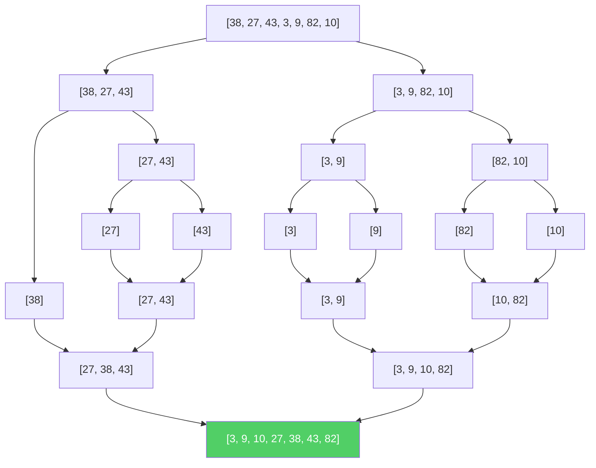

# Merge Sort

**Merge Sort** is a sorting algorithm that applies the **Divide and Conquer** strategy to sort data. It is one of the most well-known examples of Divide and Conquer in action — it splits the array in half repeatedly until each piece has just one element, then merges those pieces back together in sorted order.

> [!NOTE]
> Divide and Conquer is the general strategy (split → solve → combine); Merge Sort is a specific algorithm that uses this strategy. Other D&C algorithms include Quicksort and Binary Search.

Imagine you're playing a card game and you receive a messy hand of 8 cards. Instead of scanning through all cards repeatedly, you split your hand in half — 4 cards in each hand. You split each group again into 2, then again until you're holding single cards. Now, you pick up two single cards, compare them, and place them in order. You merge pairs of 2 into sorted groups of 4, then merge those into a fully sorted hand of 8. The magic is that **merging two already-sorted groups is easy** — just compare the front cards and pick the smaller one.

## How it Works

1. **Divide:** Split the array into two halves from the middle.
2. **Conquer:** Recursively sort each half by applying Merge Sort again.
3. **Combine (Merge):** Merge the two sorted halves back into one sorted array by comparing elements one by one.
4. **Base Case:** An array with 0 or 1 element is already sorted — stop splitting.

> [!NOTE]
> The key insight of Merge Sort is: **merging two already-sorted lists into one sorted list is very easy and fast** — you just compare the front elements and pick the smaller one each time. The "divide" step breaks the problem down until sorting is trivial (single elements), and the "merge" step does all the real work.

## Step-by-Step Example

Let's sort the list: `[38, 27, 43, 3, 9, 82, 10]`

### Phase 1: Divide (Split until single elements)

```text
                [38, 27, 43, 3, 9, 82, 10]
                /                          \
        [38, 27, 43]                  [3, 9, 82, 10]
         /        \                    /            \
      [38]     [27, 43]           [3, 9]        [82, 10]
                /    \             /    \          /    \
             [27]   [43]        [3]   [9]      [82]  [10]
```

Now every piece has just **one element** — and a single element is always sorted! ✅

### Phase 2: Merge (Combine back in sorted order)

```text
             [27]   [43]        [3]   [9]      [82]  [10]
                \    /             \    /          \    /
             [27, 43]            [3, 9]         [10, 82]
         \        /                \              /
      [27, 38, 43]              [3, 9, 10, 82]
                \                    /
          [3, 9, 10, 27, 38, 43, 82]  ✅ Sorted!
```

### Tracing One Merge Step

Let's trace how merging `[27, 38, 43]` and `[3, 9, 10, 82]` works:

```text
Left:  [27, 38, 43]     Right: [3, 9, 10, 82]     Result: []
        ^                       ^
Compare: 27 vs 3 → pick 3

Left:  [27, 38, 43]     Right: [3, 9, 10, 82]     Result: [3]
        ^                          ^
Compare: 27 vs 9 → pick 9

Left:  [27, 38, 43]     Right: [3, 9, 10, 82]     Result: [3, 9]
        ^                             ^
Compare: 27 vs 10 → pick 10

Left:  [27, 38, 43]     Right: [3, 9, 10, 82]     Result: [3, 9, 10]
        ^                                 ^
Compare: 27 vs 82 → pick 27

Left:  [27, 38, 43]     Right: [3, 9, 10, 82]     Result: [3, 9, 10, 27]
            ^                             ^
Compare: 38 vs 82 → pick 38

Left:  [27, 38, 43]     Right: [3, 9, 10, 82]     Result: [3, 9, 10, 27, 38]
                ^                         ^
Compare: 43 vs 82 → pick 43

Left:  [27, 38, 43]     Right: [3, 9, 10, 82]     Result: [3, 9, 10, 27, 38, 43]
             (empty)                      ^
Left is empty → append remaining: 82

Final Result: [3, 9, 10, 27, 38, 43, 82] ✅
```

> [!TIP]
> The merge step is like merging two sorted decks of cards. You always look at the top card of each deck, pick the smaller one, and place it face-down in the result pile. When one deck runs out, dump the rest of the other deck onto the result.

## Visual Diagram



## Complexity

- **Time Complexity:**
  - **Best, Average, and Worst Case:** $O(n \log n)$. Unlike Quicksort, Merge Sort **always** divides the array exactly in half, so the performance is consistent regardless of the input.
  - **Why $n \log n$?** There are $\log n$ levels of splitting (you halve the array $\log n$ times). At each level, merging all the pieces takes $O(n)$ total work. So: $\log n$ levels × $n$ work per level = $O(n \log n)$.
- **Space Complexity:** $O(n)$. Merge Sort needs extra space to hold the temporary arrays during merging. This is the main trade-off compared to in-place algorithms like Quicksort.

| Case        | Time Complexity | Space Complexity |
| ----------- | --------------- | ---------------- |
| **Best**    | $O(n \log n)$   | $O(n)$           |
| **Average** | $O(n \log n)$   | $O(n)$           |
| **Worst**   | $O(n \log n)$   | $O(n)$           |

> [!IMPORTANT]
> Merge Sort guarantees $O(n \log n)$ in **all** cases. This is a huge advantage over Quicksort, which can degrade to $O(n^2)$ in the worst case. If you need guaranteed performance, Merge Sort is the safer choice.

## Algorithm Steps

1. If the array has 0 or 1 elements, it's already sorted — return it (base case).
2. Find the middle index: `mid = len(arr) // 2`.
3. Recursively sort the left half: `merge_sort(arr[:mid])`.
4. Recursively sort the right half: `merge_sort(arr[mid:])`.
5. Merge the two sorted halves:
   - Use two pointers, one for each half.
   - Compare the elements at both pointers, pick the smaller one, and add it to the result.
   - Move the pointer forward in whichever half you picked from.
   - When one half is exhausted, append the remaining elements from the other half.

## Implementation

### Python

#### 1. Basic Implementation (Clear and Simple)

```python
def merge_sort(arr):
    # Base case: array with 0 or 1 element is already sorted
    if len(arr) <= 1:
        return arr

    # Divide: find the middle and split
    mid = len(arr) // 2
    left_half = merge_sort(arr[:mid])     # Recursively sort left
    right_half = merge_sort(arr[mid:])    # Recursively sort right

    # Conquer: merge the two sorted halves
    return merge(left_half, right_half)


def merge(left, right):
    """Merge two sorted lists into one sorted list."""
    result = []
    i = 0  # Pointer for left
    j = 0  # Pointer for right

    # Compare elements from both lists and pick the smaller one
    while i < len(left) and j < len(right):
        if left[i] <= right[j]:
            result.append(left[i])
            i += 1
        else:
            result.append(right[j])
            j += 1

    # One list is exhausted — append the remaining elements from the other
    result.extend(left[i:])
    result.extend(right[j:])

    return result


# Example usage:
numbers = [38, 27, 43, 3, 9, 82, 10]
sorted_numbers = merge_sort(numbers)
print(f"Sorted list: {sorted_numbers}")
# Output: Sorted list: [3, 9, 10, 27, 38, 43, 82]
```

#### 2. In-Place Implementation (Memory Efficient)

This version modifies the original array instead of creating new lists at each step.

```python
def merge_sort_inplace(arr, left, right):
    """Sort arr[left..right] in-place."""
    if left < right:
        mid = (left + right) // 2

        # Sort both halves
        merge_sort_inplace(arr, left, mid)
        merge_sort_inplace(arr, mid + 1, right)

        # Merge the sorted halves
        merge_inplace(arr, left, mid, right)


def merge_inplace(arr, left, mid, right):
    """Merge arr[left..mid] and arr[mid+1..right] into arr[left..right]."""
    # Create temporary copies of both halves
    left_copy = arr[left:mid + 1]
    right_copy = arr[mid + 1:right + 1]

    i = 0  # Pointer for left_copy
    j = 0  # Pointer for right_copy
    k = left  # Pointer for the original array

    # Merge back into arr[left..right]
    while i < len(left_copy) and j < len(right_copy):
        if left_copy[i] <= right_copy[j]:
            arr[k] = left_copy[i]
            i += 1
        else:
            arr[k] = right_copy[j]
            j += 1
        k += 1

    # Copy remaining elements
    while i < len(left_copy):
        arr[k] = left_copy[i]
        i += 1
        k += 1

    while j < len(right_copy):
        arr[k] = right_copy[j]
        j += 1
        k += 1


# Example usage:
numbers = [38, 27, 43, 3, 9, 82, 10]
merge_sort_inplace(numbers, 0, len(numbers) - 1)
print(f"In-place sorted: {numbers}")
# Output: In-place sorted: [3, 9, 10, 27, 38, 43, 82]
```

### Java

#### 1. Basic Implementation (Clear and Simple)

```java
import java.util.ArrayList;
import java.util.List;

public class MergeSortBasic {

    public static List<Integer> mergeSort(List<Integer> arr) {
        // Base case: array with 0 or 1 element is already sorted
        if (arr.size() <= 1) {
            return arr;
        }

        // Divide: find the middle and split
        int mid = arr.size() / 2;
        List<Integer> leftHalf = mergeSort(new ArrayList<>(arr.subList(0, mid)));
        List<Integer> rightHalf = mergeSort(new ArrayList<>(arr.subList(mid, arr.size())));

        // Conquer: merge the two sorted halves
        return merge(leftHalf, rightHalf);
    }

    private static List<Integer> merge(List<Integer> left, List<Integer> right) {
        List<Integer> result = new ArrayList<>();
        int i = 0; // Pointer for left
        int j = 0; // Pointer for right

        // Compare elements from both lists and pick the smaller one
        while (i < left.size() && j < right.size()) {
            if (left.get(i) <= right.get(j)) {
                result.add(left.get(i));
                i++;
            } else {
                result.add(right.get(j));
                j++;
            }
        }

        // Append remaining elements
        while (i < left.size()) {
            result.add(left.get(i));
            i++;
        }
        while (j < right.size()) {
            result.add(right.get(j));
            j++;
        }

        return result;
    }

    public static void main(String[] args) {
        List<Integer> numbers = List.of(38, 27, 43, 3, 9, 82, 10);
        System.out.println("Sorted list: " + mergeSort(new ArrayList<>(numbers)));
        // Output: Sorted list: [3, 9, 10, 27, 38, 43, 82]
    }
}
```

#### 2. In-Place Implementation (Array-Based)

```java
public class MergeSortInPlace {

    public static void mergeSort(int[] arr, int left, int right) {
        if (left < right) {
            int mid = (left + right) / 2;

            // Sort both halves
            mergeSort(arr, left, mid);
            mergeSort(arr, mid + 1, right);

            // Merge the sorted halves
            merge(arr, left, mid, right);
        }
    }

    private static void merge(int[] arr, int left, int mid, int right) {
        // Create temporary copies of both halves
        int[] leftCopy = new int[mid - left + 1];
        int[] rightCopy = new int[right - mid];

        System.arraycopy(arr, left, leftCopy, 0, leftCopy.length);
        System.arraycopy(arr, mid + 1, rightCopy, 0, rightCopy.length);

        int i = 0; // Pointer for leftCopy
        int j = 0; // Pointer for rightCopy
        int k = left; // Pointer for original array

        // Merge back into arr[left..right]
        while (i < leftCopy.length && j < rightCopy.length) {
            if (leftCopy[i] <= rightCopy[j]) {
                arr[k] = leftCopy[i];
                i++;
            } else {
                arr[k] = rightCopy[j];
                j++;
            }
            k++;
        }

        // Copy remaining elements
        while (i < leftCopy.length) {
            arr[k] = leftCopy[i];
            i++;
            k++;
        }
        while (j < rightCopy.length) {
            arr[k] = rightCopy[j];
            j++;
            k++;
        }
    }

    public static void main(String[] args) {
        int[] data = {38, 27, 43, 3, 9, 82, 10};
        mergeSort(data, 0, data.length - 1);

        System.out.print("In-place sorted: ");
        for (int num : data) {
            System.out.print(num + " ");
        }
        System.out.println();
        // Output: In-place sorted: 3 9 10 27 38 43 82
    }
}
```

## Merge Sort vs Quicksort

These two are the most important $O(n \log n)$ sorting algorithms, and interviews often ask you to compare them:

| Criteria              | Merge Sort                     | Quicksort                   |
| --------------------- | ------------------------------ | --------------------------- |
| **Strategy**          | Divide, sort, merge            | Pick pivot, partition, sort |
| **Worst-case time**   | $O(n \log n)$ always           | $O(n^2)$ (bad pivot)        |
| **Average-case time** | $O(n \log n)$                  | $O(n \log n)$               |
| **Space**             | $O(n)$ extra                   | $O(\log n)$ (in-place)      |
| **Stable?**           | ✅ Yes (preserves equal order)  | ❌ No (by default)           |
| **In-place?**         | ❌ No (needs extra arrays)      | ✅ Yes                       |
| **Best for**          | Linked lists, guaranteed perf  | Arrays, average-case speed  |
| **Used by**           | Python's `sort()`, Java's sort | C's `qsort`, many libraries |

> [!NOTE]
> Python's built-in `sort()` and `sorted()` use **Timsort**, which is a hybrid of Merge Sort and Insertion Sort. Java uses a dual-pivot Quicksort for primitives and Timsort for objects. Both languages chose Merge Sort variants for their stability guarantee.

## Stability: Why It Matters

Merge Sort is a **stable** sort — it preserves the relative order of elements that have equal keys.

**Example:** Sorting students by grade (some have the same grade):

```text
Before: [("Alice", B), ("Bob", A), ("Charlie", B), ("David", A)]

Sort by grade:
  Stable:   [("Bob", A), ("David", A), ("Alice", B), ("Charlie", B)]
                ↑ Bob was before David, and they stay in that order ✅

  Unstable: [("David", A), ("Bob", A), ("Charlie", B), ("Alice", B)]
                ↑ Order of equal elements might change ⚠️
```

This matters when you sort by multiple criteria (e.g., sort by grade, then by name within the same grade).

## Advantages & Disadvantages

**Advantages:**
- Guaranteed $O(n \log n)$ performance — no worst-case surprise like Quicksort's $O(n^2)$.
- Stable sort — preserves the relative order of equal elements.
- Excellent for sorting linked lists (no random access needed, and no extra space for the merge step).
- Naturally parallelizable — the two halves can be sorted independently on different cores.

**Disadvantages:**
- Requires $O(n)$ extra space for the temporary arrays during merging (not in-place).
- Slower than Quicksort in practice for arrays due to cache performance and overhead of copying.
- Recursive implementation can cause stack overflow on extremely large arrays (though this is rare).

## Key Takeaways

- Merge Sort splits the array in half, sorts each half recursively, and merges them back — **divide and conquer**.
- The merge step is the core: comparing front elements of two sorted lists and picking the smaller one.
- Time complexity is **always** $O(n \log n)$ — best, average, and worst case.
- It needs $O(n)$ extra space, which is the main trade-off versus in-place sorts.
- It's a **stable** sort, making it ideal when preserving the order of equal elements matters.
- Python and Java both use Merge Sort variants (Timsort) in their built-in sorting functions.
- Choose Merge Sort over Quicksort when you need **guaranteed performance** or **stability**.
