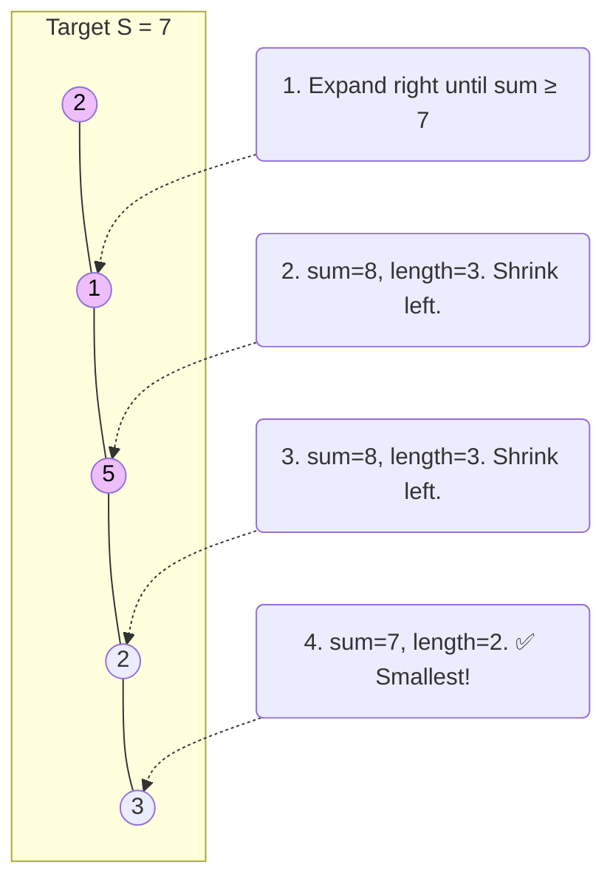

# Sliding Window

The **Sliding Window** technique is a specific variation of the Two Pointers pattern. It is used to process **contiguous subarrays or substrings** within a larger array or string.

Instead of recalculating overlapping data from scratch every time, the sliding window technique takes the result of the previous window and modifies it. When the window "slides" forward, you simply **subtract the element that fell out of the window** and **add the new element that came into the window**.

> [!NOTE]
> While general Two Pointers can start at opposite ends and move toward each other, a Sliding Window always maintains a continuous block of elements (a "window") defined by a `left` and `right` pointer. Both pointers move in the same direction (usually left to right).

## Real-Life Analogy: Looking Through a Train Window

Imagine you are riding a train, looking out a small square window. The window is exactly wide enough to see **three trees** at a time.

As the train moves forward:
1. A new tree comes into view on the right side of the window.
2. An old tree disappears from the left side of the window.
3. At any given moment, you still only see exactly three trees.

If someone asks you, "How many apples are on the trees currently in your window?", you don't need to recount all three trees every time the train moves. You just take your previous total, **subtract** the apples from the tree that just left your view, and **add** the apples from the new tree that just entered your view.

This saves you a ton of time and effort — which is exactly why the Sliding Window algorithm reduces $O(N \times K)$ nested loops into a single $O(N)$ pass!

## Two Types of Sliding Windows

### 1. Fixed-Size Window
The distance between the `left` and `right` pointers remains exactly the same (e.g., $K$). The entire window slides across the array one step at a time.
* **Best for:** "Find the max sum of a subarray of size K", "Find the average of all contiguous subarrays of size K".

### 2. Dynamic-Size Window
The window can grow and shrink. The `right` pointer expands the window to include more elements, and the `left` pointer shrinks the window when a certain condition is broken.
* **Best for:** "Find the shortest subarray with a sum $\ge$ target", "Find the longest substring with no repeating characters".

---

## Classic Problems & Examples

Let's look at the most common Sliding Window problems, starting with a fixed window and moving to dynamic windows.

### Problem 1: Maximum Sum Subarray of Size K (Fixed Window)

**Problem:** Given an array of positive integers and a positive integer `k`, find the maximum sum of any contiguous subarray of size `k`.

**Example:** `arr = [2, 1, 5, 1, 3, 2]`, `k = 3`

**Brute Force ($O(N \times K)$):** Look at `[2, 1, 5]`, then look at `[1, 5, 1]`, then `[5, 1, 3]`. For every window, calculate the sum from scratch.

**Sliding Window Strategy ($O(N)$):** 
Calculate the sum of the first window. Then, slide the window by subtracting the element going out and adding the element coming in.

**Step-by-step:**

```text
[ 2,  1,  5,  1,  3,  2 ]     Window sum = 2 + 1 + 5 = 8
  |-------|                   Max sum = 8

[ 2,  1,  5,  1,  3,  2 ]     Window sum = 8 - 2 + 1 = 7
      |-------|               Max sum = 8

[ 2,  1,  5,  1,  3,  2 ]     Window sum = 7 - 1 + 3 = 9
          |-------|           Max sum = 9  ✅ (New Max!)

[ 2,  1,  5,  1,  3,  2 ]     Window sum = 9 - 5 + 2 = 6
              |-------|       Max sum = 9
```

#### Python

```python
def max_sub_array_of_size_k(k, arr):
    max_sum = 0
    window_sum = 0
    window_start = 0

    for window_end in range(len(arr)):
        window_sum += arr[window_end]  # Add the next element

        # When we hit the window size 'k', we slide it forward
        if window_end >= k - 1:
            max_sum = max(max_sum, window_sum)
            window_sum -= arr[window_start]  # Subtract the element going out
            window_start += 1                # Slide the window ahead

    return max_sum

# Example
arr =
k = 3
print(max_sub_array_of_size_k(k, arr))  # Output: 9
```

#### Java

```java
public class MaxSumSubArrayOfSizeK {
    public static int findMaxSumSubArray(int k, int[] arr) {
        int maxSum = 0;
        int windowSum = 0;
        int windowStart = 0;
        
        for (int windowEnd = 0; windowEnd < arr.length; windowEnd++) {
            windowSum += arr[windowEnd]; // Add the next element
            
            // Slide the window if we've hit size k
            if (windowEnd >= k - 1) {
                maxSum = Math.max(maxSum, windowSum);
                windowSum -= arr[windowStart]; // Subtract outgoing element
                windowStart++;                 // Slide window start forward
            }
        }
        
        return maxSum;
    }

    public static void main(String[] args) {
        int[] arr = {2, 1, 5, 1, 3, 2};
        int k = 3;
        System.out.println("Maximum sum of a subarray of size " + k + ": " + findMaxSumSubArray(k, arr));
        // Output: 9
    }
}
```

---

### Problem 2: Smallest Subarray with a Greater Sum (Dynamic Window)

**Problem:** Given an array of positive integers and a number `S`, find the length of the **smallest contiguous subarray** whose sum is greater than or equal to `S`. Return 0 if no such subarray exists.

**Example:** `arr = [2, 1, 5, 2, 3, 2]`, `S = 7`

**Sliding Window Strategy:**
Because we don't know the exact size of the window, we use a **Dynamic Window**. 
1. Expand the window (move `right`) to add elements until the sum $\ge S$.
2. Once the condition is met, record the window size.
3. Shrink the window from the left (move `left`) to see if we can find a *smaller* window that still satisfies the condition.
4. Repeat until the end of the array.



#### Python

```python
import math

def min_subarray_len(s, arr):
    min_length = math.inf
    window_sum = 0
    window_start = 0
    
    for window_end in range(len(arr)):
        window_sum += arr[window_end]  # Expand window
        
        # Shrink the window as small as possible until the sum is smaller than 's'
        while window_sum >= s:
            min_length = min(min_length, window_end - window_start + 1)
            window_sum -= arr[window_start]
            window_start += 1
            
    return min_length if min_length != math.inf else 0

# Example
arr =
S = 7
print(min_subarray_len(S, arr))  # Output: 2 (subarray or)
```

#### Java

```java
public class MinSizeSubArraySum {
    public static int findMinSubArray(int S, int[] arr) {
        int minLength = Integer.MAX_VALUE;
        int windowSum = 0;
        int windowStart = 0;
        
        for (int windowEnd = 0; windowEnd < arr.length; windowEnd++) {
            windowSum += arr[windowEnd]; // Expand the window
            
            // Shrink window from the left as long as the condition is satisfied
            while (windowSum >= S) {
                minLength = Math.min(minLength, windowEnd - windowStart + 1);
                windowSum -= arr[windowStart]; // Subtract the element going out
                windowStart++;                 // Shrink the window
            }
        }
        
        return minLength == Integer.MAX_VALUE ? 0 : minLength;
    }

    public static void main(String[] args) {
        int[] arr = {2, 1, 5, 2, 3, 2};
        int S = 7;
        System.out.println("Smallest subarray length: " + findMinSubArray(S, arr)); 
        // Output: 2
    }
}
```

---

### Problem 3: Longest Substring Without Repeating Characters

**Problem:** Given a string `s`, find the length of the longest substring without repeating characters.

> [!TIP]
> Whenever a problem asks for contiguous elements (substring/subarray) meeting a specific rule (no duplicates), Dynamic Sliding Window combined with a Hash Map or Hash Set is your best friend.

**Example:** `s = "abcabcbb"`

**Sliding Window Strategy:**
1. Use a Hash Set to track the characters currently in your window.
2. Expand the `right` pointer. If the character is not in the set, add it and update the max length.
3. If the character *is* already in the set (a duplicate), shrink the `left` pointer, removing characters from the set until the duplicate is gone.

**Step-by-step for "abcabcbb":**
```text
[ a,  b,  c ] a  b  c  b  b      -> max=3, Set=[a,b,c]
      |-------|                 

  a [ b,  c,  a ] b  c  b  b      -> Hit 'a'. Shrink left. max=3, Set=[b,c,a]
          |-------|             

  a   b [ c,  a,  b ] c  b  b     -> Hit 'b'. Shrink left. max=3, Set=[c,a,b]
              |-------|         
```

#### Python

```python
def length_of_longest_substring(s):
    char_set = set()
    left = 0
    max_length = 0
    
    for right in range(len(s)):
        # If we see a duplicate, shrink the window from the left
        while s[right] in char_set:
            char_set.remove(s[left])
            left += 1
            
        # Add the new unique character to the set
        char_set.add(s[right])
        # Update the max length found so far
        max_length = max(max_length, right - left + 1)
        
    return max_length

# Example
print(length_of_longest_substring("abcabcbb"))  # Output: 3 (substring "abc", "bca", or "cab")
print(length_of_longest_substring("bbbbb"))     # Output: 1 (substring "b")
```

#### Java

```java
import java.util.HashSet;
import java.util.Set;

public class LongestSubstring {
    public static int lengthOfLongestSubstring(String s) {
        Set<Character> charSet = new HashSet<>();
        int left = 0;
        int maxLength = 0;
        
        for (int right = 0; right < s.length(); right++) {
            char currentChar = s.charAt(right);
            
            // If character is a duplicate, shrink from the left until it's removed
            while (charSet.contains(currentChar)) {
                charSet.remove(s.charAt(left));
                left++;
            }
            
            // Add the new unique character to the window
            charSet.add(currentChar);
            maxLength = Math.max(maxLength, right - left + 1);
        }
        
        return maxLength;
    }

    public static void main(String[] args) {
        System.out.println("Longest substring: " + lengthOfLongestSubstring("abcabcbb")); // 3
        System.out.println("Longest substring: " + lengthOfLongestSubstring("bbbbb"));    // 1
    }
}
```

## Complexity Analysis

| Metric | Complexity | Why? |
| :--- | :--- | :--- |
| **Time** | **$O(N)$** | Although there is a `while` loop inside a `for` loop in dynamic window problems, the `left` pointer only ever moves forward. Every element is processed at most twice (once added by `right`, once removed by `left`). $O(N + N) = O(N)$. |
| **Space** | **$O(1)$ or $O(K)$** | $O(1)$ if you only need variables to track sums. If you use a Hash Map or Set (like in Problem 3), it takes space proportional to the unique characters/elements in the window, which is bounded by the alphabet size or $O(K)$. |

## Sliding Window vs. General Two Pointers

How do you know if you should use Sliding Window or just standard Two Pointers?

| Feature | General Two Pointers | Sliding Window |
| :--- | :--- | :--- |
| **Data grouping** | Usually comparing separate items (pairs, triplets). | Always evaluating a **contiguous** sequence (subarray, substring). |
| **Pointer directions** | Can be opposite ends (`left` inward, `right` inward) or same direction. | Almost always same direction (`left` and `right` start at 0, expanding to the right). |
| **State tracking** | Usually just tracks individual values (like sum of `arr[left] + arr[right]`). | Tracks a running state of the window (window sum, hash map of frequencies, etc.). |

## When to Use Sliding Window

If you see a problem with the following characteristics, Sliding Window is likely the correct approach:

1. The problem involves a linear data structure like an **Array**, **List**, or **String**.
2. You are asked to find a **contiguous subarray or substring** (e.g., "Longest contiguous sequence", "Shortest subarray").
3. You need to calculate a max/min/average/target value for that block of elements.
4. The brute force solution is $O(N^2)$ or $O(N^3)$, but you are looking for an $O(N)$ solution.

## Key Takeaways

- Sliding Window prevents redundant calculations by tracking a rolling state (e.g., adding the new element and subtracting the old element).
- **Fixed Windows** maintain a constant distance between `left` and `right`.
- **Dynamic Windows** use `right` to aggressively expand and satisfy a condition, and `left` to aggressively shrink and optimize the condition.
- Despite the nested loops in dynamic windows, the time complexity remains $O(N)$ because the left pointer never moves backward.