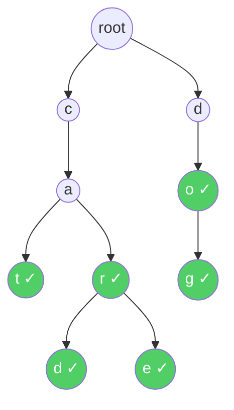
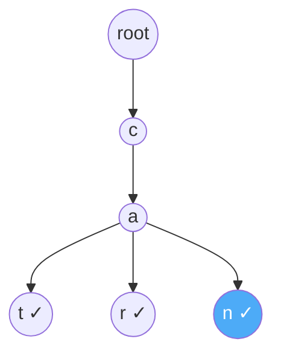

# Tries (Prefix Trees)

A **Trie** (pronounced "try") is a tree-like data structure used for storing and searching **strings** efficiently. Unlike a binary tree where each node has at most 2 children, a Trie node can have **up to 26 children** (one for each letter of the alphabet). It's built so that words sharing the same **prefix** (beginning) share the same path in the tree.

Imagine the **autocomplete** feature on your phone. You type "ca" and it instantly suggests "car", "cat", "cake", "call". Your phone doesn't search through every word in the dictionary — it walks down a tree of letters. After reaching the "c" → "a" path, it only looks at words branching from that point. That tree is a Trie.

> [!NOTE]
> The name "Trie" comes from the word re**trie**val. It's designed to make finding strings extremely fast — especially when many strings share common prefixes.

## How a Trie Looks

Let's store these words: **"cat"**, **"car"**, **"card"**, **"care"**, **"dog"**, **"do"**



**Key observations:**
- The **root** node is empty — it represents the starting point.
- "cat" and "car" **share** the path `c → a` because they have the same prefix "ca".
- "car", "card", and "care" **share** the path `c → a → r`.
- The green ✓ marks indicate nodes where a **complete word ends**.
- "do" ends at `o` (✓), and "dog" continues to `g` (✓). Both are valid words.

> [!IMPORTANT]
> Not every node is a complete word. The node `c` exists because "cat" and "car" pass through it, but "c" itself is not a word in our Trie. That's why we need a **flag** (`is_end_of_word`) to mark which nodes represent complete words.

## Real-Life Analogy: A Phone Directory

Imagine a physical phone directory organized by first letter, then second letter, and so on:

```text
Section C:
  CA:
    CAR → 📞 555-0101
      CARD → 📞 555-0102
      CARE → 📞 555-0103
    CAT → 📞 555-0104
  ...
Section D:
  DO → 📞 555-0201
    DOG → 📞 555-0202
  ...
```

You don't scan every name from A to Z. You jump to the right section (C), then the right subsection (CA), then narrow down further. Each "section" is a node in the Trie. This is why lookups are so fast — you only follow the path of the letters you need.

## Trie Operations

### 1. Insert a Word

Walk through the word letter by letter. At each letter, check if a child node for that letter exists. If it does, move to it. If it doesn't, create a new node. After the last letter, mark the node as `end_of_word`.

**Example:** Insert "can" into the Trie that already has "cat" and "car":

```text
Start at root
  'c' → exists, move to it
  'a' → exists, move to it
  'n' → does NOT exist, CREATE new node
  Mark 'n' as end_of_word ✓

Path reused: c → a (shared with "cat" and "car")
New path: n
```



### 2. Search for a Word

Walk through the word letter by letter. If at any point a child node doesn't exist for the next letter, the word is **not in the Trie**. If you reach the end of the word, check if the node is marked as `end_of_word`.

**Example:** Search for "car":

```text
Start at root
  'c' → exists, move to it ✅
  'a' → exists, move to it ✅
  'r' → exists, move to it ✅
  End of word? YES ✓ → FOUND!
```

**Example:** Search for "ca":

```text
Start at root
  'c' → exists, move to it ✅
  'a' → exists, move to it ✅
  End of word? NO ✗ → NOT FOUND
  ("ca" is a prefix, but not a stored word)
```

**Example:** Search for "cup":

```text
Start at root
  'c' → exists, move to it ✅
  'u' → does NOT exist → NOT FOUND
```

### 3. Starts With (Prefix Search)

Same as search, but you **don't** check `end_of_word` at the end. If you can walk through all the letters of the prefix without hitting a dead end, then at least one word in the Trie starts with that prefix.

**Example:** Does any word start with "ca"?

```text
Start at root
  'c' → exists ✅
  'a' → exists ✅
  All letters matched → YES, words exist with prefix "ca"
  (cat, car, card, care, can all start with "ca")
```

### 4. Delete a Word

Deleting is trickier because you need to be careful not to remove nodes that are shared by other words.

**Logic:**
1. If the word doesn't exist, do nothing.
2. Unmark `end_of_word` on the last node.
3. Remove nodes bottom-up **only if** they have no other children and are not `end_of_word` for another word.

**Example:** Delete "card" from a Trie containing "car", "card", "care":

```text
Walk to c → a → r → d
Unmark 'd' as end_of_word
'd' has no children → remove it
'r' still has child 'e' and is end_of_word ("car") → STOP, don't delete
```

## Complexity

| Operation              | Time Complexity | Space Complexity |
| ---------------------- | --------------- | ---------------- |
| **Insert**             | $O(m)$          | $O(m)$ worst     |
| **Search**             | $O(m)$          | $O(1)$           |
| **Starts with prefix** | $O(m)$          | $O(1)$           |
| **Delete**             | $O(m)$          | $O(1)$           |

Where $m$ is the **length of the word/prefix** (not the total number of words).

> [!TIP]
> Notice that Trie operations depend on **word length** $m$, not the **number of words** $n$ in the Trie. Whether the Trie has 10 words or 10 million, searching for "cat" always takes exactly 3 steps. This is what makes Tries so powerful for string lookups.

**Space complexity** for the entire Trie is $O(n \times m)$ in the worst case (where $n$ is the number of words and $m$ is the average word length), because each word could potentially create all new nodes. In practice, shared prefixes reduce this significantly.

## Trie vs Other Data Structures

| Feature            | Array/List       | Hash Table       | Trie                     |
| ------------------ | ---------------- | ---------------- | ------------------------ |
| **Search word**    | $O(n \times m)$  | $O(m)$ average   | $O(m)$                   |
| **Prefix search**  | $O(n \times m)$  | ❌ Not supported  | $O(m)$ ✅                 |
| **Autocomplete**   | $O(n \times m)$  | ❌ Not efficient  | $O(m + k)$ ✅             |
| **Sorted output**  | Need to sort     | ❌ Unordered      | ✅ Natural (DFS traversal) |
| **Space**          | $O(n \times m)$  | $O(n \times m)$  | Can be higher per node   |

Where $k$ is the number of results returned for autocomplete.

> [!NOTE]
> Hash Tables can check if a specific word exists in $O(m)$ time, but they **cannot** answer "which words start with this prefix?" efficiently. Tries are purpose-built for prefix operations.

## Implementation

### Python

```python
class TrieNode:
    def __init__(self):
        self.children = {}         # letter → TrieNode
        self.is_end_of_word = False


class Trie:
    def __init__(self):
        self.root = TrieNode()

    def insert(self, word):
        """Insert a word into the Trie."""
        node = self.root
        for char in word:
            if char not in node.children:
                node.children[char] = TrieNode()  # Create node if missing
            node = node.children[char]             # Move to next node
        node.is_end_of_word = True                 # Mark end of word

    def search(self, word):
        """Return True if the word exists in the Trie."""
        node = self._find_node(word)
        return node is not None and node.is_end_of_word

    def starts_with(self, prefix):
        """Return True if any word in the Trie starts with this prefix."""
        return self._find_node(prefix) is not None

    def _find_node(self, prefix):
        """Walk down the Trie following the prefix. Return the last node, or None."""
        node = self.root
        for char in prefix:
            if char not in node.children:
                return None          # Path doesn't exist
            node = node.children[char]
        return node

    def get_all_words_with_prefix(self, prefix):
        """Return all words that start with the given prefix (autocomplete)."""
        node = self._find_node(prefix)
        if node is None:
            return []
        results = []
        self._dfs_collect(node, prefix, results)
        return results

    def _dfs_collect(self, node, current_word, results):
        """DFS to collect all complete words from this node onward."""
        if node.is_end_of_word:
            results.append(current_word)
        for char, child_node in sorted(node.children.items()):
            self._dfs_collect(child_node, current_word + char, results)

    def delete(self, word):
        """Delete a word from the Trie."""
        self._delete_recursive(self.root, word, 0)

    def _delete_recursive(self, node, word, depth):
        """Returns True if the parent should delete this node."""
        if depth == len(word):
            if not node.is_end_of_word:
                return False               # Word doesn't exist
            node.is_end_of_word = False
            return len(node.children) == 0  # Delete node if no children

        char = word[depth]
        if char not in node.children:
            return False                    # Word doesn't exist

        should_delete = self._delete_recursive(node.children[char], word, depth + 1)

        if should_delete:
            del node.children[char]
            # Delete this node too if it has no other children and isn't end of another word
            return len(node.children) == 0 and not node.is_end_of_word

        return False


# --- Example Usage ---
trie = Trie()

# Insert words
for word in ["cat", "car", "card", "care", "can", "dog", "do"]:
    trie.insert(word)

# Search
print("Search 'car':", trie.search("car"))     # True
print("Search 'ca':", trie.search("ca"))        # False (prefix, not a word)
print("Search 'cup':", trie.search("cup"))      # False

# Prefix check
print("Starts with 'ca':", trie.starts_with("ca"))  # True
print("Starts with 'cu':", trie.starts_with("cu"))  # False

# Autocomplete
print("Words with prefix 'ca':", trie.get_all_words_with_prefix("ca"))
# Output: ['can', 'car', 'card', 'care', 'cat']

print("Words with prefix 'do':", trie.get_all_words_with_prefix("do"))
# Output: ['do', 'dog']

# Delete
trie.delete("card")
print("After deleting 'card':")
print("  Search 'card':", trie.search("card"))   # False
print("  Search 'car':", trie.search("car"))     # True (still exists)
print("  Search 'care':", trie.search("care"))   # True (still exists)
```

### Java

```java
import java.util.*;

public class Trie {

    static class TrieNode {
        Map<Character, TrieNode> children = new HashMap<>();
        boolean isEndOfWord = false;
    }

    private final TrieNode root;

    public Trie() {
        root = new TrieNode();
    }

    public void insert(String word) {
        TrieNode node = root;
        for (char ch : word.toCharArray()) {
            node.children.putIfAbsent(ch, new TrieNode());  // Create if missing
            node = node.children.get(ch);                    // Move to next
        }
        node.isEndOfWord = true;                             // Mark end of word
    }

    public boolean search(String word) {
        TrieNode node = findNode(word);
        return node != null && node.isEndOfWord;
    }

    public boolean startsWith(String prefix) {
        return findNode(prefix) != null;
    }

    private TrieNode findNode(String prefix) {
        TrieNode node = root;
        for (char ch : prefix.toCharArray()) {
            if (!node.children.containsKey(ch)) {
                return null;    // Path doesn't exist
            }
            node = node.children.get(ch);
        }
        return node;
    }

    public List<String> getAllWordsWithPrefix(String prefix) {
        TrieNode node = findNode(prefix);
        List<String> results = new ArrayList<>();
        if (node != null) {
            dfsCollect(node, new StringBuilder(prefix), results);
        }
        return results;
    }

    private void dfsCollect(TrieNode node, StringBuilder current, List<String> results) {
        if (node.isEndOfWord) {
            results.add(current.toString());
        }
        List<Character> keys = new ArrayList<>(node.children.keySet());
        Collections.sort(keys);  // Alphabetical order
        for (char ch : keys) {
            current.append(ch);
            dfsCollect(node.children.get(ch), current, results);
            current.deleteCharAt(current.length() - 1);  // Backtrack
        }
    }

    public static void main(String[] args) {
        Trie trie = new Trie();

        // Insert words
        for (String word : new String[]{"cat", "car", "card", "care", "can", "dog", "do"}) {
            trie.insert(word);
        }

        // Search
        System.out.println("Search 'car': " + trie.search("car"));     // true
        System.out.println("Search 'ca': " + trie.search("ca"));       // false
        System.out.println("Search 'cup': " + trie.search("cup"));     // false

        // Prefix check
        System.out.println("Starts with 'ca': " + trie.startsWith("ca"));  // true
        System.out.println("Starts with 'cu': " + trie.startsWith("cu"));  // false

        // Autocomplete
        System.out.println("Words with prefix 'ca': " + trie.getAllWordsWithPrefix("ca"));
        // Output: [can, car, card, care, cat]

        System.out.println("Words with prefix 'do': " + trie.getAllWordsWithPrefix("do"));
        // Output: [do, dog]
    }
}
```

## Autocomplete: Putting It All Together

The autocomplete feature you use every day (search engines, phone keyboards, IDEs) is essentially:

1. **Build a Trie** from a dictionary of words.
2. **User types a prefix** (e.g., "pro").
3. **Call `get_all_words_with_prefix("pro")`** — walk to the `p → r → o` node, then DFS to collect all words below it.
4. **Return suggestions** — "program", "project", "process", "promise", etc.

```text
User types: "pro"

Trie walk: root → p → r → o
                              ↓
                         DFS from here:
                         ├── process ✓
                         ├── program ✓
                         ├── project ✓
                         └── promise ✓

Suggestions: ["process", "program", "project", "promise"]
```

The key advantage: you only explore the **subtree** under the prefix, not the entire dictionary.

## When to Use Tries

- **Autocomplete / Type-ahead:** Search engines, IDEs, phone keyboards.
- **Spell checkers:** Quickly check if a word exists in a dictionary.
- **IP routing tables:** Routers use a variant called a "Patricia Trie" to match IP prefixes.
- **Word games:** Scrabble solvers, Boggle — quickly check if a sequence of letters forms a valid word or prefix.
- **Contact search:** Searching contacts by name prefix on your phone.
- **DNA sequence matching:** Bioinformatics uses Tries to match DNA patterns (alphabet = {A, C, G, T}).

## Common Interview Problems

1. **Implement Trie** — Insert, search, and starts_with (LeetCode 208).
2. **Word Search II** — Given a board of letters and a list of words, find all words on the board using a Trie for efficient prefix pruning.
3. **Design Autocomplete System** — Build a Trie with frequency counts to rank suggestions.
4. **Longest Common Prefix** — Insert all strings into a Trie, then walk down while each node has exactly one child.
5. **Replace Words** — Given a dictionary of roots, replace each word in a sentence with its shortest root using a Trie.

## Key Takeaways

- A Trie stores strings character by character, with **shared prefixes sharing the same path**.
- Each node has up to 26 children (for lowercase English) and a boolean flag marking if a word ends there.
- All operations — insert, search, prefix check — take $O(m)$ time where $m$ is the word length, **independent of the number of words**.
- Tries excel at **prefix-based operations** (autocomplete, prefix search) where hash tables fall short.
- The trade-off is **memory** — each node stores a map/array of children, which can use more space than a simple list or hash table.
- Use a Trie when you need fast prefix lookups, autocomplete, or spell-checking over a large dictionary.
