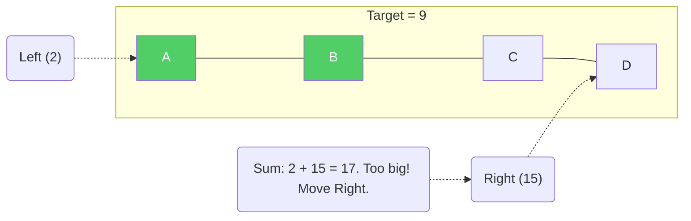

# Two Pointers

The **Two Pointers** technique is a highly effective strategy where you use two variables (the "pointers") to iterate through a data structure — typically an array, string, or linked list — at the same time. 

By moving the pointers systematically based on specific conditions, you can often solve problems in a **single pass ($O(n)$)** that would otherwise require nested loops ($O(n^2)$).

Think of it like this: *"Instead of comparing every item against every other item, let's look at two items at a time and intelligently narrow down our search."*

> [!NOTE]
> In languages like C or C++, a "pointer" is an actual memory address. In the context of this algorithmic pattern, however, "pointers" simply refer to **index variables** (like `i` and `j` or `left` and `right`) that keep track of positions in an array or string.

## Real-Life Analogy: Spending Exactly $100

Imagine you are at a store where items are lined up on a shelf, strictly sorted by price from cheapest (left) to most expensive (right). You have a $100 gift card and want to buy exactly two items that use up the entire balance.

**Brute Force:** You pick up the first item, then walk down the aisle adding its price to every other item to see if it hits $100. Then you pick up the second item and repeat. This is exhausting.

**Two Pointers:** 
1. You point your left hand at the **cheapest** item (start of the shelf) and your right hand at the **most expensive** item (end of the shelf).
2. You add their prices together.
3. If the total is **more than $100**, you know the right-hand item is too expensive. You move your right hand one step to the left (to a slightly cheaper item).
4. If the total is **less than $100**, you know the left-hand item is too cheap. You move your left hand one step to the right (to a slightly more expensive item).
5. You keep adjusting until you hit exactly $100.

Because the items are sorted, you never have to guess wildly or start over. You just squeeze your hands together until you find the exact match!

## The Three Main Patterns

Almost all Two Pointers problems fall into one of these three categories:

### 1. Opposite Ends (Collision)
One pointer starts at the beginning (`left = 0`) and the other at the end (`right = n - 1`). They move toward each other until they meet.
* **Best for:** Sorted arrays (finding pairs), reversing strings, checking palindromes.

### 2. Same Direction (Fast and Slow)
Both pointers start at the beginning. One pointer moves faster (e.g., two steps at a time) or ahead of the other. Also known as the "Tortoise and Hare" algorithm.
* **Best for:** Linked list cycles, removing duplicates, finding the middle of a linked list.

### 3. Sliding Window
A variation of the same-direction pointers where the two pointers define the boundaries of a "window" (a subarray or substring). The window expands and contracts as it slides across the data.
* **Best for:** Longest/shortest contiguous subarray or substring matching a condition.

---

## Classic Problems & Examples

Let's walk through the most common examples of the Two Pointers technique.

### Problem 1: Reverse an Array/String (Opposite Ends)

**Problem:** Write a function that reverses an array in-place. You must do this by modifying the input array with $O(1)$ extra memory.

**Example:** `['h', 'e', 'l', 'l', 'o']` → `['o', 'l', 'l', 'e', 'h']`

**Two Pointers Strategy:**
Place one pointer at the start and one at the end. Swap their values. Move the start pointer forward and the end pointer backward. Repeat until they cross.

**Step-by-step:**

```text
[ 'h', 'e', 'l', 'l', 'o' ]
   ^                   ^
  left               right    -> Swap 'h' and 'o'

[ 'o', 'e', 'l', 'l', 'h' ]
        ^         ^
       left     right         -> Swap 'e' and 'l'

[ 'o', 'l', 'l', 'e', 'h' ]
             ^
         left/right           -> They meet! Done.
```

#### Python

```python
def reverse_string(s):
    """Reverses a list of characters in-place."""
    left = 0
    right = len(s) - 1
    
    while left < right:
        # Swap the characters
        s[left], s[right] = s[right], s[left]
        # Move the pointers toward each other
        left += 1
        right -= 1

# Example
chars = ['h', 'e', 'l', 'l', 'o']
reverse_string(chars)
print(chars)  # Output: ['o', 'l', 'l', 'e', 'h']
```

#### Java

```java
import java.util.Arrays;

public class ReverseString {
    public static void reverseString(char[] s) {
        int left = 0;
        int right = s.length - 1;
        
        while (left < right) {
            // Swap
            char temp = s[left];
            s[left] = s[right];
            s[right] = temp;
            
            // Move pointers
            left++;
            right--;
        }
    }

    public static void main(String[] args) {
        char[] chars = {'h', 'e', 'l', 'l', 'o'};
        reverseString(chars);
        System.out.println(Arrays.toString(chars)); 
        // Output: [o, l, l, e, h]
    }
}
```

---

### Problem 2: Two Sum on a Sorted Array (Opposite Ends)

**Problem:** Given a **sorted** array of numbers and a target, find two numbers that add up to the target. Return their indices (1-indexed).

> [!TIP]
> Remember the brute force `Two Sum` problem? Nested loops took $O(n^2)$. Using a Hash Map takes $O(n)$ time but $O(n)$ space. Because this array is **sorted**, Two Pointers can do it in **$O(n)$ time and $O(1)$ space!**

**Example:** `numbers = [2, 7, 11, 15]`, `target = 9`

**Two Pointers Strategy:**
Start pointers at the edges. 
- If `sum == target`, you found it!
- If `sum > target`, the sum is too big. Move the `right` pointer left to decrease the sum.
- If `sum < target`, the sum is too small. Move the `left` pointer right to increase the sum.



#### Python

```python
def two_sum_sorted(numbers, target):
    left = 0
    right = len(numbers) - 1
    
    while left < right:
        current_sum = numbers[left] + numbers[right]
        
        if current_sum == target:
            return [left + 1, right + 1]  # 1-indexed as per typical problem rules
        elif current_sum > target:
            right -= 1  # Need a smaller number
        else:
            left += 1   # Need a larger number
            
    return []

# Example
print(two_sum_sorted(, 9))  # Output:
```

#### Java

```java
import java.util.Arrays;

public class TwoSumSorted {
    public static int[] twoSum(int[] numbers, int target) {
        int left = 0;
        int right = numbers.length - 1;
        
        while (left < right) {
            int currentSum = numbers[left] + numbers[right];
            
            if (currentSum == target) {
                return new int[]{left + 1, right + 1}; // 1-indexed
            } else if (currentSum > target) {
                right--; // Sum too big, move right pointer left
            } else {
                left++;  // Sum too small, move left pointer right
            }
        }
        return new int[]{};
    }

    public static void main(String[] args) {
        int[] result = twoSum(new int[]{2, 7, 11, 15}, 9);
        System.out.println(Arrays.toString(result)); 
        // Output:
    }
}
```

---

### Problem 3: Remove Duplicates from Sorted Array (Fast & Slow Pointers)

**Problem:** Given a sorted array, remove the duplicates **in-place** such that each element appears only once. Return the new length of the array.

**Example:** `[0, 0, 1, 1, 1, 2, 2, 3]` → Return `4` (Array becomes `[0, 1, 2, 3, _, _, _, _]`)

**Two Pointers Strategy:**
Use a `slow` pointer to track the position of the last unique element found. Use a `fast` pointer to scan through the array. Whenever `fast` finds a new unique number, move it to the `slow + 1` position.

**Step-by-step:**
```text

 s  f              -> Same, move fast


 s     f           -> Different! (0 and 1). Move slow, overwrite with fast.
 

    s     f        -> Same, move fast


    s        f     -> Same, move fast


    s           f  -> Different! (1 and 2). Move slow, overwrite.


       s           -> Result length is slow + 1 = 3.
```

#### Python

```python
def remove_duplicates(nums):
    if not nums:
        return 0
        
    slow = 0
    
    # 'fast' is our scanning pointer
    for fast in range(1, len(nums)):
        # Whenever we find a new, unique element...
        if nums[fast] != nums[slow]:
            slow += 1               # Increment slow pointer
            nums[slow] = nums[fast] # Overwrite the duplicate with the new element
            
    return slow + 1

# Example
arr =
new_length = remove_duplicates(arr)
print(f"New length: {new_length}")
print(f"Modified array: {arr[:new_length]}")

# Output:
#   New length: 4
#   Modified array:
```

#### Java

```java
import java.util.Arrays;

public class RemoveDuplicates {
    public static int removeDuplicates(int[] nums) {
        if (nums.length == 0) return 0;
        
        int slow = 0;
        
        for (int fast = 1; fast < nums.length; fast++) {
            if (nums[fast] != nums[slow]) {
                slow++;
                nums[slow] = nums[fast];
            }
        }
        return slow + 1;
    }

    public static void main(String[] args) {
        int[] arr = {0, 0, 1, 1, 1, 2, 2, 3};
        int newLength = removeDuplicates(arr);
        
        System.out.println("New length: " + newLength);
        System.out.println("Modified array: " + Arrays.toString(Arrays.copyOf(arr, newLength)));
        
        // Output:
        //   New length: 4
        //   Modified array:
    }
}
```

## Complexity Analysis

The biggest advantage of the Two Pointers technique is its efficiency.

| Metric | Complexity | Why? |
| :--- | :--- | :--- |
| **Time** | **$O(n)$** | We process each element at most once or twice. The pointers move linearly across the collection. |
| **Space** | **$O(1)$** | We only use a few integer variables (the pointers) regardless of the size of the array. |

## Brute Force vs. Two Pointers

| Problem | Brute Force Approach | Two Pointers Approach | Improvement |
| :--- | :--- | :--- | :--- |
| **Two Sum (Sorted)** | Nested loops check every pair | Shrink from outside based on sum | $O(n^2) \rightarrow O(n)$ |
| **Valid Palindrome** | Create new reversed string & compare | Check first & last char inward | $O(n)$ space $\rightarrow O(1)$ space |
| **Remove Duplicates** | Shift array on every duplicate found | Overwrite using fast & slow pointers | $O(n^2)$ time $\rightarrow O(n)$ time |

## When to Use Two Pointers

If a problem falls into any of these categories, Two Pointers should be one of the first techniques you consider:

1. **The data is sorted.** Sorting creates an order that Two Pointers can exploit (e.g., moving left increases a sum, moving right decreases it).
2. **You are searching for a pair or triplet.** Examples include Two Sum, Three Sum, and finding pairs with a specific difference.
3. **You are dealing with reversing or symmetry.** Examples include checking palindromes or reversing arrays.
4. **You need to do it "in-place".** The problem specifically asks for $O(1)$ space (e.g., removing duplicates, moving zeroes to the end).
5. **You are dealing with Linked Lists.** Fast and slow pointers are the standard way to detect cycles or find the middle of a linked list (since you can't easily traverse backward or access indexes directly).

## Key Takeaways

- Two Pointers uses two index variables to traverse an array or string.
- It frequently drops nested loops ($O(n^2)$) down to a single pass ($O(n)$).
- It drops auxiliary data structures like sets or new arrays ($O(n)$ space) down to constant space ($O(1)$).
- **Opposite Ends** is great for sorted data and symmetry.
- **Fast & Slow** is great for tracking uniques and navigating linked lists.