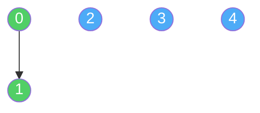
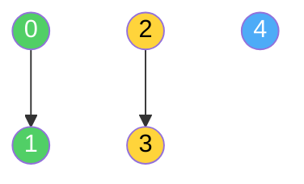
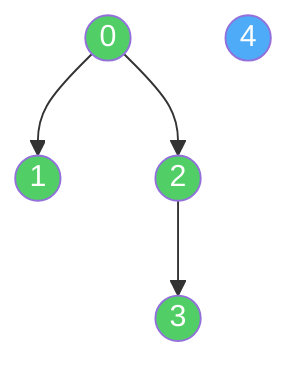
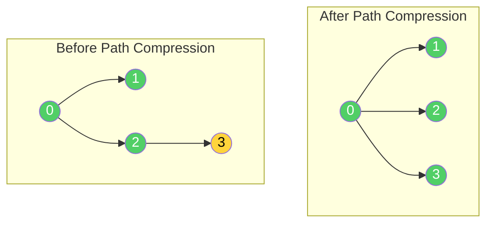
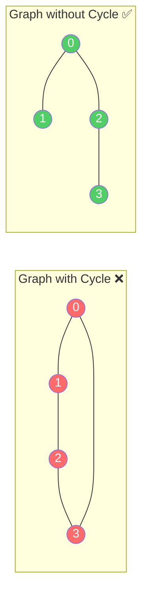

# Union-Find (Disjoint Set)

A **Union-Find** (also called **Disjoint Set Union** or **DSU**) is a data structure that keeps track of a collection of **non-overlapping groups** (sets). It supports two main operations:

1. **Find:** Which group does this element belong to?
2. **Union:** Merge two groups into one.

Imagine you're at a school on the first day. Everyone starts as a stranger — each person is their own "group." As people make friends, their groups merge. If Alice befriends Bob, and Bob befriends Charlie, then Alice, Bob, and Charlie are all in the same friend group — even though Alice and Charlie never directly spoke. Union-Find is the data structure that tracks these groups efficiently.

> [!NOTE]
> The word "disjoint" means **non-overlapping**. Every element belongs to **exactly one** group at any time. There's no shared membership — if you're in Group A, you can't also be in Group B.

## Real-Life Analogy: Friend Circles

Picture a classroom of 7 students on the first day of school. Nobody knows each other yet.

```text
Day 1 (Everyone is their own group):
  {Alice}  {Bob}  {Charlie}  {David}  {Eve}  {Frank}  {Grace}
  7 groups total
```

Now friendships form:
- Alice befriends Bob → `{Alice, Bob}` merge
- Charlie befriends David → `{Charlie, David}` merge
- Bob befriends Charlie → Now the two groups merge: `{Alice, Bob, Charlie, David}`
- Eve befriends Frank → `{Eve, Frank}` merge

```text
After friendships:
  {Alice, Bob, Charlie, David}  {Eve, Frank}  {Grace}
  3 groups total
```

The key questions Union-Find answers:
- **"Are Alice and David in the same friend group?"** → Yes (Find)
- **"Are Alice and Eve in the same friend group?"** → No (Find)
- **"Eve just befriended David"** → Merge those two groups (Union)

## How It Works

### The Core Idea: Representative (Parent)

Each group has a **representative** (also called the **root** or **leader**). To check if two elements are in the same group, you just check if they have the **same representative**.

We store this using a **parent array** where `parent[i]` points to the parent of element `i`. The representative of a group is the element that is **its own parent** (it points to itself).

```text
Initial state (everyone is their own parent):

Element:   0   1   2   3   4
Parent:    0   1   2   3   4
           ↑   ↑   ↑   ↑   ↑
          root root root root root

Every element is a root → 5 separate groups
```

### Step-by-Step Example

Let's trace through Union-Find operations with 5 elements: `{0, 1, 2, 3, 4}`

**Step 1: Initial State**


Each element is its own root. There are **5 separate groups**.

**Step 2: Union(0, 1)** — Connect 0 and 1

Make 0 the parent of 1 (or vice versa). Now they share the same root.

```text
parent[1] = 0

Element:   0   1   2   3   4
Parent:    0   0   2   3   4
```



Groups: `{0, 1}`, `{2}`, `{3}`, `{4}` — **4 groups**

**Step 3: Union(2, 3)** — Connect 2 and 3

```text
parent[3] = 2

Element:   0   1   2   3   4
Parent:    0   0   2   2   4
```



Groups: `{0, 1}`, `{2, 3}`, `{4}` — **3 groups**

**Step 4: Union(1, 3)** — Connect the two groups

Element 1's root is **0**. Element 3's root is **2**. So we connect root 2 under root 0.

```text
parent[2] = 0

Element:   0   1   2   3   4
Parent:    0   0   0   2   4
```



Groups: `{0, 1, 2, 3}`, `{4}` — **2 groups**

**Step 5: Find(3)** — Which group does 3 belong to?

```text
find(3):
  parent[3] = 2  → not a root, go up
  parent[2] = 0  → not a root, go up
  parent[0] = 0  → root found! ✓

Answer: Element 3 belongs to the group with root 0
```

**Step 6: Are 1 and 3 connected?**

```text
find(1) = 0
find(3) = 0
Same root → YES, they are connected ✅
```

## Two Key Optimizations

The naive version works, but can become slow if the tree grows tall (like a long chain). Two simple tricks make Union-Find **blazing fast**.

### 1. Path Compression (Optimize Find)

**Problem:** When you call `find(3)`, you walk up: `3 → 2 → 0`. Next time you call `find(3)`, you walk up again. Wasteful!

**Solution:** After finding the root, **point every node along the path directly to the root**. Future lookups become instant.

```text
Before path compression:
  3 → 2 → 0 (root)

find(3) with path compression:
  Walk up: 3 → 2 → 0 (root is 0)
  Now set: parent[3] = 0, parent[2] = 0

After path compression:
  3 → 0 (direct!)
  2 → 0 (direct!)
```



> [!TIP]
> After path compression, the tree becomes almost **flat**. Every node points directly (or almost directly) to the root. This means future `find()` calls are nearly $O(1)$.

### 2. Union by Rank (Optimize Union)

**Problem:** If you always attach one tree under the other without thinking, you can get a long chain (like a linked list), making `find()` slow.

**Solution:** Keep track of the **rank** (approximate height) of each tree. When merging two trees, **attach the shorter tree under the taller one**. This keeps the tree balanced and short.

```text
Union by Rank example:

Tree A (rank 2):        Tree B (rank 1):
      0                       3
     / \                      |
    1   2                     4

Union(A, B) → Attach shorter tree (B) under taller tree (A):

         0
       / | \
      1  2   3
             |
             4
```

> [!IMPORTANT]
> With **both** optimizations combined (path compression + union by rank), any sequence of $m$ operations on $n$ elements runs in $O(m \cdot \alpha(n))$ time, where $\alpha(n)$ is the **inverse Ackermann function**. This grows so incredibly slowly that it's effectively **constant** for all practical purposes. For $n = 10^{80}$ (more than the atoms in the universe), $\alpha(n) \leq 4$.

## Complexity

| Operation     | Naive          | With Both Optimizations     |
| ------------- | -------------- | --------------------------- |
| **Find**      | $O(n)$         | $O(\alpha(n)) \approx O(1)$ |
| **Union**     | $O(n)$         | $O(\alpha(n)) \approx O(1)$ |
| **Connected** | $O(n)$         | $O(\alpha(n)) \approx O(1)$ |
| **Space**     | $O(n)$         | $O(n)$                      |

Where $n$ is the number of elements and $\alpha$ is the inverse Ackermann function (practically constant).

> [!NOTE]
> Union-Find is one of the few data structures where operations are **nearly constant time** regardless of input size. This makes it ideal for handling millions of elements — like pixels in an image or nodes in a massive network.

## Union-Find vs Other Approaches

| Problem                       | BFS/DFS           | Union-Find                  |
| ----------------------------- | ----------------- | --------------------------- |
| **Are two nodes connected?**  | $O(V + E)$        | $O(\alpha(n)) \approx O(1)$ |
| **Add a new connection**      | Rebuild traversal  | $O(\alpha(n)) \approx O(1)$ |
| **Count connected components**| $O(V + E)$        | $O(n \cdot \alpha(n))$      |
| **Dynamic connectivity**      | ❌ Expensive        | ✅ Ideal                     |
| **Shortest path**             | ✅ BFS can do this  | ❌ Not supported             |

> [!TIP]
> Use **BFS/DFS** when you need to traverse or find paths. Use **Union-Find** when you need to repeatedly **merge groups** and **check connectivity** — especially when edges are added dynamically (one at a time).

## Implementation

### Python

```python
class UnionFind:
    def __init__(self, n):
        """Initialize n elements (0 to n-1), each in its own group."""
        self.parent = list(range(n))  # parent[i] = i (everyone is their own root)
        self.rank = [0] * n           # rank[i] = 0 (all trees start with height 0)
        self.count = n                # number of distinct groups

    def find(self, x):
        """Find the root (representative) of x's group, with path compression."""
        if self.parent[x] != x:
            self.parent[x] = self.find(self.parent[x])  # Path compression: point directly to root
        return self.parent[x]

    def union(self, x, y):
        """Merge the groups containing x and y. Returns False if already in the same group."""
        root_x = self.find(x)
        root_y = self.find(y)

        if root_x == root_y:
            return False  # Already in the same group, nothing to merge

        # Union by rank: attach shorter tree under taller tree
        if self.rank[root_x] < self.rank[root_y]:
            self.parent[root_x] = root_y
        elif self.rank[root_x] > self.rank[root_y]:
            self.parent[root_y] = root_x
        else:
            self.parent[root_y] = root_x
            self.rank[root_x] += 1  # Tree got taller by 1

        self.count -= 1  # One fewer group
        return True

    def connected(self, x, y):
        """Check if x and y are in the same group."""
        return self.find(x) == self.find(y)

    def get_count(self):
        """Return the number of distinct groups."""
        return self.count


# --- Example Usage ---
uf = UnionFind(7)  # 7 people: 0 through 6

# Form friendships
uf.union(0, 1)  # Alice(0) befriends Bob(1)
uf.union(2, 3)  # Charlie(2) befriends David(3)
uf.union(1, 3)  # Bob(1) befriends David(3) → merges {0,1} and {2,3}
uf.union(4, 5)  # Eve(4) befriends Frank(5)

# Check connections
print("Are 0 and 3 connected?", uf.connected(0, 3))  # True (same group)
print("Are 0 and 4 connected?", uf.connected(0, 4))  # False (different groups)
print("Are 4 and 5 connected?", uf.connected(4, 5))  # True

# Count groups
print("Number of groups:", uf.get_count())  # 3: {0,1,2,3}, {4,5}, {6}

# New connection merges two groups
uf.union(3, 5)  # David(3) befriends Frank(5) → merges {0,1,2,3} and {4,5}
print("After union(3,5):")
print("  Are 0 and 5 connected?", uf.connected(0, 5))  # True
print("  Number of groups:", uf.get_count())             # 2: {0,1,2,3,4,5}, {6}
```

### Java

```java
public class UnionFind {

    private int[] parent;
    private int[] rank;
    private int count; // number of distinct groups

    public UnionFind(int n) {
        parent = new int[n];
        rank = new int[n];
        count = n;
        for (int i = 0; i < n; i++) {
            parent[i] = i;  // Everyone is their own root
            rank[i] = 0;
        }
    }

    /**
     * Find the root (representative) of x's group, with path compression.
     */
    public int find(int x) {
        if (parent[x] != x) {
            parent[x] = find(parent[x]);  // Path compression
        }
        return parent[x];
    }

    /**
     * Merge the groups containing x and y.
     * Returns false if they are already in the same group.
     */
    public boolean union(int x, int y) {
        int rootX = find(x);
        int rootY = find(y);

        if (rootX == rootY) {
            return false;  // Already in the same group
        }

        // Union by rank: attach shorter tree under taller tree
        if (rank[rootX] < rank[rootY]) {
            parent[rootX] = rootY;
        } else if (rank[rootX] > rank[rootY]) {
            parent[rootY] = rootX;
        } else {
            parent[rootY] = rootX;
            rank[rootX]++;  // Tree got taller by 1
        }

        count--;
        return true;
    }

    /**
     * Check if x and y are in the same group.
     */
    public boolean connected(int x, int y) {
        return find(x) == find(y);
    }

    /**
     * Return the number of distinct groups.
     */
    public int getCount() {
        return count;
    }

    public static void main(String[] args) {
        UnionFind uf = new UnionFind(7);  // 7 people: 0 through 6

        // Form friendships
        uf.union(0, 1);  // Alice(0) befriends Bob(1)
        uf.union(2, 3);  // Charlie(2) befriends David(3)
        uf.union(1, 3);  // Bob(1) befriends David(3) → merges {0,1} and {2,3}
        uf.union(4, 5);  // Eve(4) befriends Frank(5)

        // Check connections
        System.out.println("Are 0 and 3 connected? " + uf.connected(0, 3));  // true
        System.out.println("Are 0 and 4 connected? " + uf.connected(0, 4));  // false
        System.out.println("Are 4 and 5 connected? " + uf.connected(4, 5));  // true

        // Count groups
        System.out.println("Number of groups: " + uf.getCount());  // 3

        // New connection merges two groups
        uf.union(3, 5);
        System.out.println("After union(3,5):");
        System.out.println("  Are 0 and 5 connected? " + uf.connected(0, 5));  // true
        System.out.println("  Number of groups: " + uf.getCount());             // 2
    }
}
```

## Classic Application: Detecting Cycles in an Undirected Graph

One of the most common uses of Union-Find is detecting whether adding an edge to a graph would create a **cycle**.

**Logic:** For each edge `(u, v)`:
1. If `find(u) == find(v)` → they're already connected → adding this edge creates a **cycle**.
2. If `find(u) != find(v)` → they're in different groups → safe to connect with `union(u, v)`.

```python
def has_cycle(num_vertices, edges):
    """Detect if an undirected graph has a cycle using Union-Find."""
    uf = UnionFind(num_vertices)

    for u, v in edges:
        if uf.connected(u, v):
            print(f"  Edge ({u},{v}): already connected → CYCLE DETECTED!")
            return True
        uf.union(u, v)
        print(f"  Edge ({u},{v}): connected successfully")

    return False


# Example 1: Graph WITH a cycle
#   0 - 1
#   |   |
#   3 - 2
print("Graph 1 (has cycle):")
edges1 = [(0, 1), (1, 2), (2, 3), (3, 0)]
print("Has cycle:", has_cycle(4, edges1))
# Edge (0,1): connected successfully
# Edge (1,2): connected successfully
# Edge (2,3): connected successfully
# Edge (3,0): already connected → CYCLE DETECTED!
# Has cycle: True

print()

# Example 2: Graph WITHOUT a cycle (a tree)
#   0 - 1
#   |
#   2 - 3
print("Graph 2 (no cycle):")
edges2 = [(0, 1), (0, 2), (2, 3)]
print("Has cycle:", has_cycle(4, edges2))
# Edge (0,1): connected successfully
# Edge (0,2): connected successfully
# Edge (2,3): connected successfully
# Has cycle: False
```



## Classic Application: Kruskal's Minimum Spanning Tree

Union-Find is a core part of **Kruskal's algorithm** for finding the Minimum Spanning Tree (MST) — the cheapest way to connect all nodes in a weighted graph.

**Algorithm:**
1. Sort all edges by weight (cheapest first).
2. For each edge, use Union-Find to check if adding it creates a cycle.
3. If no cycle → include the edge in the MST.
4. If cycle → skip the edge.
5. Stop when you have `V - 1` edges (a tree with `V` vertices has exactly `V - 1` edges).

```python
def kruskal_mst(num_vertices, edges):
    """
    Find the Minimum Spanning Tree using Kruskal's algorithm.
    edges: list of (weight, u, v)
    """
    edges.sort()  # Sort edges by weight
    uf = UnionFind(num_vertices)
    mst = []
    total_weight = 0

    for weight, u, v in edges:
        if not uf.connected(u, v):  # Would adding this edge create a cycle?
            uf.union(u, v)
            mst.append((u, v, weight))
            total_weight += weight
            print(f"  Include edge ({u},{v}) with weight {weight}")

    print(f"  Total MST weight: {total_weight}")
    return mst


# Example:
#       1
#   0 ---- 1
#   |  \   |
# 4 |  3\  | 2
#   |    \ |
#   3 ---- 2
#       5
print("Kruskal's MST:")
edges = [
    (1, 0, 1),  # edge 0-1, weight 1
    (2, 1, 2),  # edge 1-2, weight 2
    (3, 0, 2),  # edge 0-2, weight 3
    (4, 0, 3),  # edge 0-3, weight 4
    (5, 2, 3),  # edge 2-3, weight 5
]
mst = kruskal_mst(4, edges)
# Include edge (0,1) with weight 1
# Include edge (1,2) with weight 2
# Include edge (0,3) with weight 4
# Total MST weight: 7
```

## When to Use Union-Find

- **Dynamic Connectivity:** "Are these two things connected?" when connections are added over time (social networks, computer networks).
- **Cycle Detection:** Check if adding an edge to an undirected graph creates a cycle.
- **Kruskal's MST:** Building the minimum spanning tree using sorted edges.
- **Connected Components:** Count or track how many separate groups exist in a graph.
- **Network Redundancy:** Determine if two servers can communicate, or if a network connection is redundant.
- **Image Processing:** Group adjacent pixels with similar colors (connected component labeling).
- **Equivalence Relations:** Group items that are "equivalent" by some transitive relation (e.g., accounts belonging to the same person).

## Common Interview Problems

1. **Number of Connected Components** — Given `n` nodes and a list of edges, count the number of connected components using Union-Find.
2. **Redundant Connection** (LeetCode 684) — Find the edge that, if removed, would make the graph a tree (the edge that creates a cycle).
3. **Number of Islands II** (LeetCode 305) — Given a grid where land is added one cell at a time, count the number of islands after each addition.
4. **Accounts Merge** (LeetCode 721) — Merge accounts that share a common email address using Union-Find.
5. **Graph Valid Tree** (LeetCode 261) — Check if an undirected graph is a valid tree (connected and no cycles).
6. **Smallest String With Swaps** (LeetCode 1202) — Group characters by connected swap indices, then sort within each group.

## Key Takeaways

- Union-Find tracks **non-overlapping groups** and supports two operations: `find` (which group?) and `union` (merge groups).
- Each element has a **parent pointer**. The **root** (an element pointing to itself) represents the entire group.
- **Path compression** makes `find` nearly instant by flattening the tree — every node points directly to the root after the first lookup.
- **Union by rank** keeps trees balanced by attaching the shorter tree under the taller one during merges.
- With both optimizations, operations run in $O(\alpha(n))$ — effectively **constant time**.
- Union-Find excels at **dynamic connectivity** problems where edges are added over time and you need fast "are these connected?" queries.
- It cannot find shortest paths or traverse graphs — use BFS/DFS for that. Union-Find is purely about **grouping and connectivity**.
