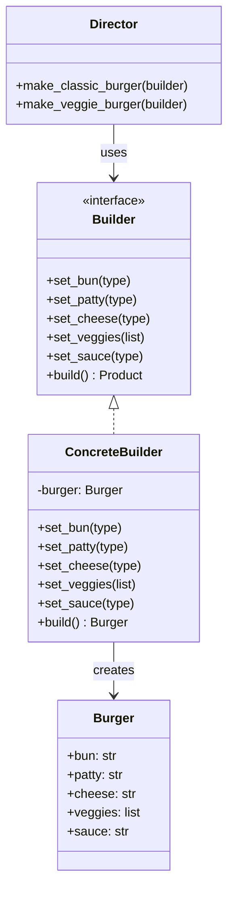

# Builder Design Pattern

The **Builder** is a creational design pattern. It lets you build complex objects **step by step**. Instead of passing a huge list of parameters to a constructor, you use a separate "builder" object to set each part one at a time, and then get the final result.

Think of it this way: some objects are complicated. They have many optional fields. Without the Builder pattern, you'd need a constructor with 10+ parameters — most of them `null`. The Builder pattern fixes this by letting you set only the parts you actually need.

## Real-World Analogy
Imagine you walk into a **burger restaurant**. You don't just say "Give me a burger." Instead, you customize it step by step:

1. **Bun** → "I want a sesame bun."
2. **Patty** → "Make it a chicken patty."
3. **Cheese** → "Add cheddar cheese."
4. **Veggies** → "Lettuce and tomato, please."
5. **Sauce** → "BBQ sauce."

You build your burger **one ingredient at a time**. When you're done, you say "That's it!" and the kitchen gives you the finished burger.

* You don't have to add every possible topping — just the ones you want.
* The order doesn't matter much — you can add sauce before cheese or after.
* At the end, you get one complete, ready-to-eat burger.

That's exactly how the Builder pattern works in code!

## The Problem Builder Solves

Without a Builder, creating a complex object might look like this:

```python
# Ugly constructor with too many parameters — hard to read!
house = House("brick", 4, 2, True, False, True, "solar", None, True)
```

Which argument is which? What does that `True` mean? What if you only care about 3 of these fields?

With a Builder, it becomes:

```python
# Clean and readable!
house = (HouseBuilder()
    .set_walls("brick")
    .set_windows(4)
    .set_doors(2)
    .set_garage(True)
    .set_roof("solar")
    .build())
```

Now it's **self-documenting** — you can read exactly what each value means.

## The Core Parts



1. **Product**: The complex object being built (e.g., `Burger`).
2. **Builder (Interface)**: Declares the step-by-step methods to build each part of the product.
3. **Concrete Builder**: Implements the Builder interface and keeps track of the product being assembled. It provides a `build()` method that returns the final product.
4. **Director** *(optional)*: A helper class that knows **how** to build common configurations. It calls the builder's methods in a specific order. You don't always need a Director — it's just a convenience.

---

## Example 1: Python Implementation

We'll build a `Burger` object step by step using a `BurgerBuilder`.

```python
# -----------------------------------------
# 1. Product — The complex object we want to build
# -----------------------------------------
class Burger:
    def __init__(self):
        self.bun = None
        self.patty = None
        self.cheese = None
        self.veggies = []
        self.sauce = None

    def __str__(self):
        parts = []
        parts.append(f"  Bun:     {self.bun or 'None'}")
        parts.append(f"  Patty:   {self.patty or 'None'}")
        parts.append(f"  Cheese:  {self.cheese or 'None'}")
        parts.append(f"  Veggies: {', '.join(self.veggies) if self.veggies else 'None'}")
        parts.append(f"  Sauce:   {self.sauce or 'None'}")
        return "🍔 Burger:\n" + "\n".join(parts)


# -----------------------------------------
# 2. Builder — Step-by-step construction
# -----------------------------------------
class BurgerBuilder:
    def __init__(self):
        self._burger = Burger()

    def set_bun(self, bun_type: str):
        self._burger.bun = bun_type
        return self  # Return self so we can chain calls!

    def set_patty(self, patty_type: str):
        self._burger.patty = patty_type
        return self

    def set_cheese(self, cheese_type: str):
        self._burger.cheese = cheese_type
        return self

    def set_veggies(self, veggies: list):
        self._burger.veggies = veggies
        return self

    def set_sauce(self, sauce_type: str):
        self._burger.sauce = sauce_type
        return self

    def build(self) -> Burger:
        """Returns the finished burger and resets the builder."""
        finished_burger = self._burger
        self._burger = Burger()  # Reset for next build
        return finished_burger


# -----------------------------------------
# 3. Director (Optional) — Pre-defined recipes
# -----------------------------------------
class BurgerDirector:
    """
    The Director knows HOW to build popular burgers.
    It uses a builder to do the actual construction.
    """
    @staticmethod
    def make_classic_burger(builder: BurgerBuilder) -> Burger:
        return (builder
            .set_bun("Sesame")
            .set_patty("Beef")
            .set_cheese("Cheddar")
            .set_veggies(["Lettuce", "Tomato", "Onion"])
            .set_sauce("Ketchup")
            .build())

    @staticmethod
    def make_veggie_burger(builder: BurgerBuilder) -> Burger:
        return (builder
            .set_bun("Whole Wheat")
            .set_patty("Black Bean")
            .set_cheese("Swiss")
            .set_veggies(["Lettuce", "Tomato", "Avocado", "Pickles"])
            .set_sauce("Mustard")
            .build())


# -----------------------------------------
# 4. Client Code
# -----------------------------------------

# Option A: Build a custom burger manually
print("=== Custom Burger ===")
builder = BurgerBuilder()
my_burger = (builder
    .set_bun("Brioche")
    .set_patty("Chicken")
    .set_cheese("Mozzarella")
    .set_sauce("BBQ")
    .build())
print(my_burger)

# Option B: Use the Director for a pre-defined recipe
print("\n=== Classic Burger (via Director) ===")
classic = BurgerDirector.make_classic_burger(BurgerBuilder())
print(classic)

print("\n=== Veggie Burger (via Director) ===")
veggie = BurgerDirector.make_veggie_burger(BurgerBuilder())
print(veggie)
```

**Output:**
```
=== Custom Burger ===
🍔 Burger:
  Bun:     Brioche
  Patty:   Chicken
  Cheese:  Mozzarella
  Veggies: None
  Sauce:   BBQ

=== Classic Burger (via Director) ===
🍔 Burger:
  Bun:     Sesame
  Patty:   Beef
  Cheese:  Cheddar
  Veggies: Lettuce, Tomato, Onion
  Sauce:   Ketchup

=== Veggie Burger (via Director) ===
🍔 Burger:
  Bun:     Whole Wheat
  Patty:   Black Bean
  Cheese:  Swiss
  Veggies: Lettuce, Tomato, Avocado, Pickles
  Sauce:   Mustard
```

### Key Takeaway from Python Example
Notice how we used **method chaining** (`return self`). Each setter returns the builder itself, so we can write `.set_bun(...).set_patty(...).set_cheese(...)` in one fluent chain. This is a very common pattern in builders.

---

## Example 2: Java Implementation

```java
import java.util.ArrayList;
import java.util.List;

// -----------------------------------------
// 1. Product — The complex object we want to build
// -----------------------------------------
class Burger {
    private String bun;
    private String patty;
    private String cheese;
    private List<String> veggies;
    private String sauce;

    public Burger() {
        this.veggies = new ArrayList<>();
    }

    // Setters (package-private — only the Builder should call these)
    void setBun(String bun)         { this.bun = bun; }
    void setPatty(String patty)     { this.patty = patty; }
    void setCheese(String cheese)   { this.cheese = cheese; }
    void setVeggies(List<String> v) { this.veggies = v; }
    void setSauce(String sauce)     { this.sauce = sauce; }

    @Override
    public String toString() {
        return "🍔 Burger:\n"
            + "  Bun:     " + (bun != null ? bun : "None") + "\n"
            + "  Patty:   " + (patty != null ? patty : "None") + "\n"
            + "  Cheese:  " + (cheese != null ? cheese : "None") + "\n"
            + "  Veggies: " + (veggies.isEmpty() ? "None" : String.join(", ", veggies)) + "\n"
            + "  Sauce:   " + (sauce != null ? sauce : "None");
    }
}

// -----------------------------------------
// 2. Builder — Step-by-step construction
// -----------------------------------------
class BurgerBuilder {
    private Burger burger;

    public BurgerBuilder() {
        this.burger = new Burger();
    }

    public BurgerBuilder setBun(String bun) {
        burger.setBun(bun);
        return this; // Return this for method chaining
    }

    public BurgerBuilder setPatty(String patty) {
        burger.setPatty(patty);
        return this;
    }

    public BurgerBuilder setCheese(String cheese) {
        burger.setCheese(cheese);
        return this;
    }

    public BurgerBuilder setVeggies(List<String> veggies) {
        burger.setVeggies(veggies);
        return this;
    }

    public BurgerBuilder setSauce(String sauce) {
        burger.setSauce(sauce);
        return this;
    }

    public Burger build() {
        Burger finished = this.burger;
        this.burger = new Burger(); // Reset for next build
        return finished;
    }
}

// -----------------------------------------
// 3. Director (Optional) — Pre-defined recipes
// -----------------------------------------
class BurgerDirector {

    public static Burger makeClassicBurger(BurgerBuilder builder) {
        return builder
            .setBun("Sesame")
            .setPatty("Beef")
            .setCheese("Cheddar")
            .setVeggies(List.of("Lettuce", "Tomato", "Onion"))
            .setSauce("Ketchup")
            .build();
    }

    public static Burger makeVeggieBurger(BurgerBuilder builder) {
        return builder
            .setBun("Whole Wheat")
            .setPatty("Black Bean")
            .setCheese("Swiss")
            .setVeggies(List.of("Lettuce", "Tomato", "Avocado", "Pickles"))
            .setSauce("Mustard")
            .build();
    }
}

// -----------------------------------------
// 4. Client Code
// -----------------------------------------
public class BuilderExample {
    public static void main(String[] args) {

        // Option A: Build a custom burger manually
        System.out.println("=== Custom Burger ===");
        Burger myBurger = new BurgerBuilder()
            .setBun("Brioche")
            .setPatty("Chicken")
            .setCheese("Mozzarella")
            .setSauce("BBQ")
            .build();
        System.out.println(myBurger);

        // Option B: Use the Director for pre-defined recipes
        System.out.println("\n=== Classic Burger (via Director) ===");
        Burger classic = BurgerDirector.makeClassicBurger(new BurgerBuilder());
        System.out.println(classic);

        System.out.println("\n=== Veggie Burger (via Director) ===");
        Burger veggie = BurgerDirector.makeVeggieBurger(new BurgerBuilder());
        System.out.println(veggie);
    }
}
```

---

## When Should I Use the Builder Pattern?

| Situation                                                        | Why Builder Helps                                                                                        |
| ---------------------------------------------------------------- | -------------------------------------------------------------------------------------------------------- |
| Object has **many optional parameters**                          | Avoids constructors with 10+ parameters (a.k.a. "telescoping constructors")                              |
| You want to build **different representations** of the same type | Same building steps, different outcomes (classic burger vs. veggie burger)                               |
| Object construction has **multiple steps**                       | Builder enforces a structured, step-by-step process                                                      |
| You want **readable, self-documenting** code                     | `.setBun("Sesame").setPatty("Beef")` is far clearer than `new Burger("Sesame", "Beef", null, null, ...)` |

## Builder vs. Other Creational Patterns

| Pattern              | Purpose                                                                                    |
| -------------------- | ------------------------------------------------------------------------------------------ |
| **Builder**          | Builds a complex object **step by step**. Focuses on *how* the object is assembled.        |
| **Factory Method**   | Creates an object in **one step** via a method. Focuses on *which* class to instantiate.   |
| **Abstract Factory** | Creates **families of related objects**. Focuses on *consistency* across a product family. |

## Why Should I Use This?
* **Readability:** Code that uses a Builder is easy to read and understand — each step clearly says what it does.
* **Flexibility:** You only set the parts you need. Optional fields are simply skipped — no `null` juggling.
* **Immutability:** Once `build()` is called, you have a complete object. The Builder can be designed to produce immutable objects.
* **Reusability:** The same Builder can create many different configurations of the same product. A Director can standardize popular configurations.
