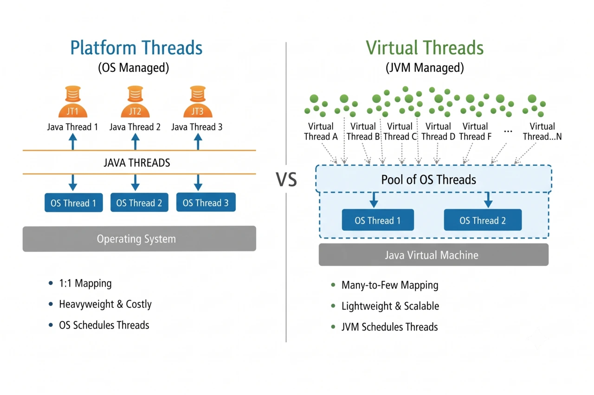

# Java Virtual Threads

Traditional threads in Java (called Platform Threads) are tied directly to your Operating System (OS). They are "heavy" and consume a lot of memory. If a server receives 10,000 requests at the same time and tries to open 10,000 platform threads, the application will likely crash or slow down because the OS cannot handle that many threads efficiently.

Virtual Threads, which were officially finalized in Java 21, fix this problem. They are lightweight threads managed by the Java Virtual Machine (JVM) instead of the OS.



---

## 1. The Simple Analogy: Restaurant Waiter

To explain Virtual Threads to anyone (including an interviewer), use this restaurant story:

* **Old Way (Platform Threads):**  
  Every customer gets their own **dedicated waiter**. When the customer takes 20 minutes to read the menu (blocking I/O / waiting for a database), the waiter just stands there doing nothing. Since waiters are expensive, the restaurant can only hire **50 waiters**. When the 51st customer walks in, they have to wait outside.
* **New Way (Virtual Threads):**  
  The restaurant only needs **8 fast waiters** (called *Carrier Threads*). The waiter takes your order, sends it to the kitchen, and **immediately serves another table**. When your food is ready, whichever waiter is free brings it to you. Now the restaurant can seat **10,000 customers** at once with the same 8 waiters!
 
---

## 2. Why Did We Need This?

In traditional Java:

1. **Every Java thread was a real Operating System (OS) thread.**
2. OS threads are **heavy**: each one reserves about **1 MB of memory**.
3. If you have 3,000 requests waiting for a slow database, your server holds ~3 GB of memory doing nothing, and soon crashes with:  
   `OutOfMemoryError: unable to create native thread`.

### The Solution:
* **Virtual Threads are managed by Java, not the OS.**
* They only weigh **a few kilobytes** instead of 1 MB.
* When your code waits for a database or API response, Java **pauses** the virtual thread and lets the real OS thread work on something else.

---

## 3. Why Use Virtual Threads?

Use virtual threads in high-concurrency applications where tasks spend most of their time waiting on **blocking I/O** (such as database queries, external API calls, or file operations).

> **Key Rule:** Virtual threads do **not** execute code faster than platform threads. Their goal is **throughput (scale)**, not lower latency (speed).

---

## 4. How to Use It in Code

You can create a single virtual thread using `Thread.ofVirtual()`:
```java
public class VirtualThreadExample {
    public static void main(String[] args) throws InterruptedException {
        // Create and start a lightweight virtual thread
        Thread vThread = Thread.ofVirtual().start(() -> {
            System.out.println("Hello from a Virtual Thread!");
            System.out.println("Running on: " + Thread.currentThread());
        });

        // Wait for it to finish so the main program doesn't exit immediately
        vThread.join();
    }
}
```

If you are building a server or running a massive amount of tasks, you can use an Executor that spins up a brand-new virtual thread for every single task. Use `Executors.newVirtualThreadPerTaskExecutor()` inside a `try-with-resources` block.
```java
import java.util.concurrent.Executors;

public class SimpleVirtualThreadDemo {
    public static void main(String[] args) {
        
        // 1. Create an executor that creates a new Virtual Thread for each task
        try (var executor = Executors.newVirtualThreadPerTaskExecutor()) {
            
            for (int i = 1; i <= 10_000; i++) {
                int taskId = i;
                
                executor.submit(() -> {
                    // Simulate waiting for database or external API (I/O)
                    Thread.sleep(1000); 
                    System.out.println("Finished task " + taskId);
                    return taskId;
                });
            }
            
        } // 2. Automatically waits here until ALL 10,000 tasks are finished!
        
        System.out.println("All tasks done!");
    }
}
```

> **Why this code is awesome:**  
> Running 10,000 tasks with traditional threads would freeze or crash your system. With virtual threads, this takes only **~1 to 2 seconds** and uses barely any memory.

---

## 5. How It Works Under the Hood (Step-by-Step)

You don't need complicated words. Just remember these 3 terms:

1. **Carrier/Platform Thread:** The real OS thread doing the actual work (Java usually keeps one per CPU core).
2. **Mounting:** Java places your Virtual Thread onto a Carrier/Platform Thread to run your Java code.
3. **Unmounting:** The moment your code hits a waiting step (like `Thread.sleep()`, HTTP call, or DB query), Java **unplugs** your virtual thread from the Carrier/Platform Thread and saves its progress in memory. The Carrier/Platform Thread is immediately free to run other tasks.
4. When the database replies, Java **plugs your virtual thread back** into any available Carrier/Platform Thread to finish the job.

---

## 6. Platform Thread vs. Virtual Thread (Quick Comparison)

| Feature | Old Thread (Platform) | Virtual Thread (Java 21) |
| :--- | :--- | :--- |
| **Who manages it?** | Operating System (OS) | Java Virtual Machine (JVM) |
| **Memory per thread** | Big (~1 MB) | Tiny (~a few KB) |
| **How many can you create?** | A few thousands max | **Millions** |
| **Creation speed** | Slow (calls the OS kernel) | Near instant (just a Java object) |
| **Should you pool it?** | **Yes** (`newFixedThreadPool`) | **NO! Never pool them** |
| **Best used for** | CPU-heavy work (Math, Video encoding) | **I/O-heavy work** (APIs, Database, Web requests) |

---

## 7. The 3 Traps for Interview

### Trap 1: "Does it make CPU-heavy code faster?"
* **Answer:** **No.**
* **Why:** If you have 8 CPU cores doing heavy mathematical calculations, 8 threads will run at 100% CPU capacity. Creating 1,000,000 virtual threads won't give you more CPU power—it will just waste time switching between them.  
* **Rule:** Virtual threads are for **waiting (I/O)**, not calculating (CPU).

---

### Trap 2: "Should we create a thread pool for Virtual Threads?"
* **Answer:** **Never pool virtual threads.**
* **Why:** We pooled traditional threads because creating an OS thread is expensive. Virtual threads are so cheap that creating and throwing them away is faster and safer than managing a pool. Just create one per task on the fly.

---

### Trap 3: "What is Thread Pinning?" (Most Important Question)
* **What is it?**  
  Normally, when a virtual thread waits, it unmounts from the real thread. But when it is **pinned**, it gets "stuck" and **cannot let go of the real OS thread**.
* **What causes it?**  
  Calling a blocking I/O operation inside a **`synchronized`** block or method.
* **How do you fix it?**  
  Replace `synchronized` with **`ReentrantLock`**.

```java
// ❌ BAD: Pins the carrier thread during I/O
public synchronized String callApiBad() {
    return httpClient.get("https://example.com"); // Blocks the real OS thread!
}

// ✅ GOOD: Virtual thread can unmount safely
private final ReentrantLock lock = new ReentrantLock();

public String callApiGood() {
    lock.lock();
    try {
        return httpClient.get("https://example.com"); // Safe!
    } finally {
        lock.unlock();
    }
}
```

---

## 8. How to Answer in an Interview (Exact Wordings)

Use these short, clear answers when the interviewer asks:

### Q1: "What are Virtual Threads in Java 21?"
> *"Virtual threads are lightweight threads managed directly by the JVM instead of the operating system. They allow us to write simple, synchronous code—like thread-per-request—while scaling to millions of concurrent requests without running out of memory."*

### Q2: "How are they different from normal threads?"
> *"Normal platform threads have a 1:1 mapping with OS threads and consume about 1 MB of memory each. Virtual threads run on top of a small pool of OS threads (called carrier threads) and only consume a few kilobytes. When a virtual thread blocks on I/O, it temporarily unmounts from the OS thread so other tasks can run."*

### Q3: "Can we replace Reactive programming (WebFlux) with Virtual Threads?"
> *"For most CRUD applications and REST APIs, yes. Virtual threads achieve the same high throughput as reactive frameworks, but with much simpler, readable, and debuggable code. However, reactive programming is still useful for complex streaming and backpressure."*

### Q4: "What is thread pinning and how do you resolve it?"
> *"Thread pinning happens when a virtual thread blocks inside a `synchronized` block or native code, preventing it from unmounting from the carrier thread. The fix is to replace `synchronized` with `ReentrantLock` around blocking operations."*

### Q5: "How should we limit concurrent calls to a database?"
> *"Since we shouldn't limit virtual threads using a thread pool, we should use a `Semaphore` or a dedicated database connection pool (like HikariCP) to limit how many threads can access the database at once."*

---

## 9. 10-Second Recall Checklist

1. **Introduced in:** Java 21.
2. **Key benefit:** Millions of threads, minimal memory (~few KB vs 1 MB).
3. **Execution pattern:** `Executors.newVirtualThreadPerTaskExecutor()`.
4. **Don'ts:** Don't pool them, don't use for CPU-heavy tasks, don't do I/O inside `synchronized`.
5. **Fix for Pinning:** Use `ReentrantLock`.
